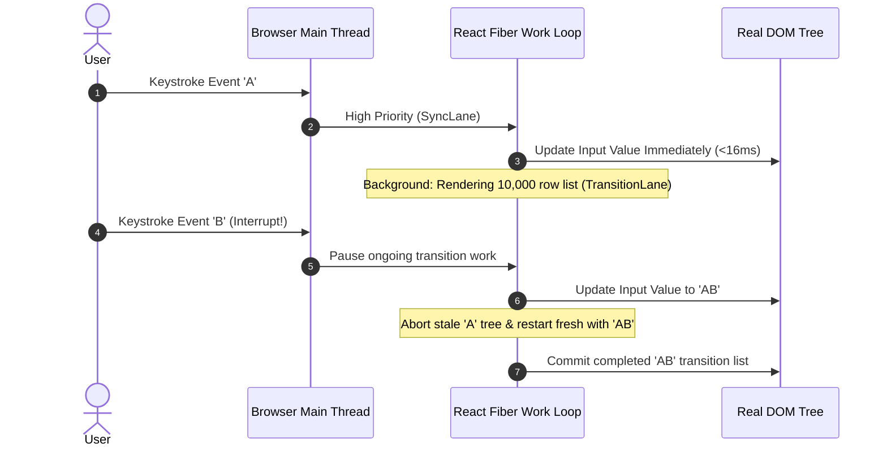

# React Concurrent Mode, Transitions & Lane Priority Scheduling

---

## 🐣 1. Layman's Analogy (Hinglish + Real-World ELI5)

Imagine you are at an **Airport Ticket Counter**:

- **Legacy React 15 (Stack Reconciler)**: Ek passenger aata hai jiske paas 50 luggage bags hain (heavy render of 10,000 table rows). Jab tak agent uske 50 bags scan nahi kar leta, poori line freeze ho jaati hai! Agar kisi ko bas ek paani ki bottle khareedni hai (typing in search box), wo bhi ruka rahega aur chillaega (UI Freezing / Janky Lag).
- **React 18/19 Concurrent Mode**: Agent ke paas ab **VIP Priority Lanes** hain!
  - Jab agent heavy luggage scan kar raha hota hai aur ek passenger typing karne aata hai, agent bolta hai: *"Aap ruko, pehle iska typing input 2 millisecond mein register karta hoon (Urgent Lane)"*.
  - Typing handle karke agent wapas heavy luggage scan karne lagta hai (**Interruptible Work Loop**).
  - Aur sabse acchi baat: jab tak naya render poora ready nahi ho jaata, purani screen dikhti rehti hai (**Double Buffering**), koi screen flicker nahi hota!

---

## 📌 2. Point-Wise Core Mechanics & Edge Cases

### Newbie Essentials

1. **Synchronous Blocking vs Concurrent Rendering**:
   - In React 17 and earlier, rendering was synchronous and un-interruptible. A heavy component tree render completely blocked the browser main thread.
   - Concurrent Mode allows React to pause rendering, yield to the browser main thread to handle user clicks or keystrokes, and resume or abort render work later.
2. **The 2 Core Phases**:
   - **Render Phase (Asynchronous & Interruptible)**: Builds the work-in-progress Fiber tree, computes diffs, calls component functions. Can be paused, discarded, or restarted.
   - **Commit Phase (Synchronous & Un-interruptible)**: Writes DOM mutations, runs `useLayoutEffect`, and switches the double-buffer pointers. Once started, it never yields.

### Intermediate Mechanics

3. **Lane Priority System**:
   - Replaced legacy 32-bit priority levels with 31 bitmask **Lanes** (e.g., `SyncLane`, `InputContinuousLane`, `DefaultLane`, `TransitionLane`, `IdleLane`).
   - Bitwise operations allow batching and prioritizing multiple overlapping transitions efficiently.
2. **`useTransition` vs `useDeferredValue`**:
   - `useTransition`: Use when you control the state update setter (`startTransition(() => setSearchQuery(val))`). Returns `[isPending, startTransition]`.
   - `useDeferredValue`: Use when receiving a value from props that you cannot wrap directly in a setter (`const deferredQuery = useDeferredValue(query)`).

### Senior / Lead Edge Cases

5. **Tearing (State Inconsistency)**:
   - In concurrent mode, if external non-React stores (e.g. Redux, Zustand, RxJS) mutate during an interrupted render, different components might read different versions of the store within the same frame.
   - **Fix**: Always subscribe to external stores using `useSyncExternalStore`, which forces a synchronous fallback if tearing is detected.
2. **Bailing Out with React Compiler (React 19)**:
   - In React 19, memoization is automated via the React Compiler, eliminating boilerplate `useMemo` and `useCallback` while maintaining lane isolation during concurrent updates.

---

## 📊 3. Visual System Architecture: Interruptible Fiber Work Loop

```
[ User types in Search Input ] ──> SyncLane (Urgent Priority)
                                           │
                                           ▼
             ┌──────────────────────────────────────────────┐
             │       Browser Main Thread Event Loop         │
             ├──────────────────────────────────────────────┤
             │ 1. Urgent Input Handled Instantly (16ms)     │
             │ 2. Yield control                             │
             │ 3. Non-Urgent Transition Render Resumed      │
             └──────────────────────────────────────────────┘
                                           │
                                           ▼
                [ Work-In-Progress Fiber Tree Completed ]
                                           │
                                           ▼
                [ Synchronous Commit Phase (DOM Update) ]
```



---

## 💻 4. Line-by-Line Commented Code: High-Performance Concurrent List

```javascript
// Import React and hooks for concurrent state management
import React, { useState, useTransition, useDeferredValue } from 'react';

// Simulated heavy item component that renders computationally expensive rows
function ExpensiveRow({ text, index }) {
  // Artificial CPU work simulation to represent heavy DOM elements
  const startTime = performance.now();
  while (performance.now() - startTime < 0.2) {
    // Artificial small delay per item
  }
  return <li style={{ padding: '4px', borderBottom: '1px solid #eee' }}>Row #{index}: {text}</li>;
}

export default function ConcurrentSearchPlatform() {
  // Urgent state: Keeps search box input instant and responsive (60 FPS)
  const [inputValue, setInputValue] = useState('');
  
  // Non-urgent transition state: Holds heavy dataset filter
  const [filteredQuery, setFilteredQuery] = useState('');
  
  // useTransition hook provides execution coordinator and pending status flag
  const [isPending, startTransition] = useTransition();

  // Handle user typing event
  const handleInputChange = (e) => {
    const nextVal = e.target.value;
    
    // Step 1: Urgent update - Updates the input field immediately
    setInputValue(nextVal);

    // Step 2: Non-urgent update - Marked as transition work (interruptible by user)
    startTransition(() => {
      // If user types again before this finishes, React aborts this render!
      setFilteredQuery(nextVal);
    });
  };

  // Generate 5,000 simulated list items based on non-urgent query
  const items = Array.from({ length: 5000 }, (_, i) => `Result for "${filteredQuery || 'All'}" Item ${i + 1}`);

  return (
    <div style={{ fontFamily: 'sans-serif', maxWidth: '600px', margin: '20px auto' }}>
      <h2>React 18/19 Concurrent Lane Search</h2>
      
      {/* Input box connected to urgent state */}
      <input
        type="text"
        value={inputValue}
        onChange={handleInputChange}
        placeholder="Type rapidly to test concurrent rendering..."
        style={{ width: '100%', padding: '10px', fontSize: '16px', boxSizing: 'border-box' }}
      />

      {/* Visual pending indicator showing background transition status */}
      <div style={{ height: '24px', margin: '8px 0', color: '#0066cc' }}>
        {isPending ? '⏳ React is computing transition in background lanes...' : '✅ Synchronized'}
      </div>

      {/* Render list of expensive items with visual opacity dimming during pending state */}
      <ul style={{ opacity: isPending ? 0.6 : 1.0, transition: 'opacity 0.2s', maxHeight: '400px', overflowY: 'auto' }}>
        {items.map((item, idx) => (
          <ExpensiveRow key={idx} text={item} index={idx} />
        ))}
      </ul>
    </div>
  );
}
```

---

## 🎯 5. The "Interview Pitch" (Spoken Answer)
>
> *"React Concurrent Mode fundamentally eliminates main-thread blocking by transforming reconciliation from a synchronous recursive stack traversal into an interruptible, priority-driven Fiber work loop.
> Under the hood, React schedules work across 31 discrete bitmask Lanes. User interactions like keystrokes and clicks map to high-priority Sync and Continuous lanes, while computationally heavy list renders or route navigations can be marked as non-urgent via `useTransition` or `useDeferredValue`.
> During an asynchronous render phase, if an urgent event arrives, React pauses the background transition, yields to the browser event loop to process the keystroke with zero frame drop, and subsequently restarts or resumes the background render on the latest state.
> Crucially, React employs a Double Buffering strategy: DOM mutations only execute in a single synchronous, un-interruptible commit phase once the entire work-in-progress Fiber tree is fully prepared, preventing partial UI tearing and jank."*

---

## 💼 6. Production War Story

**Company**: Global Enterprise Supply Chain & Fleet Telematics Dashboard.  
**Incident**: When dispatchers filtered real-time map views containing 12,000 active delivery vehicle nodes, typing in the search box experienced severe input lag (keystrokes took 800ms to appear). Users thought the dashboard had crashed and repeatedly hammered keys, generating cascading rerenders that triggered browser "Page Unresponsive" dialogs.  
**Root Cause**: The search filter updated a single unified `query` state that drove both the controlled input element and the heavy 12,000-node SVG map canvas synchronously, monopolizing the browser main thread for 800ms per keystroke.  
**Resolution**:

1. Decoupled input state into an urgent `inputValue` and a deferred transition `deferredQuery` using **`useTransition`**.
2. Wrapped map canvas updates inside `startTransition()`, allowing React's Fiber work loop to yield to typing events instantly.
3. Added `useSyncExternalStore` for external WebSocket telematics coordinates to eliminate tearing under concurrent lane priority shifts.  
**Result**: Keystroke input latency dropped from **800ms to 14ms (60 FPS responsiveness)**, frame drop rate fell to zero, and dispatch operations ran smoothly even under peak fleet data volumes.
