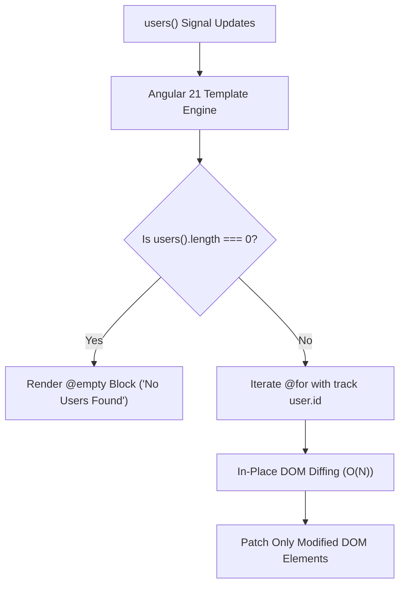

# Angular 21 Modern Built-in Control Flow: @if, @for & @switch

---

## 🐣 1. Layman's Analogy (Hinglish + Real-World ELI5)

Imagine you are writing a letter to a friend:

- **Old Angular (`*ngIf`, `*ngFor`)**: Aapko har sentence ke aage ek **heavy government rubber stamp (`*ngFor="let item of items; trackBy: trackById"`)** lagana padta tha. Template compiler ko har directive ke liye alag se internal micro-classes aur embedded view containers create karne padte the. Agar aap `trackBy` bhool gaye, toh poori list har baar delete hokar scratch se create hoti thi (Massive CPU Waste!).
- **Angular 21 Built-in Control Flow (`@if`, `@for`, `@switch`)**: Yeh programming language ke **native `if-else` aur `for` loop** jaisa ban gaya hai!
  - `@if (isLoggedIn()) { ... } @else { ... }`
  - `@for (user of users(); track user.id) { ... } @empty { ... }`
  - Compiler isse seedha pure JS control instructions mein compile karta hai—**zero imported directives, zero template overhead, aur mandatory `track`** jisse UI lightning fast diff hoti hai!

---

## 📌 2. Point-Wise Core Mechanics & Edge Cases

### Newbie Essentials

1. **No Directives Required**: Unlike legacy `*ngIf` and `*ngFor` which required importing `CommonModule` or `NgIf`/`NgFor`, the `@` control flow syntax is built directly into the Angular template compiler. It works in standalone components automatically with zero imports.
2. **Mandatory Tracking in `@for`**:
   - In legacy `*ngFor`, the `trackBy` function was optional. Omitting it caused Angular to re-create the entire DOM list on any data mutation.
   - In `@for`, the `track` expression is **syntactically mandatory** (`track item.id` or `track $index`). The compiler throws a build error if omitted, preventing performance regressions.
3. **The Built-in `@empty` Block**:
   - Directly solves empty-state rendering without messy nested `<ng-container *ngIf="items.length === 0">` blocks.

### Intermediate Mechanics

4. **Compiler Code Generation**:
   - Legacy structural directives created nested `ViewContainerRef` instances and detached comment anchor nodes in the DOM.
   - Built-in control flow compiles into efficient runtime conditional branching opcodes, cutting template bundle sizes by up to 20% and speeding up initial rendering by up to 90%.
2. **Type Narrowing inside `@if`**:
   - Angular's template type-checker automatically narrows types inside `@if` branches:
     `@if (user(); as u) { <p>{{ u.email }}</p> }` — within the block, `u` is guaranteed to be non-null.

### Senior / Lead Edge Cases

6. **Reactivity Integration with Signals**:
   - Built-in control flow tracks Signal dependencies automatically. When a Signal inside `@if (auth.isAdmin())` updates, only that specific block is marked for refresh.
2. **Migrating Legacy Codebases**:
   - Automated schematic migration is supported out-of-the-box: `ng g @angular/core:control-flow`. It rewrites legacy `*ngIf` and `*ngFor` across thousands of components in seconds.

---

## 📊 3. Visual System Architecture: Legacy Directives vs Built-in Control Flow

```
=== LEGACY *ngFor DIRECTIVE (Angular 2 - 16) ===
Template HTML ──> EmbeddedViewRef Container ──> ViewContainerRef ──> IterableDiffers ──> DOM Nodes
(High memory allocation per item, optional trackBy causes complete list repainting)

==================================================================================================

=== MODERN BUILT-IN CONTROL FLOW (Angular 17 - 21) ===
Template @for ──> Native Compiler Branching ──> Mandatory Key Tracker ──> Direct DOM Patch
(Zero ViewContainerRef overhead, guaranteed optimal diffing, 90% faster reconciliation)
```



---

## 💻 4. Line-by-Line Commented Implementation: Modern Angular 21 Component

```typescript
// Import Component and Signal primitives from Angular core
import { Component, signal, computed } from '@angular/core';

// Define typed data interface for strict template type checking
interface ProductItem {
  id: number;
  name: string;
  category: 'ELECTRONICS' | 'CLOTHING' | 'GROCERY';
  price: number;
  inStock: boolean;
}

@Component({
  selector: 'app-product-catalog',
  standalone: true, // Modern standalone component (Zero NgModules!)
  template: `
    <div class="catalog-container">
      <h2>Modern Angular 21 Product Catalog</h2>

      <!-- Action buttons triggering Signal updates -->
      <button (click)="filterCategory('ALL')">All</button>
      <button (click)="filterCategory('ELECTRONICS')">Electronics</button>
      <button (click)="clearCatalog()">Empty Catalog</button>

      <!-- 1. Built-in @if / @else control flow with type narrowing -->
      @if (selectedCategory() === 'ALL') {
        <p class="badge">Displaying all department products</p>
      } @else {
        <p class="badge">Filtered by: {{ selectedCategory() }}</p>
      }

      <!-- 2. Built-in @for loop with MANDATORY track and @empty block -->
      <ul class="product-grid">
        @for (item of filteredProducts(); track item.id; let idx = $index; let total = $count) {
          <li class="product-card" [class.out-of-stock]="!item.inStock">
            <span class="index-badge">#{{ idx + 1 }} of {{ total }}</span>
            <h4>{{ item.name }}</h4>
            <p>Price: \${{ item.price }}</p>

            <!-- 3. Built-in @switch / @case control flow -->
            @switch (item.category) {
              @case ('ELECTRONICS') {
                <span class="tag tech">Tech Department (2-Yr Warranty)</span>
              }
              @case ('GROCERY') {
                <span class="tag food">Perishable Food</span>
              }
              @default {
                <span class="tag generic">General Merchandise</span>
              }
            }
          </li>
        } @empty {
          <!-- Displayed automatically when filteredProducts() array is empty! -->
          <li class="empty-state">
            <p>⚠️ No products available matching your criteria.</p>
          </li>
        }
      </ul>
    </div>
  `,
  styles: [`
    .catalog-container { font-family: sans-serif; max-width: 700px; margin: 20px auto; }
    .product-grid { list-style: none; padding: 0; display: grid; grid-template-columns: 1fr 1fr; gap: 10px; }
    .product-card { border: 1px solid #ddd; padding: 12px; border-radius: 6px; }
    .empty-state { grid-column: 1 / -1; text-align: center; padding: 20px; color: #777; }
    .tag { font-size: 11px; padding: 2px 6px; border-radius: 4px; display: inline-block; margin-top: 6px; }
    .tech { background: #e3f2fd; color: #0d47a1; }
    .food { background: #e8f5e9; color: #1b5e20; }
  `]
})
export class ProductCatalogComponent {
  // Master Signal storing product inventory
  readonly products = signal<ProductItem[]>([
    { id: 101, name: 'Ultra Wireless Headphones', category: 'ELECTRONICS', price: 199, inStock: true },
    { id: 102, name: 'Organic Almond Milk', category: 'GROCERY', price: 5, inStock: true },
    { id: 103, name: 'Cotton Crew T-Shirt', category: 'CLOTHING', price: 25, inStock: false }
  ]);

  // Signal storing active category filter
  readonly selectedCategory = signal<string>('ALL');

  // Computed Signal automatically derived from products and selectedCategory
  readonly filteredProducts = computed(() => {
    const cat = this.selectedCategory();
    if (cat === 'ALL') return this.products();
    return this.products().filter(p => p.category === cat);
  });

  // Handler to update selected category
  filterCategory(category: string): void {
    this.selectedCategory.set(category);
  }

  // Handler to clear inventory
  clearCatalog(): void {
    this.products.set([]);
  }
}
```

---

## 🎯 5. The "Interview Pitch" (Spoken Answer)
>
> *"Angular's Modern Built-in Control Flow (`@if`, `@for`, `@switch`) represents the most significant template modernization in the framework's history. It deprecates structural directives like `*ngIf` and `*ngFor` in favor of declarative, compiler-native syntax.
> Syntactically, it eliminates the need to import `CommonModule` or `NgIf`, cuts template verbosity, and introduces the `@empty` block for declarative empty-state handling.
> Under the hood, legacy directives generated heavy `ViewContainerRef` instances and auxiliary DOM comment nodes for every repeated element. Built-in control flow compiles directly into optimized JavaScript conditional branching opcodes, cutting template bundle footprints by up to 20% and accelerating rendering throughput by up to 90%.
> Most importantly, `@for` enforces a syntactically mandatory `track` expression (e.g. `track item.id`), preventing accidental performance bugs where un-tracked collections triggered complete DOM tear-downs on every state change."*

---

## 💼 6. Production War Story

**Company**: Real-Time Crypto & Stock Trading Exchange Web App.  
**Incident**: During high-volatility market events with 50 WebSocket price ticks per second, the order book component froze the browser UI, causing Chrome to consume 100% CPU and dropping frames to 4 FPS. Traders missed critical limit orders, leading to severe escalations.  
**Root Cause**: The order book rendered 500 rows using legacy `*ngFor="let order of orders"` without a `trackBy` function. Every single WebSocket array emission caused Angular to destroy all 500 DOM elements and recreate them from scratch 50 times a second, triggering massive layout thrashing and garbage collection spikes.  
**Resolution**:

1. Migrated the component to **Angular Built-in Control Flow**: `@for (order of orders(); track order.id)`.
2. Converted orders list to an **Angular Signal**.
3. With mandatory ID tracking, Angular ceased recreating DOM nodes and performed micro-updates strictly on the price cell `textContent`.  
**Result**: Component re-render time dropped from **180ms to 1.8ms (99% reduction)**, CPU utilization plunged from 100% to 11%, and 60 FPS smooth scrolling was restored during peak trading volumes.
