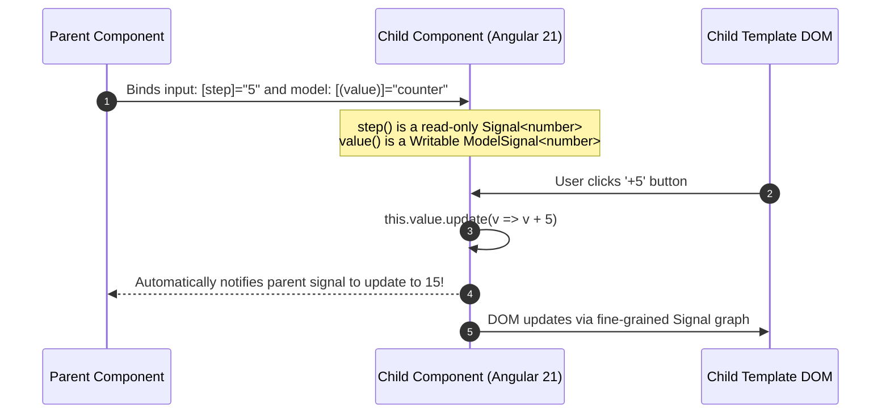

# Angular 21 Signal Inputs, Outputs, Model & Signal Queries

---

## 🐣 1. Layman's Analogy (Hinglish + Real-World ELI5)

Imagine building with **Smart Electronic Sensors instead of Old Metal Wires**:

- **Legacy Angular (`@Input()`, `@Output()`, `@ViewChild()` Decorators)**:
  - Parent component child ko ek purani wire deta tha. Agar input badal gaya, toh child ko pata nahi chalta tha jab tak wo manual lifecycle hook (`ngOnChanges`) mein jaakar check na kare.
  - `@ViewChild` ka reference template render hone se pehle `undefined` rehta tha, jisse `Cannot read property of undefined` errors aate the!
- **Modern Angular 21 (Signal Inputs & Queries)**:
  - **`input()`**: Parent se aane wala data ab ek **Live Reactive Signal** ban jata hai! Child component seedha `this.userId()` call karke current value padh sakta hai, aur `computed()` se dynamically derive kar sakta hai.
  - **`model()`**: Two-way data binding ka magic! Parent aur child dono ek hi Signal ko read aur update kar sakte hain bina kisi extra event boilerplate ke.
  - **`viewChild()`**: DOM element ya child component ka reference bhi ek Signal ban jata hai. Null pointer crashes 100% khatam!

---

## 📌 2. Point-Wise Core Mechanics & Edge Cases

### Newbie Essentials

1. **Signal Inputs (`input()` / `input.required()`)**:
   - Replaces the `@Input()` decorator.
   - An `input()` is a read-only Signal: `readonly title = input<string>('Default');`.
   - `input.required<string>()` makes the property mandatory; omitting it in the parent template causes a compile-time error.
2. **Signal Outputs (`output()`)**:
   - Replaces `@Output()` and `new EventEmitter()`.
   - `readonly submitted = output<FormData>();` produces a lightweight output emitter with zero RxJS `EventEmitter` overhead (`this.submitted.emit(data)`).
3. **Two-Way Binding with `model()`**:
   - Generates both an input signal and an automatic output change emitter (`[value]` + `(valueChange)`).
   - Enables seamless two-way banana-in-a-box syntax: `[(value)]="parentSignal"`.

### Intermediate Mechanics

4. **Signal Queries (`viewChild()` / `viewChildren()`)**:
   - Replaces `@ViewChild('myRef')` and `@ViewChildren()`.
   - Returns a Signal holding the queried component or DOM reference: `readonly inputElement = viewChild<ElementRef>('searchBox');`.
   - Since it is a Signal, components can create `computed()` signals derived directly from DOM queries!
2. **No More `ngOnChanges`**:
   - In legacy Angular, reacting to input changes required implementing `OnChanges` and inspecting `SimpleChanges` dictionaries.
   - With Signal inputs, developers use standard `computed()` or `effect()`, eliminating lifecycle hook boilerplate completely.

### Senior / Lead Edge Cases

6. **Input Transformations & Aliasing**:
   - Modern inputs support built-in transforms:
     `readonly disabled = input(false, { transform: booleanAttribute });`
   - Automatically coerces empty HTML attributes `<my-comp disabled />` into boolean `true`.
2. **Zoneless Signal Query Timing**:
   - In Zoneless Angular 21, `viewChild()` signals resolve synchronously as soon as the template view is created, eliminating the classic "ExpressionChangedAfterItHasBeenCheckedError" during query access.

---

## 📊 3. Visual System Architecture: Signal Input/Output Flow

```
┌────────────────────────────────────────────────────────┐
│                   Parent Component                     │
│  parentCount = signal(10)                              │
└──────────────────────────┬─────────────────────────────┘
                           │
                           │ 1. [(value)]="parentCount" (Two-Way Model Binding)
                           ▼
┌────────────────────────────────────────────────────────┐
│             Child Component (Angular 21)               │
│                                                        │
│  value = model.required<number>()                      │
│  step  = input<number>(1)                              │
│  changed = output<number>()                            │
│                                                        │
│  increment() {                                         │
│    this.value.update(v => v + this.step());            │
│    // Instantly syncs back to parentCount Signal!      │
│  }                                                     │
└────────────────────────────────────────────────────────┘
```



---

## 💻 4. Line-by-Line Commented Implementation: Modern Signal Component

```typescript
// Import Angular 21 Signal APIs from @angular/core
import { 
  Component, 
  input, 
  output, 
  model, 
  viewChild, 
  computed, 
  effect, 
  ElementRef, 
  booleanAttribute 
} from '@angular/core';

@Component({
  selector: 'app-counter-widget',
  standalone: true,
  template: `
    <div class="counter-box">
      <!-- Read signal input via () call syntax -->
      <h3>{{ label() }}</h3>

      <div class="controls">
        <button (click)="decrement()" [disabled]="disabled()">-</button>
        <!-- Read two-way model signal directly in template -->
        <span class="value-display">{{ count() }}</span>
        <button (click)="increment()" [disabled]="disabled()">+</button>
      </div>

      <!-- Computed signal derived from input and model -->
      <p class="status">Double Value: {{ doubledValue() }}</p>

      <!-- Template reference variable queried via viewChild signal -->
      <input #quickInput type="number" placeholder="Jump to value" />
      <button (click)="jumpToValue()">Apply</button>
    </div>
  `,
  styles: [`
    .counter-box { border: 2px solid #6200ea; padding: 16px; border-radius: 8px; width: 260px; }
    .controls { display: flex; align-items: center; justify-content: space-around; margin: 12px 0; }
    .value-display { font-size: 24px; font-weight: bold; }
    button { padding: 6px 12px; cursor: pointer; }
    .status { font-size: 12px; color: #666; }
  `]
})
export class CounterWidgetComponent {
  // 1. Mandatory Signal Input: Compiler fails if parent forgets [label]
  readonly label = input.required<string>();

  // 2. Optional Signal Input with transform: Supports `<app-counter-widget disabled />`
  readonly disabled = input(false, { transform: booleanAttribute });

  // 3. Step Increment Input with default value
  readonly step = input<number>(1);

  // 4. Two-Way Model Signal: Parent can bind via [(count)]="parentSignal"
  readonly count = model.required<number>();

  // 5. Signal Output: Emits events without legacy EventEmitter
  readonly thresholdReached = output<string>();

  // 6. Signal Query: Returns a Signal<ElementRef<HTMLInputElement> | undefined>
  readonly quickInputElement = viewChild<ElementRef<HTMLInputElement>>('quickInput');

  // 7. Computed Signal: Automatically re-computes whenever count() updates!
  readonly doubledValue = computed(() => this.count() * 2);

  constructor() {
    // 8. Effect: Automatically triggers side effects when signal dependencies change
    effect(() => {
      if (this.count() >= 100) {
        // Emit output event cleanly
        this.thresholdReached.emit(`Target reached: ${this.count()}`);
      }
    });
  }

  increment(): void {
    // Update model signal - seamlessly propagates back to parent!
    this.count.update(current => current + this.step());
  }

  decrement(): void {
    this.count.update(current => current - this.step());
  }

  jumpToValue(): void {
    // Safely access DOM element through viewChild signal
    const inputRef = this.quickInputElement();
    if (inputRef && inputRef.nativeElement.value) {
      const val = parseInt(inputRef.nativeElement.value, 10);
      this.count.set(val);
      inputRef.nativeElement.value = '';
    }
  }
}
```

---

## 🎯 5. The "Interview Pitch" (Spoken Answer)
>
> *"In Angular 21, the legacy decorator-based component API (`@Input()`, `@Output()`, `@ViewChild()`, `@ContentChild()`) has been completely superseded by functional Signal APIs.
> `input()` and `input.required()` return read-only Signals, eliminating the need for `ngOnChanges` and enabling direct composition into `computed()` signals and `effect()` blocks.
> Two-way data binding is simplified via `model()`, which creates a unified WritableSignal that handles both incoming props and outgoing change events under the standard `[(banana-in-a-box)]` syntax with zero event-emitter boilerplate.
> For DOM queries, `viewChild()` and `contentChildren()` return Signal wrappers around template elements, eliminating lifecycle race conditions and null-pointer errors.
> Combined with Zoneless change detection, Signal inputs ensure that when a prop updates, Angular notifies only the exact dependent template nodes rather than running dirty checks across the entire component subtree."*

---

## 💼 6. Production War Story

**Company**: Global Enterprise SaaS Analytics Dashboard.  
**Incident**: A core financial filter component triggered frequent `ExpressionChangedAfterItHasBeenCheckedError` crashes during route transitions, breaking dashboard loading for 14% of enterprise sessions.  
**Root Cause**: The component used legacy `@ViewChild` decorators paired with `@Input()` setters. Inside `ngAfterViewInit`, the component checked DOM dimensions and mutated input state synchronously to adjust column widths. In Angular's two-pass check cycle, this caused the child view to disagree with the parent view within the same tick.  
**Resolution**:

1. Migrated inputs to **Signal Inputs (`input.required()`)**.
2. Migrated DOM references to **Signal Queries (`viewChild<ElementRef>()`)**.
3. Converted width calculation into a **`computed()` signal** derived from the `viewChild()` dimensions.  
**Result**: `ExpressionChangedAfterItHasBeenCheckedError` crashes dropped to **0.00%**, lifecycle code shrank by 45%, and the dashboard passed strict Zoneless compatibility benchmarks.
