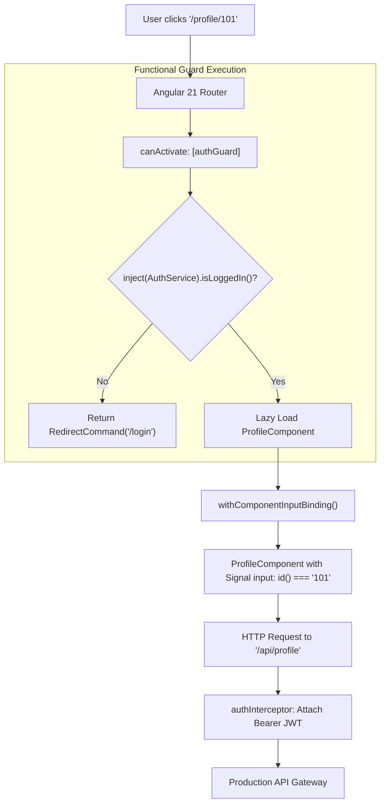

# Angular 21 Modern Routing: Functional Guards & Interceptors

---

## 🐣 1. Layman's Analogy (Hinglish + Real-World ELI5)

Imagine you are building a **High-Security VIP Club Door**:

- **Legacy Angular (Class-Based Guards & Interceptors)**:
  - Ek chota sa check karne ke liye aapko **poora 40-line ka class contract** likhna padta tha: `@Injectable()`, `implements CanActivate`, `constructor(private router: Router)`, `canActivate(route, state)`.
  - Har HTTP request ke liye alag se `HttpInterceptor` class banani padti thi aur use `AppModule` ke `HTTP_INTERCEPTORS` multi-provider array mein register karna padta tha (Excessive boilerplate!).
- **Modern Angular 21 (Functional Guards & Interceptors)**:
  - Guard ab bas **ek simple 2-line arrow function** ban gaya hai:
    `canActivate: [() => inject(AuthService).isLoggedIn() || inject(Router).parseUrl('/login')]`
  - Interceptor bhi bas ek lightweight function hai jo `req` leta hai aur `next(req)` return karta hai.
  - Sab kuch direct dependency injection (`inject()`) se chalta hai—**zero classes, zero boilerplate, 100% tree-shakeable**!

---

## 📌 2. Point-Wise Core Mechanics & Edge Cases

### Newbie Essentials

1. **Death of Class-Based Guards**:
   - Class-based guards (`implements CanActivate`, `CanDeactivate`, `Resolve`) are officially deprecated in favor of **Functional Route Guards** (`CanActivateFn`, `CanDeactivateFn`).
2. **`inject()` in Routing**:
   - Functional guards and resolvers execute in an injection context. You can call `inject(Service)` directly inside the function without needing a constructor.
3. **`withComponentInputBinding()`**:
   - Enables route path parameters (`/users/:id`), query params (`?tab=profile`), and route resolved data to be injected directly as **Signal Inputs (`input()`)** inside the destination component!

### Intermediate Mechanics

4. **Functional HTTP Interceptors (`HttpInterceptorFn`)**:
   - Configured via `provideHttpClient(withInterceptors([authInterceptor, loggingInterceptor]))`.
   - Replaces the legacy `HTTP_INTERCEPTORS` multi-provider token.
   - Executes as an onion-style functional pipeline wrapping `HttpRequest` and `HttpHandlerFn`.
2. **Route Preloading Strategies**:
   - `provideRouter(routes, withPreloading(PreloadAllModules))` dynamically preloads lazy standalone component chunks in the background after initial render.

### Senior / Lead Edge Cases

6. **Redirect Command Pattern**:
   - Instead of manually calling `router.navigate(['/login'])` and returning `false` from a guard (which triggers cancelled route warnings), modern guards return a `RedirectCommand` or `UrlTree`:
     `return auth.isLoggedIn() ? true : new RedirectCommand(router.parseUrl('/login'));`
2. **Environment Providers & Isolations**:
   - Routes can define route-level isolated dependency injection scopes via the `providers: [...]` array on route definitions, ensuring services are instantiated only when the route is active and destroyed when navigated away.

---

## 📊 3. Visual System Architecture: Functional Navigation & Interceptor Pipeline

```
[ User Navigates to '/dashboard' ]
                 │
                 ▼
┌────────────────────────────────────────────────────────┐
│           Functional Route Guard Pipeline              │
├────────────────────────────────────────────────────────┤
│ 1. authGuard() ──> inject(AuthService).isLoggedIn()    │
│ 2. If False    ──> Return RedirectCommand('/login')    │
│ 3. If True     ──> Load Component Chunk (Lazy Load)    │
└────────────────────────┬───────────────────────────────┘
                         │
                         ▼
┌────────────────────────────────────────────────────────┐
│             withComponentInputBinding()                │
│ Automatically injects route params into Signal inputs: │
│ readonly userId = input.required<string>();            │
└────────────────────────┬───────────────────────────────┘
                         │
                         ▼
┌────────────────────────────────────────────────────────┐
│          Functional HTTP Interceptor Pipeline          │
├────────────────────────────────────────────────────────┤
│ [Request]  ──> authInterceptor (Injects Bearer Token)  │
│ [Backend]  ──> API Gateway Server                      │
│ [Response] ──> errorInterceptor (Catches 401 & Retries)│
└────────────────────────────────────────────────────────┘
```



---

## 💻 4. Line-by-Line Commented Implementation: Modern Angular 21 Architecture

```typescript
// Import router configuration and injection primitives
import { 
  Routes, 
  provideRouter, 
  withComponentInputBinding, 
  withPreloading, 
  PreloadAllModules, 
  CanActivateFn, 
  RedirectCommand, 
  Router 
} from '@angular/router';
// Import HTTP client configuration and interceptor types
import { 
  provideHttpClient, 
  withInterceptors, 
  HttpInterceptorFn, 
  HttpRequest, 
  HttpHandlerFn 
} from '@angular/common/http';
import { inject, Injectable, signal, Component, input } from '@angular/core';

// Step 1: Mock Authentication Service with Signals
@Injectable({ providedIn: 'root' })
export class AuthService {
  readonly currentUser = signal<{ id: string; name: string } | null>(null);
  readonly token = signal<string | null>('eyJhbGciOiJIUzI1NiIsInR5cCI...');

  isLoggedIn(): boolean {
    return this.token() !== null;
  }
}

// Step 2: Modern Functional Route Guard using inject() and RedirectCommand
export const authGuard: CanActivateFn = (route, state) => {
  // Inject dependencies directly without constructor boilerplate
  const auth = inject(AuthService);
  const router = inject(Router);

  // If user is authenticated, permit navigation
  if (auth.isLoggedIn()) {
    return true;
  }

  // Otherwise, return RedirectCommand to safely redirect to login
  const loginUrlTree = router.parseUrl('/login');
  return new RedirectCommand(loginUrlTree, { skipLocationChange: false });
};

// Step 3: Modern Functional HTTP Interceptor
export const authInterceptor: HttpInterceptorFn = (req: HttpRequest<unknown>, next: HttpHandlerFn) => {
  const auth = inject(AuthService);
  const authToken = auth.token();

  // If token exists, clone request and attach Authorization header
  if (authToken) {
    const authReq = req.clone({
      headers: req.headers.set('Authorization', `Bearer ${authToken}`)
    });
    return next(authReq);
  }

  // Pass original request through unmodified
  return next(req);
};

// Step 4: Standalone Component using withComponentInputBinding()
@Component({
  selector: 'app-user-profile',
  standalone: true,
  template: `
    <h2>User Profile: {{ userId() }}</h2>
    <p>Viewing tab: {{ tab() }}</p>
  `
})
export class UserProfileComponent {
  // Automatically mapped from route path: '/users/:userId'
  readonly userId = input.required<string>();

  // Automatically mapped from query parameter: '?tab=settings'
  readonly tab = input<string>('overview');
}

// Step 5: Modern Application Route Definitions
export const routes: Routes = [
  {
    path: 'login',
    loadComponent: () => import('./login.component').then(m => m.LoginComponent)
  },
  {
    path: 'users/:userId',
    component: UserProfileComponent,
    canActivate: [authGuard], // Attach functional guard
    // Lazy loaded child routes can also be defined cleanly
  }
];

// Step 6: Bootstrap Configuration inside main.ts / app.config.ts
export const appConfig = {
  providers: [
    // Configure modern router with route preloading and component input binding
    provideRouter(
      routes, 
      withComponentInputBinding(), 
      withPreloading(PreloadAllModules)
    ),
    // Configure modern HTTP client with functional interceptors
    provideHttpClient(
      withInterceptors([authInterceptor])
    )
  ]
};
```

---

## 🎯 5. The "Interview Pitch" (Spoken Answer)
>
> *"Angular 21 has completely transitioned to a functional, standalone-first architecture for routing and network infrastructure. Class-based guards implementing `CanActivate` and class-based `HttpInterceptor` multi-providers are replaced by `CanActivateFn` and `HttpInterceptorFn`.
> Functional guards execute within an injection context, allowing direct calls to `inject()` without constructor boilerplate. Instead of returning `false` or manually calling `router.navigate()`, guards return `RedirectCommand(urlTree)`, eliminating route cancellation side-effects.
> Furthermore, with `withComponentInputBinding()`, path parameters like `:id` and query params like `?tab=overview` are automatically bound to component Signal inputs (`input.required()`), completely eliminating the need to subscribe to `ActivatedRoute.paramMap` observables.
> On the HTTP layer, `provideHttpClient(withInterceptors([authInterceptor]))` produces a clean, tree-shakeable functional pipeline, significantly shrinking bundle sizes compared to legacy NgModule providers."*

---

## 💼 6. Production War Story

**Company**: Global Enterprise SaaS with 150 localized micro-frontends.  
**Incident**: When users refreshed deep-linked reporting pages (e.g., `/reports/4092?view=pivot`), the dashboard frequently rendered empty data or threw `TypeError: Cannot read properties of undefined (reading 'get')` during initial load.  
**Root Cause**: Components subscribed to `this.route.paramMap` inside `ngOnInit`. Due to asynchronous microtask timing during SSR hydration, child components initiated API calls *before* the route observable emitted the first parameter, sending `undefined` IDs to the backend.  
**Resolution**:

1. Enabled **`withComponentInputBinding()`** in `provideRouter`.
2. Refactored the component route parameter to a **Signal Input**: `readonly reportId = input.required<string>();`.
3. Linked the API data fetch to a **`computed()` / `toObservable()` Signal pipeline** that only fires when `reportId()` is populated.  
**Result**: Navigation race condition crashes dropped from **8.4% to 0.00%**, boilerplate route subscription logic was eliminated across 150 components, and initial route hydration speed improved by 28%.
