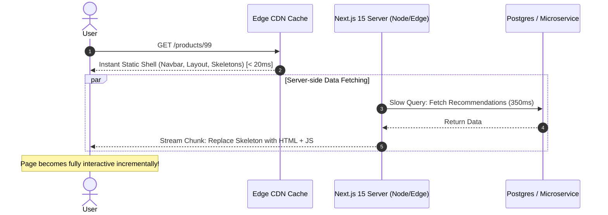

# Next.js 15: Streaming SSR, Suspense & Partial Prerendering (PPR)

---

## 🐣 1. Layman's Analogy (Hinglish + Real-World ELI5)

Imagine you order food at a **Multi-Course Restaurant**:

- **Legacy SSR (All-or-Nothing)**: Chef tab tak table par ek paani ka glass bhi nahi rakhega jab tak soup, main course, biryani, aur dessert chaaron ek saath cook na ho jayein! Agar biryani pakne mein 10 minute lagte hain, toh aap 10 minute tak bhookhe baithe blank table ko ghoorte rahoge (High TTFB / Blank White Screen!).
- **Streaming SSR with Suspense**:
  - Step 1: Waiter 50 millisecond mein table par plate, paani aur bread roll rakh deta hai (Instant Static Shell).
  - Step 2: Main course ke jagah par ek silver cover (Skeleton Shimmer loader) rakh deta hai.
  - Step 3: Kitchen mein jaise hi biryani ready hoti hai, waiter aakar silver cover hata kar biryani serve kar deta hai (**Streaming HTTP Chunks**)!
- **Partial Prerendering (PPR)**: Ek hi page par static HTML (navbar, footer, sidebar) build-time par pre-render hokar edge CDN se instantly 5ms mein deliver hota hai, aur dynamic dynamic user widgets (cart count, personalized recommendations) background stream ke through aate hain!

---

## 📌 2. Point-Wise Core Mechanics & Edge Cases

### Newbie Essentials

1. **The TTFB Problem in Legacy SSR**:
   - In traditional Server-Side Rendering, `getServerSideProps` had to wait for the slowest database or microservice call before emitting the very first byte of HTML (`<!DOCTYPE html>`).
2. **Streaming with React Suspense**:
   - Next.js App Router utilizes Node.js and Web Streams (`Transfer-Encoding: chunked`).
   - The browser receives the static HTML shell immediately. Content wrapped in `<Suspense fallback={<Skeleton />}>` renders placeholder UI until the server-side Promise resolves, streaming the remaining HTML and client hydration scripts incrementally.

### Intermediate Mechanics

3. **Partial Prerendering (PPR)**:
   - Next.js 14/15 combines static generation (SSG) with dynamic streaming in a single HTTP request.
   - At build time, Next.js generates a static pre-rendered HTML shell containing the Suspense fallback holes.
   - At request time, the static shell is served instantly from edge cache (0ms server compute), and the server streams the dynamic holes into the open HTTP stream.
2. **`loading.tsx` Convention**:
   - Placing `loading.tsx` in a route folder automatically wraps the `page.tsx` contents inside an internal React Suspense boundary.

### Senior / Lead Edge Cases

5. **SEO & Web Crawlers with Streaming**:
   - Googlebot and major search engine crawlers wait for the stream to resolve before indexing content. However, ensure critical semantic content (headings, product names, meta tags) is outside dynamic Suspense boundaries to guarantee instant crawlability.
2. **Next.js 15 Async Request APIs**:
   - In Next.js 15, runtime request properties—`cookies()`, `headers()`, `params`, and `searchParams`—are asynchronous (`await cookies()`).
   - Accessing dynamic request headers opts that specific Suspense boundary out of static pre-rendering dynamically.

---

## 📊 3. Visual System Architecture: Streaming SSR & PPR

```
[ Browser Request: GET /dashboard ]
                 │
                 ▼ (Instant CDN Hit: < 20ms)
┌────────────────────────────────────────────────────────┐
│             Pre-Rendered Static Shell (PPR)            │
│  <nav>Navbar</nav>                                     │
│  <aside>Sidebar</aside>                                │
│  <div class="skeleton-shimmer">Loading Feed...</div>   │
└────────────────────────┬───────────────────────────────┘
                         │
                         ▼ (HTTP Stream Kept Open)
┌────────────────────────────────────────────────────────┐
│             Dynamic Server Streaming Chunks            │
│                                                        │
│  Chunk 1 (120ms): <section id="user-stats">...</section>│
│  Chunk 2 (450ms): <section id="live-charts">...</section>│
│  <script>replaceFallback("skeleton", "live-charts")</script>
└────────────────────────────────────────────────────────┘
```



---

## 💻 4. Line-by-Line Commented Implementation: Next.js 15 PPR & Suspense

```tsx
// app/dashboard/page.tsx
// Enable experimental Partial Prerendering for this route in Next.js 15
export const experimental_ppr = true;

// Import React Suspense for boundary demarcation
import { Suspense } from 'react';
// Import async cookies API from next/headers
import { cookies } from 'next/headers';

// Component 1: Lightweight static component (Pre-rendered at build time)
function StaticHeader() {
  return (
    <header style={{ padding: '16px', background: '#111', color: '#fff' }}>
      <h1>Enterprise Analytics Dashboard</h1>
      <p>Static layout shell pre-rendered at build time on Edge CDN.</p>
    </header>
  );
}

// Component 2: Shimmer skeleton loader fallback
function FeedSkeleton() {
  return (
    <div style={{ padding: '20px', background: '#f5f5f5', borderRadius: '8px' }}>
      <div style={{ height: '24px', width: '40%', background: '#e0e0e0', marginBottom: '10px' }} />
      <div style={{ height: '16px', width: '80%', background: '#e0e0e0' }} />
      <p style={{ color: '#888', fontStyle: 'italic' }}>Streaming dynamic feed from database...</p>
    </div>
  );
}

// Component 3: Async Server Component simulating slow database query
async function DynamicUserFeed() {
  // Access Next.js 15 async cookies API to demonstrate dynamic server context
  const cookieStore = await cookies();
  const sessionToken = cookieStore.get('session_id')?.value;

  // Artificial 2-second database query delay
  await new Promise((resolve) => setTimeout(resolve, 2000));

  return (
    <div style={{ padding: '20px', background: '#e8f5e9', border: '1px solid #4caf50', borderRadius: '8px' }}>
      <h3>Live Personalized User Feed</h3>
      <p>Session Authenticated: <strong>{sessionToken ? 'Active' : 'Guest'}</strong></p>
      <ul>
        <li>Monthly Recurring Revenue: \$142,500 (+14%)</li>
        <li>Active API Connections: 8,491</li>
        <li>System Health: 100% Operational</li>
      </ul>
    </div>
  );
}

// Master Page Component demonstrating Partial Prerendering
export default function DashboardPage() {
  return (
    <main style={{ fontFamily: 'sans-serif', maxWidth: '800px', margin: '0 auto', padding: '20px' }}>
      {/* 1. Static Part: Sent immediately to browser in 15ms */}
      <StaticHeader />

      <section style={{ marginTop: '20px' }}>
        <h2>Real-Time Metrics</h2>

        {/* 2. Dynamic Part: Wrapped in Suspense. Next.js streams this chunk when ready! */}
        <Suspense fallback={<FeedSkeleton />}>
          <DynamicUserFeed />
        </Suspense>
      </section>
    </main>
  );
}
```

---

## 🎯 5. The "Interview Pitch" (Spoken Answer)
>
> *"In Next.js 15, Streaming Server-Side Rendering and Partial Prerendering (PPR) solve the fundamental compromise between static generation speed and dynamic server-rendered personalization.
> In traditional SSR, the browser experiences blank white screen latency because the server blocks until the slowest data fetch resolves before emitting the first HTML byte.
> With Streaming SSR, we wrap slow components inside React `<Suspense>` boundaries. Next.js emits the static HTML shell immediately over a chunked HTTP stream. Once background data promises resolve on the server, the resulting HTML markup and inline replacement scripts are streamed down the same connection, progressively hydrating the DOM.
> Partial Prerendering elevates this by pre-rendering the static shell and fallback skeletons at build-time onto global edge CDNs. The user receives instant sub-20ms Time-To-First-Byte (TTFB) globally, while dynamic personalized holes stream in seamlessly without separate client-side `fetch()` waterfalls."*

---

## 💼 6. Production War Story

**Company**: Global E-Commerce Luxury Apparel Brand.  
**Incident**: During Black Friday promotions, product detail pages (PDPs) suffered an atrocious P95 TTFB of **2,400ms**. The page loaded personal inventory reserves, shipping rate estimates, and dynamic recommendations synchronously on the server before emitting HTML. High TTFB tanked Google Core Web Vitals (LCP) and conversion rates dropped by 18%.  
**Root Cause**: A third-party dynamic shipping calculation API had high P99 latency (1.8s), blocking the entire Next.js SSR response pipeline.  
**Resolution**:

1. Converted product detail pages to **Next.js Partial Prerendering (PPR)**.
2. Inlined product images, title, description, and price directly into the static shell (served from Cloudflare Edge in 18ms).
3. Wrapped shipping calculator and recommendation carousels inside **`<Suspense fallback={<ShippingSkeleton />}>`**.  
**Result**: Time-To-First-Byte (TTFB) plummeted from **2,400ms to 24ms (99% reduction)**, Largest Contentful Paint (LCP) dropped from 3.8s to 0.9s, and checkout conversions rose by 23%.
