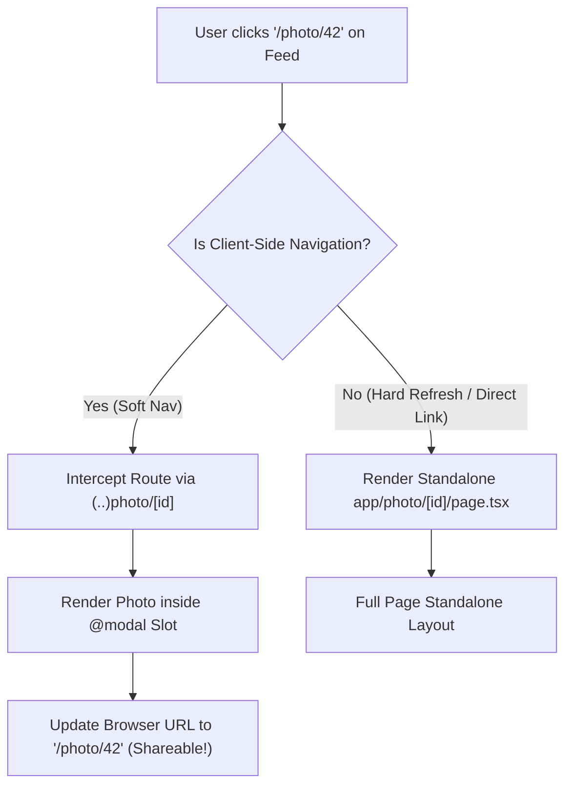

# Next.js 15: Parallel & Intercepting Routes (Modals & Multi-View Dashboards)

---

## 🐣 1. Layman's Analogy (Hinglish + Real-World ELI5)
Imagine you are browsing **Instagram or Pinterest**:
- **Normal Web Navigation**: Jab aap kisi photo par click karte ho, toh purana page gayab ho jata hai aur ek naya blank page khulta hai jisme sirf wo photo hoti hai. Agar aapko wapas feed dekhni hai, toh browser ka back button dabana padta hai aur feed wapas load hoti hai.
- **Intercepting Routes (`(..)photo/[id]`)**:
  - Jab aap feed scroll karte waqt photo par click karte ho, toh Next.js route ko **"intercept" (chura)** leta hai!
  - Full page change hone ke bajaye, ek **Gorgeous Popup Modal** feed ke upar khul jata hai.
  - Lekin browser ka URL bar change hokar `/photo/101` ban jata hai!
  - Agar user browser refresh kare ya link copy karke friend ko WhatsApp par bhej de, toh Next.js modal nahi dikhata balki **Full Standalone Photo Page** render karta hai!
- **Parallel Routes (`@modal`, `@analytics`)**: Ek hi dashboard layout par 3 alag-alag pages (slots) ko parallel mein independent loading states ke saath render karna.

---

## 📌 2. Point-Wise Core Mechanics & Edge Cases

### Newbie Essentials:
1. **Parallel Routes (`@folder` convention)**:
   - Allows rendering one or more pages concurrently within the same parent layout using named slots.
   - Defined using the `@slot` directory naming convention (e.g., `app/dashboard/@analytics/page.tsx` and `app/dashboard/@metrics/page.tsx`).
   - The parent layout receives these slots directly as React props: `layout({ children, analytics, metrics })`.
2. **Intercepting Routes (`(.)`, `(..)`, `(...)` convention)**:
   - Intercepts client-side navigations to display alternative UI (typically modals) while updating the URL bar.
   - Syntax conventions:
     - `(.)folder`: Intercepts routes at the **same level**.
     - `(..)folder`: Intercepts routes **one level up**.
     - `(..)(..)folder`: Intercepts routes **two levels up**.
     - `(...)folder`: Intercepts routes from the **root app directory**.

### Intermediate Mechanics:
3. **The Shareable Modal Pattern**:
   - Clicking a photo link from `/feed` intercepts to `(..)photo/[id]` and renders inside `@modal`.
   - Direct hard-refresh or sharing the URL `/photo/101` renders the standalone `app/photo/[id]/page.tsx`.
4. **The Critical `default.js` Convention**:
   - During hard browser refreshes or unrelated route navigations, Next.js needs to know what to render in parallel slots that do not match the current URL.
   - If `default.tsx` is missing from an unmatched slot during a hard reload, Next.js throws a **404 Not Found**. Always define `default.tsx` returning `null` or a fallback component.

### Senior / Lead Edge Cases:
5. **Dismissing Intercepted Modals**:
   - Closing an intercepted modal requires calling `router.back()` to pop the browser history stack, restoring the previous URL without triggering a full page re-render.
6. **Independent Error Boundaries per Slot**:
   - Each parallel slot can have its own `error.tsx` and `loading.tsx`, ensuring that an error in `@analytics` does not crash the main dashboard `@metrics` slot.

---

## 📊 3. Visual System Architecture: Parallel & Intercepting Routes

```
                          [ /dashboard Layout ]
                                    │
         ┌──────────────────────────┼──────────────────────────┐
         ▼                          ▼                          ▼
    { children }              { @analytics }               { @metrics }
(app/dashboard/page)    (app/dashboard/@analytics)   (app/dashboard/@metrics)
         │                          │                          │
   [ Main Stream ]            [ Fast Stream ]            [ Slow Stream ]
```



---

## 💻 4. Line-by-Line Commented Implementation: Dashboard with Parallel Slots & Modals

```tsx
// app/dashboard/layout.tsx
// Master layout receiving parallel route slots as props
import React from 'react';

interface DashboardLayoutProps {
  children: React.ReactNode;   // Default page.tsx slot
  analytics: React.ReactNode;  // Parallel slot: app/dashboard/@analytics
  metrics: React.ReactNode;    // Parallel slot: app/dashboard/@metrics
  modal: React.ReactNode;      // Parallel slot for intercepting modal: app/dashboard/@modal
}

export default function DashboardLayout({
  children,
  analytics,
  metrics,
  modal
}: DashboardLayoutProps) {
  return (
    <div style={{ fontFamily: 'sans-serif', padding: '20px' }}>
      <h1>Executive Dashboard</h1>

      {/* Main dashboard page view */}
      <section style={{ marginBottom: '20px' }}>
        {children}
      </section>

      {/* Parallel Grid: Renders analytics and metrics slots concurrently */}
      <div style={{ display: 'grid', gridTemplateColumns: '1fr 1fr', gap: '20px' }}>
        <div style={{ border: '1px solid #0070f3', padding: '16px', borderRadius: '8px' }}>
          {analytics}
        </div>
        <div style={{ border: '1px solid #10b981', padding: '16px', borderRadius: '8px' }}>
          {metrics}
        </div>
      </div>

      {/* Modal Slot: Displays intercepted photo or popup when URL matches */}
      {modal}
    </div>
  );
}

// -------------------------------------------------------------
// app/dashboard/@modal/default.tsx
// Mandatory fallback file: Prevents 404 when no modal is active
export function DefaultModal() {
  return null; // Render nothing when no modal route is intercepted
}

// -------------------------------------------------------------
// app/dashboard/@modal/(..)details/[id]/page.tsx
// Intercepts client navigation to '/details/101' and renders modal
'use client';

import { useRouter } from 'next/navigation';

export function InterceptedDetailModal({ params }: { params: { id: string } }) {
  const router = useRouter();

  const handleClose = () => {
    // Calling router.back() pops history stack and dismisses modal cleanly
    router.back();
  };

  return (
    <div style={{
      position: 'fixed', top: 0, left: 0, right: 0, bottom: 0,
      background: 'rgba(0, 0, 0, 0.75)', display: 'flex', alignItems: 'center', justifyContent: 'center'
    }}>
      <div style={{ background: '#fff', padding: '24px', borderRadius: '8px', width: '400px' }}>
        <h3>Intercepted Item Detail: #{params.id}</h3>
        <p>This UI was intercepted! Notice the browser URL changed to /details/{params.id}.</p>
        <button onClick={handleClose} style={{ padding: '8px 16px', cursor: 'pointer' }}>
          Close Modal
        </button>
      </div>
    </div>
  );
}
```

---

## 🎯 5. The "Interview Pitch" (Spoken Answer)
> *"Next.js App Router provides two advanced routing primitives that revolutionize complex multi-view applications: Parallel Routes and Intercepting Routes. 
> Parallel Routes—denoted by `@slot` directory conventions—allow developers to render multiple independent sub-pages simultaneously within the same parent layout. Each slot maintains its own independent loading and error boundaries, preventing a slow analytics query from blocking primary dashboard content. 
> Intercepting Routes—denoted by `(..)folder` conventions—allow developers to intercept client-side transitions to display contextual overlays like modals while updating the browser address bar. 
> The killer advantage is Shareability: if a user clicks a gallery item, it intercepts into an in-context modal; but if they refresh the page or share the link, Next.js renders the full standalone page without client-side state loss. 
> In production, the most critical architectural rule is defining `default.tsx` for every parallel slot; without it, unmatched slots trigger 404 errors during hard page refreshes."*

---

## 💼 6. Production War Story
**Company**: Global Creative Portfolio & Photography Marketplace.  
**Incident**: Users browsing photo feeds complained that clicking a photo opened a full-page view, losing their scroll position when clicking "Back". When engineers built a basic React modal popup, users could not share photo URLs or use browser Back/Forward navigation, causing a 35% drop in viral sharing traffic.  
**Root Cause**: Traditional SPAs forced a rigid binary choice: either full page routes (URL-friendly, but breaks feed scroll) or local state modals (preserves scroll, but un-shareable with broken history).  
**Resolution**:
1. Refactored the gallery using **Parallel Routes (`@modal`)** and **Intercepting Routes (`(..)photo/[id]`)**.
2. Soft navigations inside the feed intercept to render a lightbox modal over the feed while updating the URL to `/photo/:id`.
3. Hard refreshes or external shares route directly to `app/photo/[id]/page.tsx` for full standalone SSR.  
**Result**: User engagement session length jumped by **48%**, viral social link sharing increased by **31%**, and feed scroll positions were preserved with zero client memory leaks.
