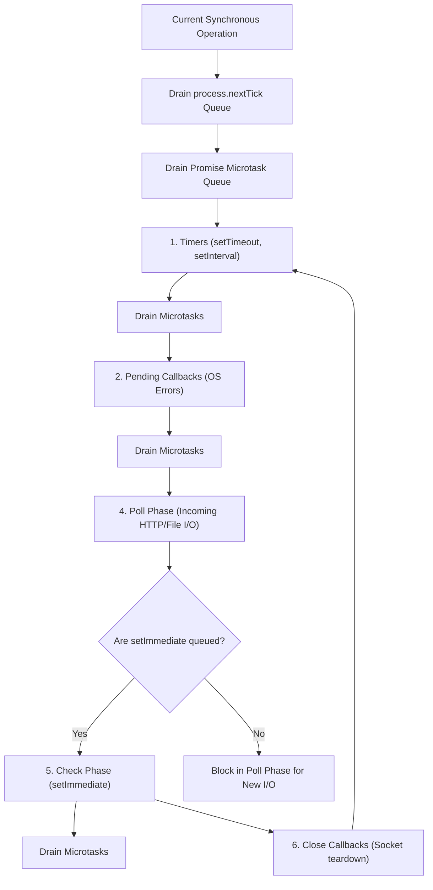

# Libuv Event Loop: The 6 Phases, process.nextTick & setImmediate

---

## 🐣 1. Layman's Analogy (Hinglish + Real-World ELI5)
Imagine a busy **Airport Departure Terminal Manager**:
- Manager (Single Threaded Event Loop) lagataar 6 specific counters (Phases) ke chakkar lagata hai:
  1. **Timers Counter**: Ghadi check karta hai—kya kisi flight ka board time ho gaya? (`setTimeout`, `setInterval`).
  2. **Pending I/O Counter**: Kya kisi purani cancelled flight ka system error report pending hai?
  3. **Idle/Prepare Counter**: Terminal ke internal system checks.
  4. **Poll Counter (Sabse Bada Adda)**: Yahan manager rukta hai aur naye passengers (incoming network HTTP requests, database responses) ka intezaar karta hai!
  5. **Check Counter**: Special VIP passengers jinko turant exit karna hai (`setImmediate()`).
  6. **Close Callbacks Counter**: Jo flights depart ho chuki hain, unke gates lock karna (`socket.on('close')`).
- **`process.nextTick()` ka Twist**: Yeh ek **Emergency Red Alert Button** hai! Manager chahe kisi bhi counter par ho, red alert aate hi wo turant current kaam ke baad aur agle phase se pehle saare `nextTick` callbacks execute karta hai! Agar aapne infinite `nextTick` chala diya, toh poora airport freeze ho jayega (Event Loop Starvation!).

---

## 📌 2. Point-Wise Core Mechanics & Edge Cases

### Newbie Essentials:
1. **The 6 Discrete Phases**:
   - **1. Timers**: Executes callbacks scheduled by `setTimeout()` and `setInterval()` whose threshold has expired.
   - **2. Pending Callbacks**: Executes I/O callbacks deferred from previous iterations (e.g. some TCP socket errors).
   - **3. Idle, Prepare**: Used internally by Node.js for internal housekeeping.
   - **4. Poll**: Retrieves new I/O events (network connections, reading files). If the poll queue is empty, the loop blocks here waiting for incoming I/O events (unless `setImmediate` is queued).
   - **5. Check**: Executes callbacks scheduled specifically via `setImmediate()`.
   - **6. Close Callbacks**: Handles teardown events (e.g., `socket.on('close', ...)`).

### Intermediate Mechanics:
2. **`process.nextTick()` vs `setImmediate()`**:
   - Despite its name, `process.nextTick()` does NOT run on the "next tick"—it runs **immediately after the current operation**, before the event loop advances to the next phase.
   - `setImmediate()` runs during the **Check phase** of the event loop.
3. **Microtask Queue Priority**:
   - Between *every individual phase* of the Libuv event loop, Node.js exhausts two microtask queues:
     1. `process.nextTick` queue (highest priority).
     2. Promise resolution microtask queue (`Promise.resolve()`, `queueMicrotask`).

### Senior / Lead Edge Cases:
4. **The `setTimeout(fn, 0)` vs `setImmediate(fn)` Race Condition**:
   - When run in the main module context, whether `setTimeout(0)` or `setImmediate()` executes first is non-deterministic because it depends on OS process performance and clock jitter.
   - However, when wrapped inside an **I/O callback (Poll phase)**, `setImmediate()` is **100% guaranteed** to run before `setTimeout()`, because the loop transitions from Poll $\to$ Check before wrapping around to Timers!
5. **Event Loop Starvation**:
   - Recursive `process.nextTick()` calls completely starve the event loop, preventing Node.js from ever reaching the Poll phase to accept incoming network sockets.

---

## 📊 3. Visual System Architecture: The Libuv Event Loop Lifecycle

```
                 ┌───────────────────────────┐
                 │       Incoming I/O        │
                 └─────────────┬─────────────┘
                               │
            ┌──────────────────▼──────────────────┐
     ┌─────►│           1. TIMERS                 │
     │      │   (setTimeout, setInterval)         │
     │      └──────────────────┬──────────────────┘
     │                         │ [Microtasks: nextTick & Promises]
     │      ┌──────────────────▼──────────────────┐
     │      │      2. PENDING CALLBACKS           │
     │      │   (Deferred system socket errors)   │
     │      └──────────────────┬──────────────────┘
     │                         │ [Microtasks: nextTick & Promises]
     │      ┌──────────────────▼──────────────────┐
     │      │       3. IDLE, PREPARE              │
     │      │     (Internal Node housekeeping)    │
     │      └──────────────────┬──────────────────┘
     │                         │ [Microtasks: nextTick & Promises]
     │      ┌──────────────────▼──────────────────┐
     │      │           4. POLL                   │<─── Blocks waiting
     │      │   (Retrieve & execute I/O callbacks)│     for new requests!
     │      └──────────────────┬──────────────────┘
     │                         │ [Microtasks: nextTick & Promises]
     │      ┌──────────────────▼──────────────────┐
     │      │           5. CHECK                  │
     │      │       (setImmediate callbacks)      │
     │      └──────────────────┬──────────────────┘
     │                         │ [Microtasks: nextTick & Promises]
     │      ┌──────────────────▼──────────────────┐
     │      │      6. CLOSE CALLBACKS             │
     │      │    (socket.on('close', ...))        │
     │      └──────────────────┬──────────────────┘
     │                         │ [Microtasks: nextTick & Promises]
     └─────────────────────────┘
```



---

## 💻 4. Line-by-Line Commented Implementation: Proving Phase Execution Order

```javascript
// Import fs module for real asynchronous file I/O
const fs = require('fs');

console.log('=== 1. Synchronous Main Script Start ===');

// Step 1: Schedule Timers Phase task
setTimeout(() => {
  console.log('--- [Timers Phase] setTimeout(0ms) executed ---');
}, 0);

// Step 2: Schedule Check Phase task
setImmediate(() => {
  console.log('--- [Check Phase] setImmediate executed ---');
});

// Step 3: Schedule Microtask via Promise
Promise.resolve().then(() => {
  console.log('>>> [Promise Microtask] Promise.then callback executed');
});

// Step 4: Schedule NextTick Queue task (Highest microtask priority)
process.nextTick(() => {
  console.log('>>> [nextTick Queue] process.nextTick callback executed');
});

// Step 5: Wrap in Poll Phase (File I/O) to prove deterministic setImmediate ordering
fs.readFile(__filename, () => {
  console.log('\n=== [Poll Phase] I/O Read Callback Executed ===');

  // Inside I/O callback, setImmediate is GUARANTEED to run before setTimeout!
  setTimeout(() => {
    console.log('  [Timers inside I/O] setTimeout executed');
  }, 0);

  setImmediate(() => {
    console.log('  [Check inside I/O] setImmediate executed GUARANTEED FIRST!');
  });

  process.nextTick(() => {
    console.log('  [Microtask inside I/O] process.nextTick executed before check');
  });
});

console.log('=== 2. Synchronous Main Script End ===\n');

/*
EXPECTED DETERMINISTIC EXECUTION OUTPUT:
=== 1. Synchronous Main Script Start ===
=== 2. Synchronous Main Script End ===
>>> [nextTick Queue] process.nextTick callback executed
>>> [Promise Microtask] Promise.then callback executed
--- [Timers Phase] setTimeout(0ms) executed (or Check depending on clock tick)
--- [Check Phase] setImmediate executed

=== [Poll Phase] I/O Read Callback Executed ===
  [Microtask inside I/O] process.nextTick executed before check
  [Check inside I/O] setImmediate executed GUARANTEED FIRST!
  [Timers inside I/O] setTimeout executed
*/
```

---

## 🎯 5. The "Interview Pitch" (Spoken Answer)
> *"Node.js achieves non-blocking asynchronous concurrency using the Libuv C event loop, which continuously cycles through 6 distinct phases: Timers, Pending Callbacks, Idle/Prepare, Poll, Check, and Close Callbacks. 
> The core engine is the Poll phase: it retrieves and executes new I/O events from the OS kernel. If the queue is empty, the loop blocks in Poll waiting for network packets—unless callbacks are queued in the Check phase, in which case it advances to Check to run `setImmediate()`. 
> Crucially, `process.nextTick()` and Promise microtasks do not belong to Libuv; they are managed by Node.js and drain completely between *every single phase transition*. 
> A classic senior interview trap is comparing `setTimeout(fn, 0)` with `setImmediate(fn)`: at top-level script execution, their ordering is non-deterministic due to OS clock granularity; however, inside an I/O callback, `setImmediate()` is mathematically guaranteed to execute first because the loop moves directly from Poll to Check before cycling back to Timers."*

---

## 💼 6. Production War Story
**Company**: Real-Time FinTech Payment Webhook Gateway.  
**Incident**: During Black Friday surges, the payment notification service stopped accepting new incoming HTTP webhooks, causing thousands of payment confirmations to fail. Metrics showed CPU was at 100%, yet the database was idle and no outgoing requests were executing.  
**Root Cause**: A junior engineer implemented an in-memory retry mechanism using recursive `process.nextTick()` to retry failed database writes. Because `process.nextTick` queues drain continuously before the event loop can advance, the recursive queue starved the event loop, completely blocking the Libuv Poll phase from ever accepting incoming TCP connections.  
**Resolution**:
1. Replaced recursive `process.nextTick()` with **`setImmediate()`** and **exponential backoff via timers**, allowing the loop to cycle through Poll on every retry.
2. Added an event loop lag health-check monitor using `perf_hooks` (`monitorEventLoopDelay`).
3. Alerted on any loop delay exceeding 50ms to auto-shed traffic to secondary replicas.  
**Result**: Webhook gateway throughput stabilized at **12,000 RPS**, event loop lag dropped from **15,000ms to 2.1ms**, and zero webhooks were dropped during subsequent peak shopping spikes.
