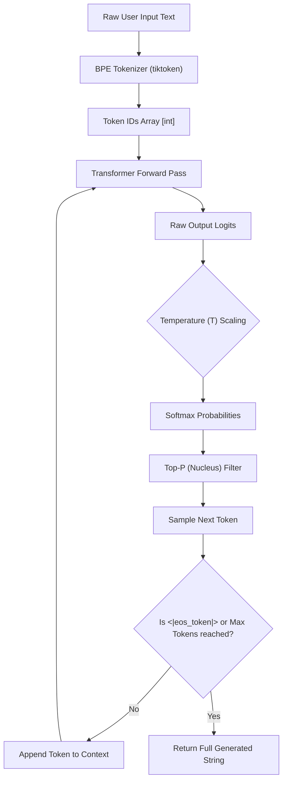

# LLM Fundamentals: Tokenization, Context Window & Sampling Parameters

---

## 🐣 1. Layman's Analogy (Hinglish + Real-World ELI5)

Imagine a large language model (LLM) as an **ultra-fast predictive keyboard** on your smartphone, but trained on nearly all human writing on the internet.

- When you type *"Main kal Subah office..."*, your phone keyboard predicts *"jaunga"* (90% probability) or *"nahi jaunga"* (10% probability).
- An LLM does not see human words or letters directly. It breaks text into small puzzle pieces called **Tokens** (like syllables or word fragments).
- **Context Window** is the size of the model's short-term desk: agar desk par sirf 10 files rakhne ki jagah hai, toh 11th file aate hi pehli file desk se gir jaati hai (context truncation).
- **Temperature & Top-P** are the "spiciness" controls:
  - Temperature = 0: Boring accountant jo hamesha sabse safe, obvious word chunta hai (deterministic).
  - Temperature = 0.9: Creative poet jo unexpected, colourful words use karta hai (creative & risky).

---

## 📌 2. Point-Wise Core Mechanics & Edge Cases

### Newbie Essentials

1. **Next-Token Prediction**: An LLM is an autoregressive probabilistic function: $P(w_t \mid w_1, w_2, \dots, w_{t-1})$. It generates text by repeatedly predicting the single most plausible next token given all preceding tokens.
2. **Tokens vs Words**: 1 token is roughly $0.75$ words in English (~4 characters). Non-English languages (Hindi, Arabic, Japanese) or code indentation often require 2–5x more tokens due to tokenizer vocabulary splits.
3. **Chat Roles**: Modern instruction-tuned models structure input into three primary roles:
   - `system`: Sets the global persona, guardrails, and behavioral contract.
   - `user`: The human prompt or query.
   - `assistant`: The generated model response or conversational history.

### Intermediate Mechanics

4. **Byte-Pair Encoding (BPE)**: Subword tokenization algorithm (used by GPT-4, Llama 3) that merges the most frequent byte pairs iteratively. Prevents Out-Of-Vocabulary (OOV) errors because unknown words fallback to raw bytes.
2. **Context Window Dynamics**:
   - Total Tokens = `Prompt Tokens (Input)` + `Completion Tokens (Output)`.
   - If `Prompt Tokens` exceeds the context window limit ($N$), the model fails with a 400 Bad Request error.
3. **Sampling Parameters Mechanics**:
   - **Softmax Temperature ($T$)**: Scaled logits $z_i' = \frac{z_i}{T}$. When $T \to 0$, argmax dominates (greedy decoding). When $T > 1$, probability distribution flattens.
   - **Top-K Sampling**: Restricts sampling pool strictly to the $K$ most probable tokens.
   - **Top-P (Nucleus Sampling)**: Dynamically selects the smallest set of tokens whose cumulative probability exceeds threshold $P$ (e.g., $P=0.9$).

### Senior / Lead Edge Cases

7. **Repetition and Presence Penalties**:
   - `frequency_penalty`: Penalizes tokens proportionally to how many times they have already appeared in the output (prevents infinite loops).
   - `presence_penalty`: Flat one-off penalty applied to any token that has appeared at least once (encourages introducing new topics).
2. **Token Length Pitfall**: A character-level regex match or slice will corrupt multi-byte UTF-8 tokens. Never truncate prompts by raw string character count; always use model-specific tokenizers (e.g., `tiktoken`).

---

## 📊 3. Visual System Architecture & Flow

```
[ Raw User Prompt ] ──> "What is Python?"
        │
        ▼ (BPE Tokenizer)
[ Token IDs ] ───────> [ 2061, 318, 11454, 30 ]
        │
        ▼ (LLM Embedding & Transformer Blocks)
[ Unnormalized Logits ] -> [ Token A: 12.4, Token B: 8.1, Token C: 2.3 ... ]
        │
        ▼ (Divide by Temperature T)
[ Scaled Logits: z / T ]
        │
        ▼ (Softmax Transformation)
[ Probability Distribution: P(w) ]
        │
        ▼ (Top-K / Top-P Truncation Filter)
[ Nucleus Sampling Pool ]
        │
        ▼ (Random Selection from Filtered Pool)
[ Next Token Selected ] -> "Python"
        │
        └── (Append to Context & Repeat until <|endoftext|>)
```



---

## 💻 4. Line-by-Line Commented Code Implementation

```python
# Import tiktoken for OpenAI-compatible token counting and encoding
import tiktoken
# Import math and random for manual implementation of sampling mathematics
import math
import random

# Step 1: Initialize tokenizer specifically matching the GPT-4o / GPT-4 model family
encoding = tiktoken.get_encoding("cl100k_base")

# Step 2: Sample text to demonstrate tokenization mechanics
sample_prompt = "Antigravity makes complex GenAI engineering simple and reliable!"

# Step 3: Encode text string into raw numeric token IDs
token_ids = encoding.encode(sample_prompt)

# Line-by-line inspection: Print each token ID alongside its decoded textual fragment
print(f"Total Tokens: {len(token_ids)}")
for token_id in token_ids:
    # Decode individual integer ID back to decoded UTF-8 string chunk
    token_str = encoding.decode([token_id])
    print(f"Token ID: {token_id:<6} -> Chunk: '{token_str}'")

# Step 4: Pure Python implementation of Softmax with Temperature scaling
def compute_temperature_softmax(logits: list[float], temperature: float) -> list[float]:
    # Prevent division by zero: clamp temperature to a tiny epsilon if zero
    temp = max(temperature, 1e-5)
    
    # Scale logits by dividing each raw logit by temperature
    scaled_logits = [logit / temp for logit in logits]
    
    # Subtract max logit for numerical stability (prevents math overflow in exp)
    max_logit = max(scaled_logits)
    exp_logits = [math.exp(x - max_logit) for x in scaled_logits]
    
    # Calculate sum of all exponentials
    sum_exp = sum(exp_logits)
    
    # Return normalized probability distribution summing to 1.0
    return [x / sum_exp for x in exp_logits]

# Step 5: Implement Top-P (Nucleus) Sampling algorithm
def sample_top_p(tokens: list[str], probs: list[float], top_p: float = 0.9) -> str:
    # Pair tokens with their probabilities and sort descending
    sorted_pairs = sorted(zip(tokens, probs), key=lambda pair: pair[1], reverse=True)
    
    cumulative_prob = 0.0
    filtered_tokens = []
    filtered_probs = []
    
    # Iterate and accumulate probabilities until threshold top_p is satisfied
    for token, prob in sorted_pairs:
        filtered_tokens.append(token)
        filtered_probs.append(prob)
        cumulative_prob += prob
        if cumulative_prob >= top_p:
            break
            
    # Normalize filtered probabilities to sum exactly to 1.0
    total_filtered = sum(filtered_probs)
    normalized_probs = [p / total_filtered for p in filtered_probs]
    
    # Select next token weighted by normalized probability distribution
    selected_token = random.choices(filtered_tokens, weights=normalized_probs, k=1)[0]
    return selected_token

# Demo with mock output logits for 3 potential next tokens
candidate_tokens = ["fast", "accurate", "unstable"]
raw_logits = [4.2, 3.8, 1.1]

# Compute probabilities at low temperature (deterministic)
low_temp_probs = compute_temperature_softmax(raw_logits, temperature=0.2)
print("\nLow Temp Probabilities (T=0.2):", [round(p, 4) for p in low_temp_probs])

# Compute probabilities at high temperature (creative/random)
high_temp_probs = compute_temperature_softmax(raw_logits, temperature=1.5)
print("High Temp Probabilities (T=1.5):", [round(p, 4) for p in high_temp_probs])

# Sample next token with Top-P = 0.90
picked_token = sample_top_p(candidate_tokens, low_temp_probs, top_p=0.90)
print(f"Sampled Next Token: '{picked_token}'")
```

---

## 🎯 5. The "Interview Pitch" (Spoken Answer)
>
> *"In production LLM systems, generating text is fundamentally an iterative next-token prediction task. Input text is tokenized via Byte-Pair Encoding (BPE) into discrete subword IDs. The transformer produces unnormalized output scores called logits over its vocabulary.
> To control generation behavior, we tune three levers: Temperature, Top-K, and Top-P. Temperature scales logits before softmax—values close to 0 sharpen the peak toward greedy deterministic decoding (crucial for code and SQL), while higher temperatures flatten the distribution for creative diversity. Top-P nucleus sampling dynamically truncates the candidate pool to the smallest set whose cumulative probability mass exceeds threshold P, eliminating low-probability hallucination tails without artificially limiting vocabulary like a fixed Top-K would."*

---

## 💼 6. Production War Story

**Company**: FinTech automated KYC & document classification platform.  
**Incident**: Production classification LLM calls had an alarming 4.8% failure rate during contract parsing, where the model would generate hallucinations, malformed JSON, or wander into repetitive looping sentences like *"and the document and the document and..."*.  
**Root Cause**: The engineering team left the default OpenAI SDK parameters intact (`temperature=1.0`, `top_p=1.0`, `presence_penalty=0.0`, `frequency_penalty=0.0`) for a structured JSON classification prompt. At $T=1.0$, the model randomly sampled low-probability tail tokens that broke JSON delimiters.  
**Resolution**:

1. Clamped `temperature=0.0` (pure greedy decoding) for strict deterministic JSON schemas.
2. Injected a strict `frequency_penalty=0.5` to break infinite repetitive generation loops.
3. Implemented exact input token pre-flight budgeting using `tiktoken` to reject requests exceeding 95% of the model's context window.  
**Result**: Classification accuracy jumped from 95.2% to 99.98%, token loop timeouts dropped to 0, and monthly API billing reduced by 18% due to the elimination of runaway generation tokens.
