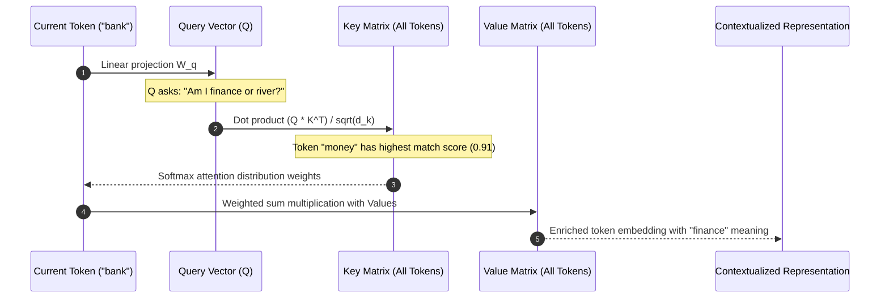

# Transformer Architecture: Attention Mechanisms, QKV & RoPE

---

## 🐣 1. Layman's Analogy (Hinglish + Real-World ELI5)

Imagine you are at a **massive office conference table with 100 people** talking at once:

- **Query ($Q$)**: Aapka sawaal: *"Mujhe budget report kisne bheji thi?"* (What you are actively looking for).
- **Key ($K$)**: Har employee ka ID badge ya table tag: *"Main HR hoon"*, *"Main Finance Budget Head hoon"*, *"Main Legal Advisor hoon"*.
- **Value ($V$)**: Wo actual jaankari ya file jo wo employee hold karta hai.
- **Attention Score**: Aapka dimaag har badge ($K$) ko aapke sawaal ($Q$) se match karta hai:
  - Finance Head ke saath match score **98%** hai.
  - HR ke saath **5%**.
- **Self-Attention Output**: Aap Finance Head ki information ($V$) par 98% dhyaan dete ho aur baaki sabki baaton ko ignore kar dete ho!
Yahi mechanism Transformers ko har word ka context samajhne ki supernatural ability deta hai (jaise samajhna ki *"bank"* word *"river bank"* hai ya *"HDFC bank"*).

---

## 📌 2. Point-Wise Core Mechanics & Edge Cases

### Newbie Essentials

1. **Decoder-Only Dominance**: While original Transformers (2017 "Attention Is All You Need") used Encoder-Decoder (like BERT/T5), modern LLMs (GPT-4, Llama 3, Claude, Gemini) are predominantly **Decoder-Only Autoregressive Transformers**.
2. **The Self-Attention Formula**:
   $$\text{Attention}(Q, K, V) = \text{Softmax}\left(\frac{QK^T}{\sqrt{d_k}}\right) V$$
   - $Q$ (Query): What current token wants to ask previous tokens.
   - $K$ (Key): What previous tokens offer as identity tags.
   - $\sqrt{d_k}$ (Scaling Factor): Prevents dot products from growing excessively large for high dimensions ($d_k$), avoiding vanishing gradients in Softmax.
   - $V$ (Value): The actual contextual representation extracted.

### Intermediate Mechanics

3. **Multi-Head Attention (MHA)**:
   - Instead of a single attention calculation, $Q, K, V$ are projected into $h$ independent subspaces ($h$ heads).
   - One head focuses on grammatical syntax (verbs-to-nouns), another on co-reference ("it" refers to "robot"), another on sentiment.
2. **Causal Masking**: In decoder-only models, future tokens are masked with $-\infty$ before softmax. Token $t$ can only attend to tokens $\le t$, preventing future leakage during training and generation.
3. **Positional Encoding & RoPE**:
   - Transformers have no inherent awareness of token order (unlike RNNs).
   - **RoPE (Rotary Position Embedding)**: Rotates $Q$ and $K$ vectors in 2D complex planes by an angle proportional to token position $m$. RoPE preserves relative distances and enables seamless context window extrapolation (e.g., from 4K to 128K tokens).

### Senior / Lead Edge Cases

6. **Key-Value (KV) Cache**:
   - During autoregressive generation, computing $K$ and $V$ for all past tokens on every new token is an $O(N^2)$ catastrophe.
   - The KV-Cache saves past $K$ and $V$ matrices in GPU VRAM, turning token generation from $O(N^2)$ to $O(N)$ forward-pass time per token.
2. **Grouped-Query Attention (GQA)**:
   - Standard MHA allocates one $K$ and $V$ head per $Q$ head, which blows up GPU VRAM during serving.
   - GQA (used in Llama 3, Mistral) groups multiple $Q$ heads to share a single $K/V$ head (e.g., 8 $Q$ heads per 1 $K/V$ head), reducing KV-cache VRAM consumption by up to 75% with zero quality loss.

---

## 📊 3. Visual Architecture Diagram

```
                 [ Input Token Embeddings ]
                            │
                            ▼
              [ Add Positional Embeddings (RoPE) ]
                            │
                            ▼
       ┌────────────────────┴────────────────────┐
       ▼                                         ▼
[ Linear Proj: Q ]                        [ Linear Proj: K, V ]
       │                                         │
       └────────────────────┬────────────────────┘
                            ▼
           [ Scaled Dot Product: (Q * K^T) / sqrt(d_k) ]
                            │
                            ▼
             [ Causal Masking (Upper Triangle = -inf) ]
                            │
                            ▼
                 [ Softmax (Probabilities) ]
                            │
                            ▼
                [ Weighted Sum with V Matrix ]
                            │
                            ▼
                   [ Multi-Head Output ]
                            │
                            ▼
       [ Residual Connection & LayerNorm (RMSNorm) ]
                            │
                            ▼
           [ Feed-Forward Network (MLP / SwiGLU) ]
                            │
                            ▼
                      [ Next Token ]
```



---

## 💻 4. Line-by-Line Commented PyTorch Code Implementation

```python
# Import PyTorch tensor library
import torch
# Import neural network modules
import torch.nn as nn
# Import functional neural net methods
import torch.nn.functional as F
# Import math for sqrt scaling
import math

class ScaledDotProductSelfAttention(nn.Module):
    def __init__(self, d_model: int, num_heads: int):
        # Call parent nn.Module initialization
        super().__init__()
        # Ensure embedding dimension is evenly divisible by number of heads
        assert d_model % num_heads == 0, "d_model must be divisible by num_heads"
        
        # Save model dimension and number of attention heads
        self.d_model = d_model
        self.num_heads = num_heads
        # Dimension of each individual attention head
        self.d_k = d_model // num_heads
        
        # Linear projection matrices for Queries, Keys, and Values
        self.q_proj = nn.Linear(d_model, d_model, bias=False)
        self.k_proj = nn.Linear(d_model, d_model, bias=False)
        self.v_proj = nn.Linear(d_model, d_model, bias=False)
        
        # Final output projection matrix after concatenating heads
        self.out_proj = nn.Linear(d_model, d_model, bias=False)

    def forward(self, x: torch.Tensor, is_causal: bool = True) -> torch.Tensor:
        # Extract batch size (B), sequence length (S), and embedding dimension (D)
        batch_size, seq_len, _ = x.shape
        
        # Step 1: Project input embeddings into Q, K, and V
        q = self.q_proj(x)
        k = self.k_proj(x)
        v = self.v_proj(x)
        
        # Step 2: Reshape for multi-head attention: (B, S, D) -> (B, num_heads, S, d_k)
        q = q.view(batch_size, seq_len, self.num_heads, self.d_k).transpose(1, 2)
        k = k.view(batch_size, seq_len, self.num_heads, self.d_k).transpose(1, 2)
        v = v.view(batch_size, seq_len, self.num_heads, self.d_k).transpose(1, 2)
        
        # Step 3: Compute raw attention scores: (Q * K^T) / sqrt(d_k)
        # Transpose last two dimensions of K to multiply: (B, H, S, d_k) x (B, H, d_k, S) -> (B, H, S, S)
        scores = torch.matmul(q, k.transpose(-2, -1)) / math.sqrt(self.d_k)
        
        # Step 4: Apply causal masking to prevent attending to future tokens
        if is_causal:
            # Create upper-triangular mask of ones with diagonal offset 1
            mask = torch.triu(torch.ones(seq_len, seq_len, device=x.device), diagonal=1).bool()
            # Fill masked positions with negative infinity so softmax assigns 0 probability
            scores = scores.masked_fill(mask, float('-inf'))
            
        # Step 5: Softmax over sequence length dimension to get attention probability weights
        attn_weights = F.softmax(scores, dim=-1)
        
        # Step 6: Multiply attention weights by Value vectors: (B, H, S, S) x (B, H, S, d_k) -> (B, H, S, d_k)
        context = torch.matmul(attn_weights, v)
        
        # Step 7: Transpose and concatenate all head representations back together
        context = context.transpose(1, 2).contiguous().view(batch_size, seq_len, self.d_model)
        
        # Step 8: Apply final linear projection layer
        output = self.out_proj(context)
        
        # Return final contextualized tensor of shape (B, S, d_model)
        return output

# Demonstration & execution test
if __name__ == "__main__":
    # Define test hyperparameters: Batch=2, Sequence Length=4, Model Dimension=64, Heads=4
    test_batch, test_seq_len, test_dim, test_heads = 2, 4, 64, 4
    
    # Instantiate attention module
    attention_layer = ScaledDotProductSelfAttention(d_model=test_dim, num_heads=test_heads)
    
    # Generate random simulated token embeddings
    mock_embeddings = torch.randn(test_batch, test_seq_len, test_dim)
    
    # Run forward pass through causal self-attention
    contextual_output = attention_layer(mock_embeddings, is_causal=True)
    
    # Verify shape consistency
    print(f"Input Tensor Shape : {mock_embeddings.shape}")
    print(f"Output Tensor Shape: {contextual_output.shape}")
    print("Attention forward pass executed successfully!")
```

---

## 🎯 5. The "Interview Pitch" (Spoken Answer)
>
> *"The self-attention mechanism is the fundamental mathematical backbone of modern LLMs. It models semantic dependencies regardless of distance across the context window. It projects each token embedding into Query, Key, and Value vectors.
> Queries represent what a token searches for, Keys identify what each token offers, and their scaled dot product—divided by $\sqrt{d_k}$ to prevent softmax saturation—yields pairwise relevance weights. In decoder-only models, we apply a causal upper-triangular mask so generation remains strictly autoregressive.
> For positional awareness, state-of-the-art architectures replace absolute sinusoidal embeddings with Rotary Position Embeddings (RoPE), which encode relative token distances via vector rotation in complex planes. In production serving, we leverage Grouped-Query Attention (GQA) and KV-Caching to avoid re-evaluating historical Keys and Values, drastically cutting GPU memory bandwidth bottlenecks."*

---

## 💼 6. Production War Story

**Company**: Real-time legal discovery & document search enterprise engine.  
**Incident**: When upgrading an open-source 70B model to a 32,000-token context window for contract analysis, inference latency skyrocketed from 80ms/token to over 2.4s/token. GPU nodes ran out of memory (OOM) with only 3 concurrent requests per A100 (80GB).  
**Root Cause**: The model used standard Multi-Head Attention (MHA) without GQA or FlashAttention. At 32K tokens, uncompressed KV-Cache allocated 52GB of VRAM per request, leaving zero space for activation tensors and triggering paging thrashing.  
**Resolution**:

1. Swapped the architecture to a model checkpoint featuring **Grouped-Query Attention (GQA)** (8:1 query-to-KV ratio), immediately slashing KV-cache memory consumption by 75%.
2. Enabled **FlashAttention-2**, which optimizes the self-attention loop directly into GPU SRAM tiles, avoiding intermediate $S \times S$ memory round-trips to HBM.  
**Result**: Inference throughput increased by **6.8x**, VRAM footprint dropped from 52GB to 11GB per stream, and concurrency per GPU jumped from 3 to 18 active users.
