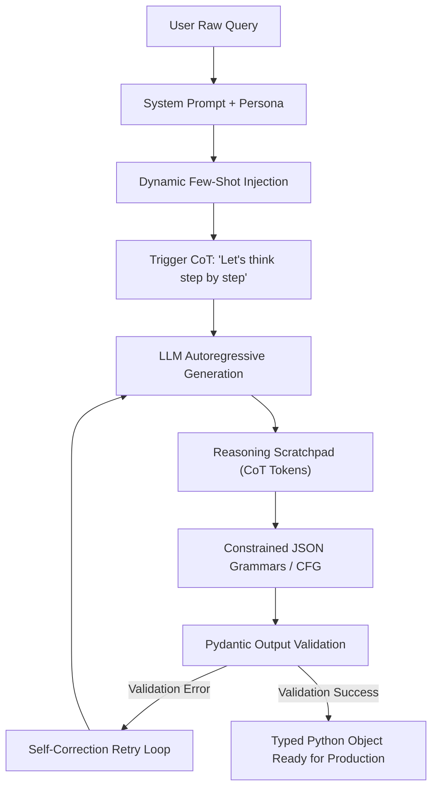

# Prompt Engineering: In-Context Learning, CoT & Structured Outputs

---

## 🐣 1. Layman's Analogy (Hinglish + Real-World ELI5)

Imagine you hire a brilliant college intern who has read every textbook in the world but has **zero common sense** about your specific company's formats:

- **Zero-Shot**: You say: *"Iss receipt ka total nikaal ke mujhe do."* (The intern might give you a 2-page essay or a casual WhatsApp reply).
- **Few-Shot**: You hand them **two completed examples**: *"Dekho, pehle invoice ka output aisa tha, doosre ka aisa tha. Ab teesra karo."* The intern instantly mimics the exact style.
- **Chain-of-Thought (CoT)**: Instead of demanding an instant answer for a complex math riddle, you instruct: *"Seedha final number mat bolo. Pehle rough paper par Step 1, Step 2 likho, phir final answer box mein dalo."* By writing intermediate steps, they catch their own calculation errors.
- **Structured Outputs**: Instead of letting them write free text, you hand them an **official printed form (JSON/Pydantic schema)** with pre-set fields. They cannot submit until every field matches the required type.

---

## 📌 2. Point-Wise Core Mechanics & Edge Cases

### Newbie Essentials

1. **Zero-Shot vs Few-Shot**:
   - Zero-shot asks the model to execute a task without examples.
   - Few-shot provides $K$ input-output demonstrations directly in the prompt context. It aligns output formatting and style without model fine-tuning.
2. **System Prompt Role**: System prompts set the behavioral boundaries, tone, negative constraints ("Never mention competitor X"), and output schema before user input is processed.
3. **Chain-of-Thought (CoT)**:
   - Zero-Shot CoT: Appending the trigger phrase *"Let's think step by step"* prompts the model to generate reasoning tokens before committing to an answer.
   - Few-Shot CoT: Providing step-by-step reasoning demonstrations substantially improves performance on multi-step reasoning, mathematical proofs, and logic puzzles.

### Intermediate Mechanics

4. **Tree of Thoughts (ToT)**:
   - Generalizes CoT by exploring multiple reasoning branches concurrently. The model generates candidate steps, evaluates the viability of each branch, and uses depth-first or breadth-first search to backtrack when a path leads to a dead end.
2. **ReAct Prompting (Reason + Act)**:
   - Combines reasoning traces with task-specific actions:
     `Thought: ... -> Action: [Tool Name] -> Action Input: ... -> Observation: ... -> Thought: ... -> Final Answer`.
3. **Structured Outputs (JSON Mode vs Constrained Decoding)**:
   - **Naive JSON Mode**: Asking the LLM in plain English to "Return only valid JSON" frequently yields malformed JSON, unescaped quotes, or markdown wrappers (` ```json `).
   - **Constrained Decoding / JSON Schema**: Modern inference engines enforce a context-free grammar (CFG) or JSON Schema directly at the token sampling step. Non-compliant tokens receive an attention logit of $-\infty$, guaranteeing **100% syntactically valid JSON**.

### Senior / Lead Edge Cases

7. **Context Priming & Sycophancy Bias**: If your few-shot examples or system prompt include biased assertions ("Don't you agree that X is bad?"), the LLM will hallucinate justifications to flatter the user prompt.
2. **Token Bloat in Long Few-Shot Prompts**: Large few-shot prompts consume substantial context window budget and increase TTFT (Time-To-First-Token). Use semantic retrieval to dynamically inject only the top-2 most relevant examples instead of static 10-shot templates.

---

## 📊 3. Visual System Architecture Diagram

```
[ Unstructured Prompt Request ]
                │
                ▼
┌────────────────────────────────────────────────────────┐
│             Prompt Engineering Strategy                │
├──────────────────────────┬─────────────────────────────┤
│ Few-Shot Demonstrations  │ Injects 2-3 Golden Examples │
├──────────────────────────┼─────────────────────────────┤
│ Chain-of-Thought (CoT)   │ Forces Step-by-Step Scratchpad│
├──────────────────────────┼─────────────────────────────┤
│ Pydantic JSON Schema     │ Enforces Type-Safe Boundary │
└──────────────────────────┴─────────────────────────────┘
                │
                ▼
   [ Constrained LLM Decoding ]
                │
                ▼
  [ Strictly Validated Pydantic Object ]
```



---

## 💻 4. Line-by-Line Commented Python Code (Pydantic & Instructor)

```python
# Import Pydantic BaseModel and Field for schema specification
from pydantic import BaseModel, Field
# Import typing helpers for robust data structures
from typing import List, Optional
# Import enum for strict categorical values
from enum import Enum
# Import json for displaying parsed results
import json

# Step 1: Define an enumeration for strict sentiment classification
class SentimentCategory(str, Enum):
    POSITIVE = "positive"
    NEUTRAL = "neutral"
    NEGATIVE = "negative"

# Step 2: Define a structured entity extraction schema using Pydantic
class ExtractedEntity(BaseModel):
    # Name of the entity extracted
    entity_name: str = Field(description="The formal name of the person, company, or product")
    # Category classification
    entity_type: str = Field(description="Type: 'ORGANIZATION', 'PERSON', 'PRODUCT', or 'LOCATION'")
    # Confidence score bounded between 0.0 and 1.0
    confidence_score: float = Field(ge=0.0, le=1.0, description="Confidence metric of extraction")

# Step 3: Define the comprehensive analysis schema with Chain-of-Thought reasoning field
class CustomerFeedbackAnalysis(BaseModel):
    # CoT Reasoning Scratchpad: Model must articulate its thoughts before final labels
    reasoning_steps: List[str] = Field(
        description="Step-by-step reasoning breakdown explaining how the conclusions were reached"
    )
    # Categorical sentiment
    sentiment: SentimentCategory = Field(description="Overall customer sentiment")
    # List of nested extracted entities
    entities: List[ExtractedEntity] = Field(description="All named entities identified in feedback")
    # Actionable takeaway for customer support
    action_required: bool = Field(description="Flag indicating if urgent human escalation is needed")
    # Suggested resolution
    suggested_action: Optional[str] = Field(None, description="Recommended response or ticket action")

# Step 4: Construct the Master Few-Shot + Structured Output Prompt Template
def build_structured_prompt(customer_review: str) -> str:
    # Golden few-shot demonstration showing reasoning + structured output
    few_shot_demo = {
        "reasoning_steps": [
            "Customer mentions 'battery died in 2 hours', indicating severe dissatisfaction.",
            "Mentions product 'Apex Ultra Laptop' and manufacturer 'ApexCorp'.",
            "Hardware failure requires immediate replacement escalation."
        ],
        "sentiment": "negative",
        "entities": [
            {"entity_name": "ApexCorp", "entity_type": "ORGANIZATION", "confidence_score": 0.99},
            {"entity_name": "Apex Ultra Laptop", "entity_type": "PRODUCT", "confidence_score": 0.98}
        ],
        "action_required": True,
        "suggested_action": "Dispatch warranty hardware replacement ticket."
    }

    # Format the complete prompt string with system boundaries and JSON schema injection
    prompt = f"""
SYSTEM: You are a Tier-1 Customer Intelligence AI. You evaluate customer reviews with extreme precision.
Always write your intermediate reasoning in 'reasoning_steps' before selecting the final sentiment.
Output must strictly adhere to the following JSON Schema:
{json.dumps(CustomerFeedbackAnalysis.model_json_schema(), indent=2)}

--- EXAMPLE DEMONSTRATION ---
Input: "My Apex Ultra Laptop from ApexCorp died after 2 hours. Terrible quality!"
Output:
{json.dumps(few_shot_demo, indent=2)}

--- CURRENT TASK ---
Input: "{customer_review}"
Output:
"""
    return prompt

# Step 5: Simulate model output and validate with Pydantic
sample_review = "I bought the CloudCam from Sentinel Labs. Video quality is crisp, but setup took 40 minutes."

# Mocked LLM response that followed the JSON Schema and CoT instructions
mock_llm_json_response = """
{
  "reasoning_steps": [
    "Customer praises video quality ('crisp'), which is positive.",
    "Customer notes setup was tedious (40 mins), which is mildly negative.",
    "Overall sentiment balances out to neutral with constructive feedback.",
    "Entities identified: CloudCam (product) and Sentinel Labs (organization).",
    "No critical failure or anger detected; no urgent escalation needed."
  ],
  "sentiment": "neutral",
  "entities": [
    {
      "entity_name": "CloudCam",
      "entity_type": "PRODUCT",
      "confidence_score": 0.96
    },
    {
      "entity_name": "Sentinel Labs",
      "entity_type": "ORGANIZATION",
      "confidence_score": 0.99
    }
  ],
  "action_required": false,
  "suggested_action": "Forward onboarding feedback to UX documentation team."
}
"""

# Parse and validate the response through Pydantic
parsed_analysis = CustomerFeedbackAnalysis.model_validate_json(mock_llm_json_response)

# Line-by-line verification of strongly typed attributes
print("Successfully validated structured LLM response!")
print(f"Sentiment Label   : {parsed_analysis.sentiment.value.upper()}")
print(f"Action Required   : {parsed_analysis.action_required}")
print(f"Reasoning Steps   : {len(parsed_analysis.reasoning_steps)} intermediate thoughts logged")
for entity in parsed_analysis.entities:
    print(f" - Entity Detected: {entity.entity_name} ({entity.entity_type}) with confidence {entity.confidence_score}")
```

---

## 🎯 5. The "Interview Pitch" (Spoken Answer)
>
> *"Prompt engineering in production has evolved far beyond creative phrasing into rigorous interface design. We apply three core techniques: Few-Shot In-Context Learning, Chain-of-Thought (CoT) reasoning, and Constrained Structured Outputs.
> Few-shot learning grounds the model's stylistic variance by conditioning the attention heads on concrete demonstrations. For reasoning-heavy tasks, Chain-of-Thought forces the autoregressive generation to emit intermediate reasoning tokens into the context window, dramatically improving accuracy by letting the model compute partial solutions before generating the final conclusion.
> Crucially, for production backend integration, we never rely on unconstrained regex parsing. We use modern constrained decoding—such as OpenAI Structured Outputs or Pydantic with Outlines/Instructor—which guides the model's logits using context-free grammars (CFGs) to mathematically guarantee 100% type-safe JSON conforming to our schema."*

---

## 💼 6. Production War Story

**Company**: Healthcare claims pre-authorization automation SaaS.  
**Incident**: A legacy medical coding prompt parsed incoming hospital clinical notes using naive zero-shot prompts asking for JSON. During high-volume surges, 7.3% of API responses returned corrupted JSON (missing trailing brackets, unexpected markdown backticks, or hallucinated ICD-10 keys). This triggered thousands of unhandled parser exceptions in the billing microservice.  
**Root Cause**: The prompt relied on soft natural language guidance without schema enforcement, and did not include a scratchpad field. When faced with complex multi-page patient charts, the model attempted to produce ICD codes immediately without reasoning through exclusions.  
**Resolution**:

1. Implemented **Pydantic Structured Outputs** via OpenAI `response_format={"type": "json_schema"}` to enforce valid JSON at the sampling logit level.
2. Injected a mandatory `clinical_rationale` (CoT) array field as the first key in the Pydantic model so the LLM had to write clinical justifications before emitting numerical codes.
3. Added a 2-shot dynamic exemplar retriever using vector similarity to inject relevant diagnosis examples into the context.  
**Result**: JSON parsing exceptions dropped from 7.3% to **0.00%**, diagnostic coding accuracy rose by **26.4%**, and claims processing approval speed doubled.
