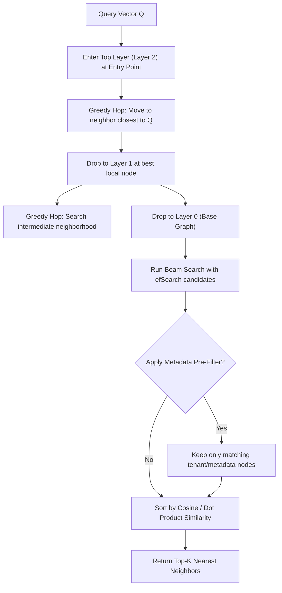

# Vector Databases: HNSW Graph Indexing & IVF-PQ Quantization

---

## 🐣 1. Layman's Analogy (Hinglish + Real-World ELI5)

Imagine you want to travel from **Delhi to a specific small tea stall in a village in Kerala**:

- **Brute-Force Search ($k$-NN)**: Aap Delhi se pedal chalna shuru karte ho aur India ke har ek ghar ka darwaza khatkhata ke poochte ho: *"Kya tum Ramesh ki chai ki dukan ho?"* (Checking 1 billion documents 1-by-1 = $O(N)$ Disaster!).
- **HNSW (Hierarchical Navigable Small World) Graph**:
  - **Top Highway Layer (Layer 2)**: Aap Delhi se direct flight lekar Kochi Airport utarte ho (massive long-distance skips).
  - **Intermediate Layer (Layer 1)**: Kochi se National Highway pakad ke uss zille (district) tak pahunchte ho.
  - **Bottom Dense Layer (Layer 0)**: Zille ki galiyon mein local logon se pooch kar exact chai ki dukan dhoond lete ho.
Yeh multi-layered skip-graph approach search time ko **$O(N)$ se giraakar $O(\log N)$** kar deta hai!

---

## 📌 2. Point-Wise Core Mechanics & Edge Cases

### Newbie Essentials

1. **The Vector Search Bottleneck**: Exact $k$-Nearest Neighbors ($k$-NN) compares the query vector against every single vector in the database ($O(N \cdot D)$ time complexity). For 10 million 1536-dimensional vectors, exact search takes seconds per query.
2. **Approximate Nearest Neighbor (ANN)**: Trades a tiny sliver of recall accuracy (e.g. 98% recall instead of 100%) for 100x to 1000x faster search latencies (typically < 10ms).
3. **Leading Vector Databases**:
   - **ChromaDB**: Lightweight, embedded (runs in-process like SQLite), ideal for local prototyping.
   - **Qdrant**: Rust-native, high performance, advanced payload filtering, excellent memory efficiency.
   - **Pinecone**: Fully managed serverless cloud DB, zero maintenance, auto-scaling.
   - **Milvus**: Distributed, Kubernetes-native, built for massive enterprise scale (hundreds of millions to billions of vectors).

### Intermediate Mechanics

4. **HNSW (Hierarchical Navigable Small World)**:
   - Construct a multi-layer graph based on the **Skip-List** concept.
   - **Top Layers**: Sparse nodes with long-range edges for coarse, rapid exploration.
   - **Bottom Layer (Layer 0)**: Contains every data point, connected via dense short-range edges for fine-grained local search.
   - **Key Hyperparameters**:
     - $M$: Max bidirectional links per node (typical: 16 to 64). Higher $M$ increases recall and graph build time, but consumes more RAM.
     - $efConstruction$: Search depth during index building (typical: 100 to 200).
     - $efSearch$: Size of dynamic candidate list during query time (typical: 32 to 128). Controls latency vs recall trade-off at runtime.
2. **IVF-PQ (Inverted File with Product Quantization)**:
   - **IVF (Inverted File)**: Partitions the vector space into Voronoi cells using $K$-Means clustering. Search only probes the nearest $nlist$ centroids.
   - **PQ (Product Quantization)**: Compresses vectors by slicing high-dimensional vectors (e.g. 1536 floats = 6KB) into sub-vectors and mapping them to codebooks, compressing memory by 80–95% at the cost of lossy distance approximations.

### Senior / Lead Edge Cases

6. **Pre-Filtering vs Post-Filtering with Metadata**:
   - **Post-Filtering**: Runs vector ANN search first, then filters out candidates by metadata. Risk: If the metadata filter is highly restrictive (e.g., `tenant_id == "corp_xyz"`), all top-K vector neighbors might be discarded, returning 0 results!
   - **Pre-Filtering / Single-Stage Iterative Filtering**: Qdrant and Milvus integrate payload filters directly during the HNSW graph traversal, guaranteeing that every evaluated neighbor matches the query filter without empty results.

---

## 📊 3. Visual System Architecture: HNSW Multi-Layer Skip Graph

```
Layer 2 (Express Skyway)     Node A ───────────────────────────────> Node Z
                               │                                       │
                               ▼                                       ▼
Layer 1 (State Highways)     Node A ──────────> Node M ────────────> Node Z
                               │                  │                    │
                               ▼                  ▼                    ▼
Layer 0 (Local Streets)      Node A ──> B ──> C ──> M ──> N ──> P ──> Node Z
                             (All vectors present, dense nearest-neighbor mesh)
```



---

## 💻 4. Line-by-Line Commented Code: In-Memory ChromaDB Implementation

```python
# Import chromadb library for vector storage and indexing
import chromadb
# Import chromadb utilities for embedding function configuration
from chromadb.utils import embedding_functions

# Step 1: Initialize an ephemeral, in-memory ChromaDB client for testing
client = chromadb.Client()

# Step 2: Configure a sentence-transformer embedding function
# In production, this can be swapped with OpenAI, Cohere, or local HuggingFace models
default_ef = embedding_functions.DefaultEmbeddingFunction()

# Step 3: Create or get a collection with explicit distance metric configuration
# "cosine" configures Chroma to index vectors using HNSW with cosine distance
collection = client.get_or_create_collection(
    name="enterprise_knowledge_base",
    embedding_function=default_ef,
    metadata={"hnsw:space": "cosine", "hnsw:construction_ef": 100, "hnsw:M": 16}
)

# Step 4: Define enterprise documents with rich metadata for single-stage filtering
documents = [
    "AWS S3 bucket encryption can be enabled using AES-256 or AWS KMS keys.",
    "PostgreSQL vacuuming reclaims storage occupied by dead tuples from MVCC updates.",
    "Kubernetes Pods can be scheduled using nodeAffinity and tolerations.",
    "Redis Sentinel provides high availability and automatic failover for Redis clusters.",
    "AWS IAM policies use JSON documents to define allow or deny permissions."
]

# Unique document string identifiers
doc_ids = ["doc_s3", "doc_postgres", "doc_k8s", "doc_redis", "doc_iam"]

# Rich metadata dictionaries enabling tenancy and domain categorization
metadata_list = [
    {"domain": "cloud", "provider": "aws", "tier": "infrastructure"},
    {"domain": "database", "provider": "open_source", "tier": "storage"},
    {"domain": "orchestration", "provider": "cloud_native", "tier": "platform"},
    {"domain": "caching", "provider": "open_source", "tier": "cache"},
    {"domain": "security", "provider": "aws", "tier": "iam"}
]

# Step 5: Upsert documents, IDs, and metadata into the vector database
# Chroma handles chunk tokenization, embedding generation, and HNSW graph insertion automatically
collection.add(
    documents=documents,
    metadatas=metadata_list,
    ids=doc_ids
)

print(f"Successfully indexed {collection.count()} documents into HNSW Vector Index.\n")

# Step 6: Query vector database with semantic natural language prompt AND metadata pre-filtering
user_query = "How do I manage security and permissions in the cloud?"

# Execute ANN search with Top-2 nearest neighbors restricted to provider == 'aws'
search_results = collection.query(
    query_texts=[user_query],
    n_results=2,
    where={"provider": "aws"}  # Integrated Single-Stage Metadata Pre-Filter
)

# Line-by-line inspection of the retrieved vector results
print(f"Query: '{user_query}'")
print(f"Applied Filter: provider == 'aws'\n")

for i in range(len(search_results['ids'][0])):
    retrieved_id = search_results['ids'][0][i]
    retrieved_doc = search_results['documents'][0][i]
    retrieved_dist = search_results['distances'][0][i]
    retrieved_meta = search_results['metadatas'][0][i]
    
    print(f"Rank {i+1} [ID: {retrieved_id}] - Cosine Distance: {retrieved_dist:.4f}")
    print(f"  Content : {retrieved_doc}")
    print(f"  Metadata: {retrieved_meta}\n")
```

---

## 🎯 5. The "Interview Pitch" (Spoken Answer)
>
> *"When scaling vector retrieval to millions of embeddings, exact nearest neighbor search becomes impossible due to $O(N)$ compute overhead. Vector databases solve this using Approximate Nearest Neighbor (ANN) algorithms, predominantly HNSW—Hierarchical Navigable Small World graphs.
> HNSW builds a multi-layered skip-graph where upper layers contain sparse, long-range highway edges and the ground layer contains a dense nearest-neighbor mesh. Query traversal starts at the top layer, making greedy hops to close the distance, and steps down layer by layer, dropping query latency from $O(N)$ to $O(\log N)$.
> Two critical parameters govern this trade-off: $M$, the maximum number of bidirectional links per node, and $efSearch$, the size of the dynamic priority queue during search. For memory-constrained environments, we combine Inverted File indexing with Product Quantization (IVF-PQ) to compress high-dimensional vectors by up to 90%.
> Furthermore, in multi-tenant architectures, we ensure our database supports single-stage pre-filtering during graph traversal to prevent post-filtering candidate starvation."*

---

## 💼 6. Production War Story

**Company**: Global HR Tech platform serving 800 enterprise tenants.  
**Incident**: After migrating from basic keyword search to a Vector DB, tenants with strict data isolation reported that searching for company policies frequently returned **0 results** or completely hung with 504 Gateway Timeouts, despite hundreds of policies existing in their tenant.  
**Root Cause**: The engineering team configured the vector engine with **Post-Filtering**: the engine executed a standard top-20 ANN search across the *entire* database first, and then applied `WHERE tenant_id = 'tenant_123'`. For small tenants representing < 0.1% of global documents, none of their documents appeared in the global top-20 nearest neighbors, causing the post-filter to discard 100% of candidates.  
**Resolution**:

1. Migrated the index to **Qdrant** with native **Payload Indexing (Pre-Filtering)**.
2. The payload index filtered the HNSW graph traversal in real-time, enforcing that every candidate node evaluated during the beam search matched the `tenant_id` before computing distance.  
**Result**: Zero-result false negatives dropped to **0%**, multi-tenant query latency stabilized at **14ms (P99)**, and multi-tenant data isolation compliance was rigorously satisfied.
