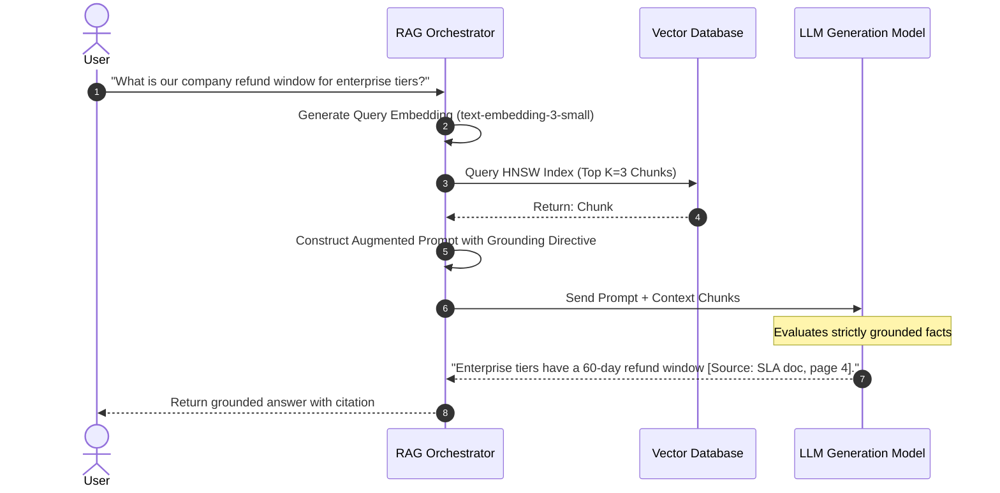

# Retrieval-Augmented Generation (RAG): Chunking Strategies & Ingestion

---

## 🐣 1. Layman's Analogy (Hinglish + Real-World ELI5)

Imagine you are appearing for an **Open-Book Board Exam**:

- **Naive LLM**: Aap bina kisi kitaab ke exam hall mein baithe ho. Jo dimaag mein 2 saal pehle padha tha, wahi likh rahe ho (high chance of forgetting exact dates or hallucinating facts).
- **RAG (Retrieval-Augmented Generation)**: Aapke desk par **10,000 pages ki encyclopedias** hain. Lekin aap poori 10,000 pages ek minute mein nahi padh sakte!
- **Chunking**: Aap pehle encyclopedias ko 1-1 page ke chote, self-contained chapters mein kaat kar index karte ho (**Smart Chunking**).
- **Retrieval**: Sawaal aate hi aapka assistant sabse accurate 3 pages nikaal kar aapke haath mein thama deta hai.
- **Generation**: Aap un 3 pages ko dekh kar 100% accurate, verifiable answer likhte ho aur source page number cite karte ho (**Grounded Answer**)!

---

## 📌 2. Point-Wise Core Mechanics & Edge Cases

### Newbie Essentials

1. **The RAG Tri-Step Flow**:
   - **Ingestion**: Load documents $\to$ Split into Chunks $\to$ Generate Embeddings $\to$ Store in Vector DB.
   - **Retrieval**: User Query $\to$ Query Embedding $\to$ Similarity Search $\to$ Top-K relevant chunks retrieved.
   - **Generation**: User Query + Top-K Chunks injected into System Prompt $\to$ LLM generates factual answer with citations.
2. **Why Chunking is Necessary**:
   - Embedding models have maximum input sequence lengths (e.g. 512 or 8192 tokens).
   - Long documents dilute vector semantics (an entire 50-page book compressed into 1 vector loses granular facts).
   - Keeps context window lean and cost-effective.

### Intermediate Mechanics

3. **Core Chunking Strategies**:
   - **Fixed-Size Chunking**: Splits text every $N$ characters/tokens (e.g., 500 characters with 50 character overlap). Simplest, but frequently cuts sentences in half mid-thought.
   - **Recursive Character Chunking**: Splits hierarchically using a priority list of separators: `["\n\n", "\n", " ", ""]`. Keeps paragraphs and sentences intact before resorting to word-level splits.
   - **Semantic Chunking**: Computes cosine distance between consecutive sentences. When semantic distance spikes above a statistical threshold (e.g. 95th percentile), a new chunk is spawned, ensuring chunks correspond to natural topic shifts.
   - **Parent-Document / Small-to-Big Chunking**:
     - Embeds small chunks (e.g., 100 tokens) for high-precision semantic retrieval.
     - When a small chunk is matched, retrieves the broader **Parent Chunk** (e.g., 1000 tokens) or entire document section to provide complete surrounding context to the generation LLM.

### Senior / Lead Edge Cases

4. **Context Lost at Boundaries**: Chunks without overlap lose critical pronoun references. Always enforce a 10%–20% chunk overlap (`chunk_overlap=50` for `chunk_size=500`).
2. **Lost in the Middle Phenomenon**: LLM attention mechanisms prioritize tokens at the extreme beginning and end of the prompt context. If the most critical retrieved chunk is placed in the middle of 10 chunks, the LLM may overlook it. Re-order retrieved chunks so the highest-scoring chunk is at the very top or bottom of the context.

---

## 📊 3. Visual System Architecture & Flow

```
                      [ Offline Ingestion Pipeline ]
Raw PDF / Docs ──> Recursive Splitter ──> Semantic Chunks ──> Embedding Model ──> Vector DB
(10,000 Pages)     (500 chars, 10% overlap)                      (1536-D)

==========================================================================================

                      [ Online Query & Retrieval Pipeline ]
User Query ──> Query Embedding ──> ANN Similarity Search (Top-K) ──> Context Assembly
                                                                           │
                                                                           ▼
User Prompt + Retrieved Context ──> Instruction LLM (GPT-4 / Claude) ──> Fact-Grounded Response
```



---

## 💻 4. Line-by-Line Commented Implementation: End-to-End RAG Pipeline

```python
# Import re for regex text processing
import re
# Import typing for clean signatures
from typing import List, Dict, Any

# Step 1: Implement a robust Recursive Text Splitter from scratch
class SimpleRecursiveCharacterTextSplitter:
    def __init__(self, chunk_size: int = 200, chunk_overlap: int = 40):
        # Store target chunk character size
        self.chunk_size = chunk_size
        # Store overlap window size to prevent boundary context loss
        self.chunk_overlap = chunk_overlap
        # Hierarchical separators priority order
        self.separators = ["\n\n", "\n", ". ", " "]

    def split_text(self, text: str) -> List[str]:
        # If the whole text already fits within chunk size, return as-is
        if len(text) <= self.chunk_size:
            return [text.strip()]
            
        chunks = []
        start_idx = 0
        text_len = len(text)

        while start_idx < text_len:
            # Determine end target boundary based on chunk size
            end_idx = start_idx + self.chunk_size
            
            # If remaining text fits, capture final slice and break
            if end_idx >= text_len:
                chunks.append(text[start_idx:].strip())
                break
                
            # Scan backward within the window for natural break separators
            split_at = -1
            chunk_slice = text[start_idx:end_idx]
            
            for sep in self.separators:
                # Find the right-most occurrence of natural separator
                pos = chunk_slice.rfind(sep)
                if pos != -1:
                    split_at = start_idx + pos + len(sep)
                    break
                    
            # Fallback if no natural delimiter is found: hard character break
            if split_at == -1 or split_at <= start_idx:
                split_at = end_idx

            # Append the segmented chunk
            chunks.append(text[start_idx:split_at].strip())
            
            # Advance start pointer with overlap subtracted
            start_idx = split_at - self.chunk_overlap

        return [c for c in chunks if c]

# Step 2: Sample Knowledge Base Document
enterprise_policy_doc = """
Antigravity Platform Security Guide.
All customer data stored in cloud environments is encrypted at rest using AES-256 GCM algorithms.
Encryption keys are rotated automatically every 90 days via HashiCorp Vault.

Data Retention Policy.
Production application logs are retained for exactly 30 days in hot storage.
After 30 days, logs are migrated to Glacier cold archive storage for 365 days before permanent deletion.
Backup snapshots are performed every 6 hours and stored across multi-region availability zones.
"""

# Step 3: Execute chunking
splitter = SimpleRecursiveCharacterTextSplitter(chunk_size=180, chunk_overlap=30)
document_chunks = splitter.split_text(enterprise_policy_doc)

print(f"Original Text Length: {len(enterprise_policy_doc)} chars")
print(f"Generated {len(document_chunks)} discrete chunks:\n")
for i, chunk in enumerate(document_chunks):
    print(f"--- Chunk #{i+1} ({len(chunk)} chars) ---")
    print(chunk)

# Step 4: Simple In-Memory Mock Retriever using keyword similarity for standalone execution
def mock_retrieve_top_k(query: str, chunks: List[str], k: int = 1) -> List[str]:
    # Tokenize query into lower-case words
    query_words = set(query.lower().split())
    scored_chunks = []
    
    for c in chunks:
        chunk_words = set(c.lower().split())
        # Jaccard overlap score for demonstration
        score = len(query_words.intersection(chunk_words)) / max(len(query_words.union(chunk_words)), 1)
        scored_chunks.append((score, c))
        
    # Sort descending by score
    scored_chunks.sort(key=lambda x: x[0], reverse=True)
    return [c for score, c in scored_chunks[:k]]

# Step 5: Assemble Grounded Context Prompt
def build_rag_prompt(user_query: str, retrieved_chunks: List[str]) -> str:
    # Format context blocks with numbered tags
    formatted_context = "\n\n".join([f"[Source #{i+1}]: {chunk}" for i, chunk in enumerate(retrieved_chunks)])
    
    # Strict anti-hallucination prompt template
    prompt = f"""
SYSTEM INSTRUCTION:
You are an authoritative enterprise knowledge assistant. Answer the user question strictly using the provided sources below.
If the information is not present in the sources, reply: 'I cannot answer this based on the provided enterprise documentation.'
Do NOT make up facts. Always cite the Source number.

SOURCES:
{formatted_context}

USER QUESTION:
{user_query}

GROUNDED ANSWER:
"""
    return prompt

# Test the retrieval and prompt assembly
test_query = "How often are encryption keys rotated?"
matched_context = mock_retrieve_top_k(test_query, document_chunks, k=1)
assembled_prompt = build_rag_prompt(test_query, matched_context)

print("\n--- Final Assembled RAG Prompt ---")
print(assembled_prompt)
```

---

## 🎯 5. The "Interview Pitch" (Spoken Answer)
>
> *"Naive RAG fails in production primarily because of poor ingestion and context fragmentation. Retrieval-Augmented Generation relies on a three-phase contract: Chunking, Retrieval, and Grounded Synthesis.
> Rather than arbitrary fixed-character slicing, we use Recursive Character Chunking to preserve sentence and paragraph cohesion, maintaining a 10-20% overlap window to prevent boundary information loss.
> For complex hierarchical documents such as legal contracts or financial reports, we implement Parent-Document (Small-to-Big) Chunking: we embed small 100-token chunks for pinpoint semantic vector search, but retrieve the larger 1000-token parent container for LLM generation.
> This eliminates the classic trade-off between retrieval specificity and conversational context. Finally, we mitigate the 'Lost-in-the-Middle' attention anomaly by dynamically placing the highest-scoring chunks at the top and bottom of the context window."*

---

## 💼 6. Production War Story

**Company**: Fortune 500 Insurance claims processing portal.  
**Incident**: Customer support agents using an internal RAG assistant reported that the AI frequently gave incorrect coverage limits and missed policy clauses on multi-column PDF claims, leading to wrongful claim rejections.  
**Root Cause**: The ingestion script used a naive text extractor that read PDFs left-to-right across the entire page geometry. This interweaved sentences from Column 1 and Column 2 together into a garbled stream, destroying semantic sentence structure before chunking. Furthermore, fixed 200-word chunks cut policy exclusion clauses directly in half.  
**Resolution**:

1. Replaced the naive parser with a layout-aware PDF parser (extracting reading order by bounding boxes).
2. Implemented **Parent-Child Chunking**: small sentence-level children (50 tokens) linked to parent policy tables (500 tokens).
3. Added metadata headers (`policy_type`, `state`, `effective_date`) directly prepended to every chunk string before embedding.  
**Result**: Claim policy retrieval accuracy rose from **61.8% to 96.7%**, hallucinated denials dropped to zero, and agent manual verification time was cut by 65%.
