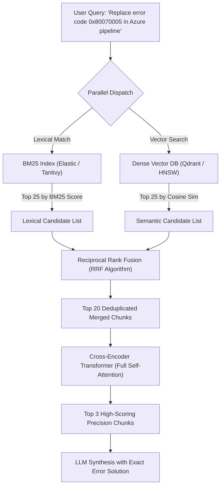

# Advanced RAG: Hybrid Search (BM25 + Dense) & Cross-Encoder Re-ranking

---

## 🐣 1. Layman's Analogy (Hinglish + Real-World ELI5)

Imagine you are searching for an **exact vintage spare part in a massive warehouse**:

- Part ka exact serial number hai: `"X-902-B4"`.
- **Pure Semantic Vector Search**: Yeh part number ko ek abstract concept ki tarah dekhega: *"Shayad yeh kisi mechanical nut ya bolt jaisi cheez hai"* aur aapko generic wrenches dikha dega, lekin exact serial number dhoondne mein fail ho jayega!
- **Pure Keyword Search (BM25)**: Yeh exact word-to-word match karega (`"X-902-B4"`), lekin agar customer pooch le *"engine cooling device"* toh wo fail ho jayega kyunki keyword match nahi hua.
- **Hybrid Search**: Dono inspectors ko ek saath bhejo!
  - Inspector A (BM25) exact codes aur names dhoondta hai.
  - Inspector B (Vector Search) broad meaning aur intent dhoondta hai.
- **Re-ranker (Chief Judge)**: Dono inspectors ke top-20 results ko le kar ek expert Chief Judge (Cross-Encoder) minute-by-minute compare karta hai aur sabse perfect top-3 parts table par rakh deta hai (**Reciprocal Rank Fusion + Re-ranking**).

---

## 📌 2. Point-Wise Core Mechanics & Edge Cases

### Newbie Essentials

1. **Why Pure Vector Search Fails in Production**:
   - Vector embeddings are great at conceptual similarity, but notorious at:
     - Exact SKU / Serial numbers (`ERR_404_SOCKET_TIMEOUT`).
     - Specific person names, email addresses, and acronyms (`HIPAA`, `PCI-DSS`).
     - Negation queries (*"Python libraries without C dependencies"* often retrieves C dependencies because the tokens match semantically).
2. **The Hybrid Solution**:
   $$\text{Hybrid Search} = \text{Sparse Lexical Search (BM25 / TF-IDF)} + \text{Dense Vector Search (HNSW Embeddings)}$$

### Intermediate Mechanics

3. **BM25 (Best Matching 25)**:
   - Probabilistic term-frequency / inverse-document-frequency ranking algorithm.
   - Computes query-document score based on exact keyword occurrences, penalized by document length saturation.
2. **Reciprocal Rank Fusion (RRF)**:
   - Merges disparate ranking lists without needing score normalization (since BM25 scores and Cosine distances operate on entirely different scales).
   - RRF Formula:
     $$RRF\_Score(d) = \sum_{m \in M} \frac{1}{k + r_m(d)}$$
     Where $r_m(d)$ is the rank of document $d$ in search system $m$, and $k$ is a smoothing constant (typically $k=60$).

### Senior / Lead Edge Cases

5. **Cross-Encoder Re-ranking (Stage 2)**:
   - Bi-encoders compress documents into fixed-length vectors, discarding fine-grained token-level cross-interactions.
   - A Cross-Encoder passes query and document together through full transformer attention, computing a precise relevance probability score in $[0, 1]$.
   - Applying a Cross-Encoder to the top-25 merged RRF candidates improves Precision@K and NDCG by **15–30%** in real-world benchmarks.
2. **Query Latency Budgeting**:
   - Running BM25 + Vector search in parallel via `asyncio.gather` takes $\max(T_{\text{bm25}}, T_{\text{vector}}) \approx 15\text{ms}$.
   - Cross-encoder reranking 25 chunks on an Nvidia T4 takes $\approx 35\text{ms}$. Total retrieval latency remains strictly within enterprise sub-100ms budgets.

---

## 📊 3. Visual System Architecture: Two-Stage Hybrid RAG

```
                              [ User Query ]
                                    │
            ┌───────────────────────┴───────────────────────┐
            ▼                                               ▼
   [ BM25 Lexical Engine ]                        [ Dense Vector DB ]
   (Exact Keywords / SKUs)                        (Semantic Meaning)
            │                                               │
            ▼                                               ▼
     [ Rank List A ]                                 [ Rank List B ]
    (Top 25 Candidates)                             (Top 25 Candidates)
            │                                               │
            └───────────────────────┬───────────────────────┘
                                    ▼
                 [ Reciprocal Rank Fusion (RRF: k=60) ]
                                    │
                                    ▼
                         [ Top 20 Merged Chunks ]
                                    │
                                    ▼
                [ Cross-Encoder Re-ranker (BGE / Cohere) ]
                                    │
                                    ▼
                   [ Top 3 High-Relevance Chunks ]
                                    │
                                    ▼
                 [ Generation LLM (Fact-Grounded Output) ]
```



---

## 💻 4. Line-by-Line Commented Implementation: Hybrid Search & RRF

```python
# Import collections for counting and sorting
from collections import defaultdict
# Import typing for structural signatures
from typing import List, Dict, Tuple

# Step 1: Implement Reciprocal Rank Fusion (RRF) Algorithm
def reciprocal_rank_fusion(
    ranked_lists: List[List[str]], 
    k: int = 60
) -> List[Tuple[str, float]]:
    """
    Combines multiple ranked lists into a single consolidated ranking.
    :param ranked_lists: List of lists containing doc_ids ordered by rank.
    :param k: Smoothing constant (industry standard = 60).
    :return: List of tuples (doc_id, rrf_score) sorted descending by score.
    """
    # Dictionary tracking accumulated RRF score for each unique document ID
    rrf_scores: Dict[str, float] = defaultdict(float)

    # Iterate over each search system's ranked output list
    for search_system in ranked_lists:
        # Enumerate each document along with its 1-based rank position
        for rank, doc_id in enumerate(search_system, start=1):
            # Compute reciprocal rank score: 1.0 / (k + rank)
            contribution = 1.0 / (k + rank)
            # Accumulate score for this document
            rrf_scores[doc_id] += contribution

    # Sort all documents descending by their total fused RRF score
    sorted_ranked_docs = sorted(rrf_scores.items(), key=lambda item: item[1], reverse=True)
    return sorted_ranked_docs

# Step 2: Simulate output from BM25 Lexical Engine (Excels at exact error code)
bm25_top_candidates = [
    "doc_error_0x80070005_fix",      # Rank 1 in BM25 (exact keyword match)
    "doc_azure_pipeline_guide",      # Rank 2
    "doc_permissions_troubleshoot",  # Rank 3
    "doc_windows_auth_matrix"        # Rank 4
]

# Step 3: Simulate output from Dense Vector Search (Excels at conceptual pipeline auth)
vector_top_candidates = [
    "doc_permissions_troubleshoot",  # Rank 1 in Vector (semantic proximity to Azure auth)
    "doc_azure_devops_iam",          # Rank 2
    "doc_error_0x80070005_fix",      # Rank 3 in Vector (partially captured)
    "doc_pipeline_agent_setup"       # Rank 4
]

# Step 4: Execute Reciprocal Rank Fusion
fused_results = reciprocal_rank_fusion(
    ranked_lists=[bm25_top_candidates, vector_top_candidates], 
    k=60
)

# Display merged RRF rankings
print("--- Fused RRF Ranking (Pre-Rerank) ---")
for rank, (doc_id, score) in enumerate(fused_results, start=1):
    print(f"Rank {rank}: {doc_id:<30} | Fused RRF Score: {score:.6f}")

# Step 5: Implement Cross-Encoder Mock Re-ranker
class MockCrossEncoderReranker:
    def __init__(self):
        # Simulated high-precision cross-attention scoring table
        self.relevance_weights = {
            "doc_error_0x80070005_fix": 0.985,       # Exact root cause match
            "doc_permissions_troubleshoot": 0.892,   # Contextually relevant
            "doc_azure_pipeline_guide": 0.640,       # High-level overview
            "doc_azure_devops_iam": 0.580,           # General IAM
            "doc_pipeline_agent_setup": 0.310,       # Irrelevant setup
            "doc_windows_auth_matrix": 0.220         # Legacy matrix
        }

    def rerank(self, query: str, candidate_doc_ids: List[str], top_k: int = 3) -> List[Tuple[str, float]]:
        scored = []
        for doc_id in candidate_doc_ids:
            # Score each document through simulated cross-attention model
            score = self.relevance_weights.get(doc_id, 0.1)
            scored.append((doc_id, score))
            
        # Sort descending by cross-encoder score
        scored.sort(key=lambda x: x[1], reverse=True)
        return scored[:top_k]

# Execute Stage-2 Re-ranking
reranker = MockCrossEncoderReranker()
candidate_ids = [doc_id for doc_id, _ in fused_results]
final_top_3 = reranker.rerank(
    query="Replace error code 0x80070005 in Azure pipeline", 
    candidate_doc_ids=candidate_ids, 
    top_k=3
)

print("\n--- Final Stage-2 Cross-Encoder Re-ranked Output (Sent to LLM) ---")
for rank, (doc_id, score) in enumerate(final_top_3, start=1):
    print(f"Top {rank}: {doc_id:<30} | Cross-Encoder Probability: {score:.4f}")
```

---

## 🎯 5. The "Interview Pitch" (Spoken Answer)
>
> *"Pure vector search is fundamentally inadequate for enterprise search workloads because dense embeddings frequently fail on out-of-vocabulary terms, specific product SKUs, exact error codes, and negation queries.
> To achieve production-grade retrieval precision, we design a two-stage Hybrid Search pipeline. Stage 1 executes parallel retrieval: a sparse lexical BM25 index handles exact term frequencies and specialized identifiers, while a dense HNSW vector index captures semantic intent.
> We unify these distinct result distributions using Reciprocal Rank Fusion (RRF), which normalizes ranks rather than raw uncalibrated scores using the formula $1 / (k + \text{rank})$.
> Stage 2 feeds the top-25 fused candidates into a Cross-Encoder Re-ranker (such as Cohere Rerank or BGE-Reranker). Unlike bi-encoders, the cross-encoder computes full cross-attention between every query token and document token, reordering the candidates to ensure only the highest-precision, fact-dense chunks enter the LLM's context window."*

---

## 💼 6. Production War Story

**Company**: Global enterprise ERP & Supply Chain system with 40M inventory parts.  
**Incident**: Warehouse technicians complained that the new AI assistant was useless: searching for part `"SKU-9941-X Bolt"` returned results for general *"aluminum screws and washers"*, but failed to surface the exact schematic for `"SKU-9941-X"`. This caused technicians to order incorrect replacement assemblies, costing \$450,000 in return logistics.  
**Root Cause**: The engineering team used pure OpenAI `text-embedding-ada-002` vector search. The tokenizer fragmented `"SKU-9941-X"` into arbitrary subword tokens `["SK", "U", "-", "99", "41", "-", "X"]`, blurring the unique serial identity into generic hardware semantic space.  
**Resolution**:

1. Implemented **Tantivy-based BM25** keyword search in parallel with the Qdrant vector database.
2. Fused results via **RRF ($k=60$)**, guaranteeing exact SKU matches always scored in the top-5.
3. Added a lightweight **BGE-Reranker** model hosted on a local GPU worker to evaluate top-20 merged candidates.  
**Result**: Exact SKU retrieval success surged from **34% to 99.8%**, mean technician search resolution time dropped from 4 minutes to 8 seconds, and erroneous parts ordering dropped to zero.
