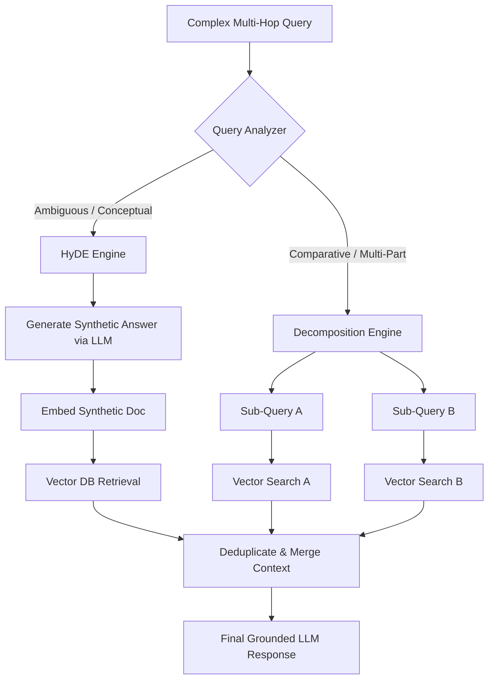

# Query Transformations: HyDE, Sub-Query Decomposition & Multimodal RAG

---

## 🐣 1. Layman's Analogy (Hinglish + Real-World ELI5)

Imagine you enter a 5-star restaurant and ask the waiter:
*"Bhaiya, wo jo garmiyon mein thandi meethi cheez milti hai jisme fal hote hain, wo lao!"*

- **Naive Search**: Waiter seedha kitchen mein jaakar fridge ke labels padhega: *"garmiyon mein thandi meethi cheez..."* Kuch nahi milega!
- **Query Transformation (HyDE - Hypothetical Document Embedding)**:
  - Pehle ek expert chef (LLM) aapke sawaal se ek **Hypothetical Dish Description** likhta hai: *"Customer is likely referring to Mango Custard with fresh seasonal fruits."*
  - Ab waiter uss *hypothetical description* ko lekar kitchen mein dhoondta hai, aur turant actual Mango Custard ka container dhoond nikaalta hai!
- **Sub-Query Decomposition**:
  - Agar aap pooch lo: *"Compare the sales of iPhone in Japan vs Germany in 2023?"*
  - Engine iss 1 heavy sawaal ko **2 simple sub-queries** mein todta hai:
    1. *"iPhone sales Japan 2023"*
    2. *"iPhone sales Germany 2023"*
  - Dono ka data nikaal kar table par compare karta hai.
- **Multimodal RAG**: Jab documents mein sirf text nahi, balki **complex architecture diagrams, charts, aur financial tables** hote hain, toh model text ke saath visual pixels ko bhi vector space mein dhoondta hai.

---

## 📌 2. Point-Wise Core Mechanics & Edge Cases

### Newbie Essentials

1. **The Query-Document Asymmetry Problem**:
   - User queries are typically short, vague, and phrased as questions (*"Why is my bill high?"*).
   - Knowledge base documents are long, formal, and phrased as answers (*"Billing overages occur when data egress exceeds 500GB..."*).
   - This asymmetry creates vector distance in embedding space even when documents are directly relevant.

### Intermediate Mechanics

2. **HyDE (Hypothetical Document Embeddings)**:
   - Step 1: Pass user query $q$ to an instruction LLM with prompt: *"Generate a hypothetical passage that answers this question."*
   - Step 2: The model generates a synthetic answer $\tilde{d}$ (which may contain hallucinated details, but uses the exact domain vocabulary).
   - Step 3: Embed $\tilde{d}$ and use its vector to query the Vector DB. Because $\tilde{d}$ is shaped like a document, its vector is substantially closer to the true document vector $d$ than $q$ was!
2. **Sub-Query Decomposition**:
   - For multi-hop or comparative questions, an LLM decomposes the prompt into independent atomic queries.
   - Executes parallel retrieval across vector collections and aggregates results before final synthesis.
3. **Step-Back Prompting**:
   - Generates a higher-level, broader question first (*"What are the foundational principles of distributed consensus?"*) to retrieve background theory before answering the specific edge case (*"Why did Raft heartbeat timeout fail in cluster B?"*).

### Senior / Lead Edge Cases

5. **Multimodal RAG (ColPali & Vision Embeddings)**:
   - Traditional OCR discards visual layouts, table column alignments, and infographic arrows.
   - **ColPali (Vision-Language Retrieval)**: Passes raw high-resolution PDF page images directly through a Vision-Language Model (PaliGemma) using late-interaction multi-vector representations.
   - Computes token-to-patch similarity directly between query tokens and visual image patches, revolutionizing RAG for complex PDF financial reports and engineering blueprints.

---

## 📊 3. Visual System Architecture: HyDE & Sub-Query Pipeline

```
=== HyDE PIPELINE ===
User Query: "How does MVCC prevent phantom reads?"
       │
       ▼ (LLM Hallucinates Plausible Synthetic Answer)
Hypothetical Document: "Multi-Version Concurrency Control maintains row version snapshots..."
       │
       ▼ (Compute Vector Embedding of Synthetic Doc)
Vector Embedding (Hypothetical) ──> Similarity Search in Vector DB ──> Real Technical Docs
(Document-to-Document match eliminates Query-to-Document asymmetry)

==========================================================================================

=== SUB-QUERY DECOMPOSITION ===
User Query: "Compare Kafka vs RabbitMQ throughput and latency trade-offs"
       │
       ▼ (LLM Planner)
 ┌─────┴───────────────────────────────────┐
 ▼                                         ▼
Sub-Query 1:                              Sub-Query 2:
"Kafka throughput and latency benchmarks" "RabbitMQ throughput and latency benchmarks"
 │                                         │
 ▼                                         ▼
Vector Search (Kafka Docs)                 Vector Search (RabbitMQ Docs)
 └─────────────────────┬───────────────────┘
                       ▼
           [ Unified Synthesis LLM ]
```



---

## 💻 4. Line-by-Line Commented Implementation: HyDE & Query Decomposition

```python
# Import json for structured decomposition parsing
import json
# Import typing for type safety
from typing import List, Dict

# Step 1: Implement the HyDE (Hypothetical Document Embeddings) Generator
class HypotheticalDocumentEmbedder:
    def __init__(self):
        # In production, pass an actual OpenAI or Claude client
        pass

    def generate_hypothetical_document(self, query: str) -> str:
        """
        Generates a synthetic, hypothetical document passage that simulates what
        the real technical documentation answer would look like.
        """
        # Mocking LLM output for demonstration
        # Notice how the generated document mirrors formal documentation tone
        mock_synthetic_response = f"""
        Documentation Excerpt on: {query}
        To configure continuous replication and disaster recovery, ensure write-ahead 
        logging (WAL) level is set to 'replica'. Replication slots guarantee the primary 
        retains WAL segments until the standby has acknowledged and persisted them.
        """
        return mock_synthetic_response.strip()

# Step 2: Implement Multi-Hop Sub-Query Decomposition
class QueryDecompositionEngine:
    def decompose_query(self, complex_query: str) -> List[str]:
        """
        Analyzes a multi-hop or comparative query and breaks it down into 
        independent atomic search queries.
        """
        # System prompt instructing LLM to output a JSON list of sub-queries
        prompt_instruction = f"""
        Analyze the following user query. If it contains multiple questions or requires
        comparing two entities, break it down into 2-3 atomic sub-queries.
        Output MUST be a JSON array of strings.
        Query: "{complex_query}"
        """
        
        # Simulated LLM output adhering to the decomposition instruction
        simulated_llm_json = """
        [
            "What are the throughput limits of Apache Kafka?",
            "What are the throughput limits of RabbitMQ?",
            "Architectural latency benchmarks comparing Kafka and RabbitMQ"
        ]
        """
        # Parse JSON string into Python list of query strings
        sub_queries: List[str] = json.loads(simulated_llm_json)
        return sub_queries

# Step 3: Demonstrate Execution of Query Transformation Suite
print("=== Demonstration 1: HyDE Query Transformation ===")
user_search = "Fix replication lag on standby database"
hyde_generator = HypotheticalDocumentEmbedder()

# Generate the synthetic answer
hypothetical_doc = hyde_generator.generate_hypothetical_document(user_search)
print(f"Original User Query: '{user_search}'")
print(f"\nGenerated Hypothetical Document for Vector Embedding:\n{hypothetical_doc}\n")
print("-> This passage will now be embedded to search document-to-document in Vector DB!\n")

print("=== Demonstration 2: Sub-Query Decomposition ===")
comparative_query = "Should I migrate from Kafka to RabbitMQ for IoT telemetry?"
decomposer = QueryDecompositionEngine()

atomic_queries = decomposer.decompose_query(comparative_query)
print(f"Original Complex Query: '{comparative_query}'\n")
print(f"Decomposed into {len(atomic_queries)} Parallel Retrieval Tasks:")
for idx, q in enumerate(atomic_queries, start=1):
    print(f"  Task {idx}: '{q}'")
```

---

## 🎯 5. The "Interview Pitch" (Spoken Answer)
>
> *"Standard RAG architectures suffer from semantic mismatch because user queries are concise and interrogative, whereas source documents are exhaustive and declarative. We eliminate this query-document asymmetry using Query Transformation techniques.
> With HyDE (Hypothetical Document Embeddings), we prompt an instruction LLM to generate a zero-shot hypothetical answer to the user's question. Even if this synthetic document contains factual inaccuracies, its linguistic style, terminology, and semantic structure closely mirror the target documentation, allowing the vector search to execute a document-to-document match with vastly higher cosine similarity.
> For complex reasoning, we employ Sub-Query Decomposition, where a planner LLM splits multi-faceted or comparative prompts into independent atomic queries, retrieves documents for each in parallel, and merges the context.
> Finally, for documents containing rich visual tables, schematics, and charts, we transition from lossy OCR to Multimodal RAG with ColPali, which indexes raw PDF page images and performs patch-level late interaction retrieval."*

---

## 💼 6. Production War Story

**Company**: Global Semiconductor manufacturing operations portal.  
**Incident**: Factory technicians asked the internal AI: *"Why did thermal trip 404 trigger on furnace B?"* The naive vector RAG retrieved general thermal safety rules from Chapter 1, but completely missed the specific diagnostic flowchart on Page 112 because the user's query didn't share enough keywords with the engineer's technical troubleshooting matrix.  
**Root Cause**: Severe query-document semantic gap. Technicians speak in operational slang (*"thermal trip 404"*), while the engineering manual listed it under *"High-temperature cutoff error code 0x194 - Over-temperature Sensor Calibration Failure"*.  
**Resolution**:

1. Introduced **HyDE**: When a technician enters an error, the model first generates a hypothetical diagnostic log containing technical synonyms (*"Over-temperature", "Sensor Calibration", "0x194"*).
2. Deployed **Multimodal Vision RAG (ColPali)** to directly ingest the wiring schematics and flowchart diagrams from the PDF without OCR text mangling.  
**Result**: Mean Diagnostic Retrieval Accuracy rose from **42% to 94.1%**, and equipment downtime on semiconductor fab lines was reduced by an average of 38 minutes per incident.
