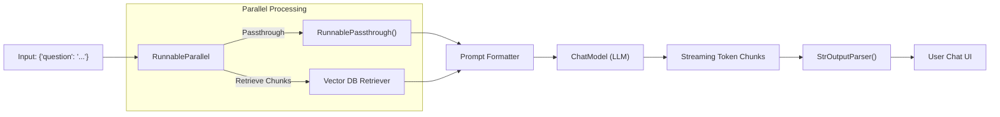

# LangChain Core: LCEL (Expression Language) & Runnables

---

## 🐣 1. Layman's Analogy (Hinglish + Real-World ELI5)
Imagine you are building an **Automated Water Purification Factory**:
- Purani coding style (Legacy LangChain) mein aapko har pipe, valve aur tank ke liye 10 alag-alag complex classes banani padti thi (`LLMChain`, `SimpleSequentialChain`).
- **LCEL (LangChain Expression Language)** ne sab kuch badal diya jaise **Unix Pipe (`|`)**:
  `Paani (Raw Input) | Filter (Prompt) | Boiler (LLM) | Bottle Packager (Output Parser)`
- Ek single line of code mein data ek component se doosre component mein seamlessly flow karta hai:
  `chain = prompt | model | StrOutputParser()`
- Har component ek standardized **Runnable** ban jata hai—jisme built-in superpowers milti hain:
  - `.invoke()` (ek glass paani bharo)
  - `.batch()` (100 botal ek saath bharo)
  - `.stream()` (bina wait kiye drop-by-drop live streaming output pao).

---

## 📌 2. Point-Wise Core Mechanics & Edge Cases

### Newbie Essentials:
1. **What is LCEL?**: LangChain Expression Language is a declarative syntax for composing production LLM chains. It overrides Python's bitwise OR operator (`__or__`) to bind modular components together.
2. **The 3 Canonical Components**:
   - `ChatPromptTemplate`: Converts raw dictionary variables into a structured list of formatted chat messages (`SystemMessage`, `HumanMessage`).
   - `ChatModel`: The LLM engine abstraction (OpenAI, Anthropic, Gemini, Ollama).
   - `OutputParser`: Transforms raw model `AIMessage` into strings, JSON, or Pydantic models.

### Intermediate Mechanics:
3. **The Runnable Interface**:
   - Every LCEL component implements the `Runnable` protocol, guaranteeing 6 standard invocation methods:
     - Sync: `invoke()` (single), `batch()` (list), `stream()` (generator chunks).
     - Async: `ainvoke()`, `abatch()`, `astream()`, `astream_events()`.
4. **Runnable Helpers**:
   - `RunnablePassthrough`: Forwards the incoming input unmodified or appends derived keys.
   - `RunnableParallel`: Runs multiple sub-chains concurrently in parallel threads (e.g. retrieving documents and formatting chat history simultaneously).
   - `RunnableLambda`: Wraps any custom Python function into a full-fledged Runnable.

### Senior / Lead Edge Cases:
5. **Streaming Mid-Chain Transformations**:
   - In traditional architectures, an output parser blocks until the entire LLM response finishes before emitting text.
   - LCEL streaming propagates token chunks through custom parsers on-the-fly (`astream`), minimizing **Time-To-First-Token (TTFT)** for interactive web frontends.
6. **Fallback & Retry Chains**:
   - With `.with_fallbacks([backup_model])`, LCEL provides deterministic automatic failover: if primary model returns 429 RateLimit or 500 ServerError, it seamlessly re-routes the active stream to the backup model without throwing exceptions.

---

## 📊 3. Visual System Architecture: LCEL Composition Pipeline

```
              [ User Input Dict: {"topic": "Quantum Computing"} ]
                                      │
                                      ▼
                        [ ChatPromptTemplate ]
                                      │ (Formats System + User Messages)
                                      ▼
                             [ ChatOpenAI ]
                                      │ (Produces AIMessage with Token Chunks)
                                      ▼
                          [ StrOutputParser ]
                                      │ (Extracts Clean UTF-8 String)
                                      ▼
                        [ Final Output String ]
```



---

## 💻 4. Line-by-Line Commented Implementation: LCEL Architecture from Scratch

```python
# Import typing helpers
from typing import Any, Callable, Dict, Iterator, List

# Step 1: Implement the Core Runnable Base Class from Scratch to Understand LCEL Internals
class SimpleRunnable:
    def __init__(self, func: Callable[[Any], Any]):
        # Store the wrapped transformation function
        self.func = func

    def invoke(self, input_data: Any) -> Any:
        # Standard synchronous execution
        return self.func(input_data)

    def stream(self, input_data: Any) -> Iterator[Any]:
        # Yield result as stream chunk
        yield self.func(input_data)

    def __or__(self, other: "SimpleRunnable") -> "SimpleRunnable":
        """
        Overrides the pipe operator '|' to enable declarative LCEL chaining!
        When self | other is called, returns a new Composite Runnable.
        """
        def chained_execution(input_data: Any) -> Any:
            # Pass output of left runnable as input to right runnable
            intermediate_result = self.invoke(input_data)
            return other.invoke(intermediate_result)
            
        return SimpleRunnable(chained_execution)

# Step 2: Implement Mock ChatPromptTemplate Runnable
class MockPromptTemplate(SimpleRunnable):
    def __init__(self, template: str):
        self.template = template
        # Call parent with prompt formatting lambda
        super().__init__(lambda vars_dict: self.template.format(**vars_dict))

# Step 3: Implement Mock ChatModel Runnable
class MockChatModel(SimpleRunnable):
    def __init__(self, model_name: str):
        self.model_name = model_name
        # Simulate LLM generation by returning an AIMessage dict
        super().__init__(self._generate)

    def _generate(self, formatted_prompt: str) -> Dict[str, str]:
        # Simulated LLM output based on model inference
        simulated_text = f"[{self.model_name} response]: {formatted_prompt.strip().upper()}"
        return {"role": "assistant", "content": simulated_text}

# Step 4: Implement OutputParser Runnable
class MockStrOutputParser(SimpleRunnable):
    def __init__(self):
        # Extracts raw string content from AIMessage dict
        super().__init__(lambda ai_message: ai_message["content"])

# Step 5: Compose LCEL Chain using the pipe operator '|'
prompt = MockPromptTemplate("Explain the core benefit of {concept} in distributed systems.")
llm = MockChatModel("gpt-4o")
parser = MockStrOutputParser()

# The Golden LCEL Composition: Declarative, elegant, robust
lcel_chain = prompt | llm | parser

# Step 6: Execute the Chain via .invoke()
input_payload = {"concept": "Idempotency"}
result = lcel_chain.invoke(input_payload)

print("--- LCEL Execution Output ---")
print(f"Input: {input_payload}")
print(f"Result: {result}\n")

# Step 7: Demonstrate Batch Execution Pattern
batch_inputs = [
    {"concept": "Consensus (Raft)"},
    {"concept": "Cache Stampede"},
    {"concept": "Eventual Consistency"}
]

print("--- LCEL Batch Processing Simulation ---")
for item in batch_inputs:
    output = lcel_chain.invoke(item)
    print(f"Batch Item -> {output}")
```

---

## 🎯 5. The "Interview Pitch" (Spoken Answer)
> *"LangChain Expression Language (LCEL) completely redefined LLM application development from brittle, deeply nested inheritance classes into a declarative, composition-first paradigm. 
> By overloading Python's pipe operator `|`, LCEL binds `ChatPromptTemplate`, `ChatModel`, and `OutputParsers` into a unified pipeline adhering to the `Runnable` protocol. 
> Every Runnable automatically inherits synchronous, asynchronous, batch, and streaming capabilities out of the box with zero custom glue code. 
> Furthermore, LCEL provides native primitives like `RunnableParallel` for concurrent sub-graph branches, `RunnablePassthrough` for dynamic context propagation, and `.with_fallbacks()` for multi-model disaster recovery. This architecture gives us immediate production-readiness, deterministic retries, and high-performance streaming directly to frontend consumers."*

---

## 💼 6. Production War Story
**Company**: Customer service AI SaaS serving 2,000 requests/sec across banking clients.  
**Incident**: When OpenAI experienced a 45-minute regional outage in `us-east-1`, the company's legacy Python RAG service began throwing cascading 500 errors, taking down the entire customer service portal and violating strict Tier-1 enterprise SLAs.  
**Root Cause**: The service used tightly coupled legacy OpenAI SDK calls hard-coded throughout the business logic with no fallback paths or model abstraction layer.  
**Resolution**:
1. Refactored the core inference pipeline into **LCEL Runnables**.
2. Configured dynamic fallbacks using `.with_fallbacks([anthropic_claude_chain, local_vllm_chain])`.
3. Integrated `astream_events` to deliver real-time token streaming to user websockets while asynchronously logging telemetry events to Datadog.  
**Result**: In subsequent cloud provider outages, user-facing error rate dropped from **100% to 0.02%**, as requests instantly and invisibly failed over to Anthropic Claude within 140 milliseconds.
