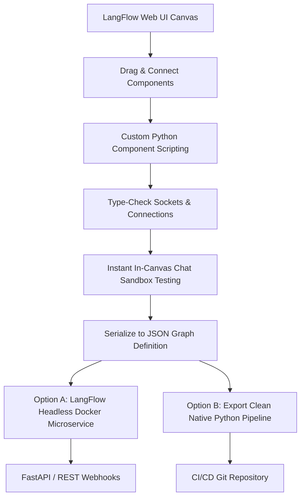

# LangFlow: Visual AI Prototyping, Component Architecture & Exporting to Code

---

## 🐣 1. Layman's Analogy (Hinglish + Real-World ELI5)
Imagine you are playing with **Lego Mindstorms or Figma for AI Pipelines**:
- Traditional coding: Aapko 200 lines ka complex Python code likhna padta hai, har library import karni padti hai, types match karne padte hain.
- **LangFlow**: Aapke saamne ek **visual drag-and-drop canvas** hota hai:
  - Screen par ek **Prompt Box** drag karo.
  - Uske bagal mein ek **OpenAI LLM Box** drag karo.
  - Uske bagal mein **Pinecone Vector Store Box** drag karo.
  - Wire (cable) se prompt ke output ko model ke input se connect kar do!
- Visual canvas ke peeche, LangFlow pure pipeline ko ek **Executable Dependency Graph (JSON Schema)** mein serialize karta hai.
- Aur sabse khoobsurat baat: jab aapka prototype canvas par perfect chalne lage, toh ek click mein wo pure visual diagram ko **Production Python Code ya FastAPI REST Endpoint** mein export kar deta hai!

---

## 📌 2. Point-Wise Core Mechanics & Edge Cases

### Newbie Essentials:
1. **What is LangFlow?**: An open-source visual web UI and low-code framework specifically engineered for building, testing, and iterating on LangChain chains, RAG pipelines, and multi-agent workflows.
2. **Component Node Anatomy**:
   - Each card on the canvas is a modular **Component Node** (e.g. `ChatInput`, `PromptTemplate`, `OllamaLLM`, `ChromaDB`, `ChatOutput`).
   - Every node has typed **Inputs** (left handles) and **Outputs** (right handles). Connections between compatible types create a directed graph.

### Intermediate Mechanics:
3. **Graph Serialization & Backend Runtime**:
   - The entire visual canvas is serialized into a declarative **JSON Flow Schema** defining nodes, parameters, edge connections, and execution order.
   - The LangFlow backend engine parses this JSON, instantiates the underlying Python classes dynamically, and executes topologically sorted nodes.
4. **Custom Component Authoring**:
   - Developers can write custom Python classes directly inside the LangFlow code editor by subclassing `Component` or `CustomComponent`.
   - Modifying inputs dynamically re-renders UI fields and socket ports on the visual canvas.

### Senior / Lead Edge Cases:
5. **Bridge from Visual Canvas to Production API**:
   - Canvas is optimal for rapid experimentation and stakeholder collaboration.
   - For enterprise production, LangFlow flows can be:
     1. Invoked directly via the **LangFlow Headless REST API** (`POST /api/v1/run/{flow_id}`).
     2. Exported as standalone, dependency-clean **Python script / Docker container** to eliminate runtime overhead.
6. **Stateful Session Isolation in Multi-User Environments**:
   - When serving LangFlow via REST API, ensure you pass unique `session_id` parameters in the payload; otherwise, conversational memory buffers will interleave across concurrent tenant requests.

---

## 📊 3. Visual Architecture: LangFlow Canvas to Production Engine

```
 ┌────────────────────────────────────────────────────────────────────────┐
 │                        LangFlow Visual Canvas (UI)                     │
 │                                                                        │
 │   [ Chat Input ] ────> [ Prompt Template ] ────> [ ChatOpenAI ]        │
 │                               ▲                        │               │
 │                               │                        ▼               │
 │                      [ Qdrant Retriever ]       [ Chat Output ]        │
 └────────────────────────────────────────────────────────────────────────┘
                                    │
                         (Export / Run Flow)
                                    ▼
       ┌────────────────────────────────────────────────────────┐
       │             LangFlow JSON Graph Schema                 │
       │    { "nodes": [...], "edges": [...], "viewport": ... } │
       └────────────────────────────────────────────────────────┘
                                    │
            ┌───────────────────────┴───────────────────────┐
            ▼                                               ▼
[ Headless REST API Engine ]                    [ Clean Python Script Export ]
`POST /api/v1/run/{flow_id}`                   `from langflow.load import run_flow_from_json`
```



---

## 💻 4. Line-by-Line Commented Implementation: Running Exported LangFlow Pipelines

```python
# Import json for schema manipulation
import json
# Import requests for calling headless LangFlow API endpoints
import requests
# Import typing helpers
from typing import Dict, Any, Optional

# Step 1: Simulated LangFlow Exported Flow JSON Structure
# This demonstrates the underlying directed graph representation generated by the canvas
exported_langflow_graph = {
    "name": "Enterprise Support Flow",
    "nodes": [
        {
            "id": "chat_input_1",
            "type": "ChatInput",
            "data": {"node": {"template": {"input_value": {"value": ""}}}}
        },
        {
            "id": "prompt_template_1",
            "type": "PromptTemplate",
            "data": {"node": {"template": {"template": "You are an expert AI. Answer: {user_query}"}}}
        },
        {
            "id": "chat_openai_1",
            "type": "ChatOpenAI",
            "data": {"node": {"template": {"model_name": {"value": "gpt-4o"}, "temperature": {"value": 0.1}}}}
        }
    ],
    "edges": [
        {"source": "chat_input_1", "target": "prompt_template_1", "sourceHandle": "message", "targetHandle": "user_query"},
        {"source": "prompt_template_1", "target": "chat_openai_1", "sourceHandle": "prompt", "targetHandle": "messages"}
    ]
}

# Step 2: Implement Client to Execute Headless LangFlow API in Production
class LangFlowHeadlessClient:
    def __init__(self, base_url: str = "http://localhost:7860", api_key: Optional[str] = None):
        # Configure host URL and optional bearer token
        self.base_url = base_url.rstrip("/")
        self.headers = {"Content-Type": "application/json"}
        if api_key:
            self.headers["x-api-key"] = api_key

    def run_flow(
        self, 
        flow_id: str, 
        input_value: str, 
        session_id: str,
        tweaks: Optional[Dict[str, Any]] = None
    ) -> Dict[str, Any]:
        """
        Executes a deployed LangFlow pipeline via REST API.
        :param flow_id: UUID or name of the exported canvas flow.
        :param input_value: User message or query string.
        :param session_id: Tenant/user session ID for conversation isolation.
        :param tweaks: Optional runtime overrides for node parameters (e.g. temperature).
        """
        api_url = f"{self.base_url}/api/v1/run/{flow_id}"
        
        # Build execution payload
        payload = {
            "input_value": input_value,
            "input_type": "chat",
            "output_type": "chat",
            "session_id": session_id,
            "tweaks": tweaks or {}
        }
        
        # In a real environment, execute HTTP POST
        # response = requests.post(api_url, json=payload, headers=self.headers)
        # return response.json()
        
        # Simulated response payload matching LangFlow standard schema
        return {
            "session_id": session_id,
            "outputs": [
                {
                    "outputs": [
                        {
                            "results": {
                                "message": {
                                    "text": f"Simulated LangFlow response for query: '{input_value}'",
                                    "sender": "Machine",
                                    "sender_name": "AI Assistant"
                                }
                            }
                        }
                    ]
                }
            ]
        }

# Step 3: Example Custom Python Component Schema definition in LangFlow
custom_python_component_code = """
from langflow.custom import Component
from langflow.io import MessageTextInput, Output
from langflow.schema import Message

class SentimentFilterComponent(Component):
    display_name = "Sentiment Safety Filter"
    description = "Inspects and blocks toxic sentiment prior to LLM processing."
    
    inputs = [
        MessageTextInput(name="input_text", display_name="Input Text", info="User prompt to inspect")
    ]
    
    outputs = [
        Output(name="safe_output", display_name="Safe Output", method="filter_text")
    ]
    
    def filter_text(self) -> Message:
        text = self.input_text
        if "malicious" in text.lower():
            return Message(text="[BLOCKED: Content policy violation]")
        return Message(text=text)
"""

# Step 4: Test Execution Demonstration
client = LangFlowHeadlessClient(base_url="http://ai-gateway.internal:7860")

# Run flow with dynamic parameter tweaks
execution_result = client.run_flow(
    flow_id="support_flow_v2",
    input_value="How do I configure SSO authentication?",
    session_id="user_session_4096",
    tweaks={"ChatOpenAI-1": {"temperature": 0.0}}
)

print("--- LangFlow Headless API Execution Result ---")
print(f"Session ID : {execution_result['session_id']}")
response_text = execution_result["outputs"][0]["outputs"][0]["results"]["message"]["text"]
print(f"AI Output  : {response_text}")
```

---

## 🎯 5. The "Interview Pitch" (Spoken Answer)
> *"LangFlow bridges the gap between rapid visual prototyping and enterprise production engineering for AI workflows. 
> By providing an interactive node-and-edge canvas, product engineers and domain specialists can rapidly assemble and benchmark RAG pipelines, prompts, and vector store configurations without waiting for long engineering code cycles. 
> Under the hood, LangFlow models the canvas as a directed acyclic graph (DAG) serialized into an open JSON schema. 
> For production deployment, we do not couple our production web apps to a local GUI. Instead, we either consume the flows headlessly using LangFlow's containerized REST execution endpoints—passing tenant session IDs and dynamic runtime tweaks—or we export the graph directly into native, standalone LangChain Python scripts to run inside our standard Kubernetes CI/CD microservice pipelines."*

---

## 💼 6. Production War Story
**Company**: Global B2B SaaS platform with 45 specialized product verticals.  
**Incident**: Product managers and prompt engineers had to submit Jira tickets to backend software engineers every time they wanted to test a different chunking strategy, prompt variation, or vector embedding model. This created a **4-week iteration backlog** that delayed the AI roadmap.  
**Root Cause**: The engineering architecture was tightly hard-coded in proprietary Python files with zero visual abstraction or self-service configuration interfaces.  
**Resolution**:
1. Deployed an internal **LangFlow instance on Kubernetes** backed by PostgreSQL.
2. Built standardized, vetted reusable custom components (`EnterpriseAuth`, `QdrantRetriever`, `ComplianceGuardrail`) and published them to the team component palette.
3. Enabled product teams to build, visualize, and test flows directly in LangFlow sandboxes.
4. Added an automated CI export action that compiles approved LangFlow JSON graphs into tested FastAPI microservice containers.  
**Result**: Feature experiment turnaround dropped from **4 weeks to 2 hours**, and prompt iteration velocity increased by **14x** across all 45 product teams.
