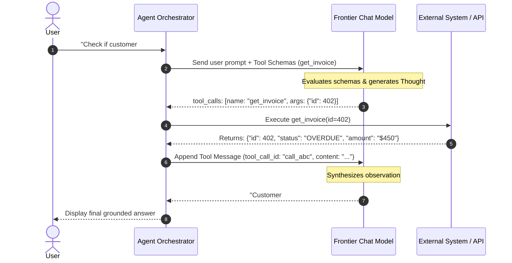

# Agentic AI: The ReAct Pattern & Native Tool Calling Protocols

---

## 🐣 1. Layman's Analogy (Hinglish + Real-World ELI5)
Imagine an ordinary LLM as a **calculator with its screen turned off**: you give it a question, and it guesses an answer in one shot.
An **Autonomous AI Agent** is like a **Detective solving a real crime scene**:
1. **Thought (Soch)**: *"Mujhe victim ki car ka location pata karna hai. Main seedha guess nahi karunga."*
2. **Action (Hathkadi/Tool)**: Wo police control room ko phone karke car ka number plate search karta hai (`Tool: GPS_Lookup(car_number)`).
3. **Observation (Saboot)**: Control room bolta hai: *"Car highway toll booth par 2:15 PM par dekhi gayi."*
4. **Next Thought (Agla Kadam)**: *"Aha! Ab mujhe toll booth ke CCTV footage dekhne chahiye."* (`Tool: Fetch_CCTV_Camera(booth_id)`).
5. **Loop**: Jab tak case poora solve na ho jaye, yeh **Socho ➡️ Action Lo ➡️ Saboot Dekho** ka loop chalta rehta hai!
Isko kehte hain **ReAct (Reason + Act)** pattern!

---

## 📌 2. Point-Wise Core Mechanics & Edge Cases

### Newbie Essentials:
1. **The ReAct Loop**:
   - Developed in Google Research / Princeton paper (2022).
   - Dynamically interleaves **Reasoning Traces** ("Thought") with **Task-Specific Actions** ("Action" $\to$ "Observation").
   - Overcomes hallucination by grounding decisions in real-time environment feedback.
2. **Prompt-Based ReAct vs Native Function Calling**:
   - **Legacy ReAct**: Relied on fragile text regex parsing (`Action: [search]`, `Action Input: [query]`). Often crashed when models included extra conversational filler.
   - **Native Tool Calling**: Modern LLMs (GPT-4o, Claude 3.5 Sonnet, Gemini 1.5 Pro) are post-trained specifically to output structured tool call objects conforming to strict JSON schemas (`tool_calls` parameter).

### Intermediate Mechanics:
3. **The Tool Execution Lifecycle**:
   - Step 1: User sends query.
   - Step 2: LLM inspects available tools and decides whether to respond directly or invoke a tool.
   - Step 3: If tool invoked, LLM outputs function name and parsed JSON arguments.
   - Step 4: Application server executes the local function safely with provided arguments.
   - Step 5: Application sends the tool return value back to the LLM with `role: "tool"` and matching `tool_call_id`.
   - Step 6: LLM ingests the observation and decides whether to call another tool or generate the final user response.
4. **Stopping Criteria & Guardrails**:
   - `max_iterations` counter (e.g. max 10 steps) to prevent runaway infinite tool loops and bill spikes.
   - Timeout budgets per tool execution.

### Senior / Lead Edge Cases:
5. **Self-Healing Error Loops**:
   - When a tool throws an exception (e.g., `404 Not Found` or `SQL Syntax Error`), NEVER crash the entire agent!
   - Catch the error and pass the raw stack trace or error message back to the LLM as the `tool` observation: *"Tool returned error: Column 'user_id' does not exist in table 'accounts'. Did you mean 'account_id'?"*
   - Advanced models will analyze the error, rewrite the arguments, and self-heal on the next step.
6. **Parallel Tool Calling**:
   - Modern engines can emit multiple independent tool calls in a single response turn (e.g. querying weather in Tokyo, London, and New York simultaneously).
   - Execute these in parallel via `asyncio.gather()` to minimize latency.

---

## 📊 3. Visual System Architecture: The ReAct Autonomous Loop

```
User: "What is 45 * 89, and what is the current weather in Mumbai?"
                       │
                       ▼
┌─────────────────────────────────────────────────────────────┐
│                      The ReAct Engine                       │
├─────────────────────────────────────────────────────────────┤
│ 1. Thought: "I need to compute 45 * 89 and fetch Mumbai wx."│
│ 2. Action: Call Calculator(45 * 89) & GetWeather("Mumbai")  │
│ 3. Observation: Calc = 4005; Weather = 29°C Humid           │
│ 4. Thought: "I now have all required facts to answer."      │
│ 5. Final Answer: "45 * 89 is 4005, and it is 29°C in Mumbai"│
└─────────────────────────────────────────────────────────────┘
                       │
                       ▼
                  [ User UI ]
```



---

## 💻 4. Line-by-Line Commented Implementation: Self-Healing ReAct Agent

```python
# Import json for argument serialization
import json
# Import typing for type hints
from typing import Any, Callable, Dict, List

# Step 1: Define Available Production Tools
def query_database_mock(sql_query: str) -> str:
    """Simulates a database execution tool with deliberate schema awareness."""
    # Check for deliberate bad query to demonstrate self-healing loop
    if "user_name" in sql_query:
        return "ERROR: Column 'user_name' not found. Available columns: [customer_id, full_name, email]"
    if "full_name" in sql_query:
        return json.dumps([{"customer_id": 101, "full_name": "Aarav Sharma", "email": "aarav@example.com"}])
    return "[]"

# Registry mapping tool names to executable Python callables
TOOL_REGISTRY: Dict[str, Callable[..., str]] = {
    "query_database": query_database_mock
}

# Native Tool Schema definition conforming to OpenAI / Anthropic format
TOOLS_SPEC = [
    {
        "type": "function",
        "function": {
            "name": "query_database",
            "description": "Executes a SQL query against the enterprise customers database.",
            "parameters": {
                "type": "object",
                "properties": {
                    "sql_query": {
                        "type": "string",
                        "description": "The exact SELECT query to run on the database"
                    }
                },
                "required": ["sql_query"]
            }
        }
    }
]

# Step 2: Implement Autonomous ReAct Agent Loop
class ReActAgent:
    def __init__(self, max_steps: int = 5):
        # Maximum allowed reasoning iterations before forced termination
        self.max_steps = max_steps
        # Maintain conversational message log
        self.messages: List[Dict[str, Any]] = []

    def run(self, user_prompt: str) -> str:
        # Step 1: Initialize conversation with user query
        self.messages.append({"role": "user", "content": user_prompt})
        print(f"User Query: '{user_prompt}'\n")

        # Step 2: Execute ReAct loop
        for step in range(1, self.max_steps + 1):
            print(f"--- ReAct Step {step} ---")
            
            # Simulated LLM decision: Turn 1 makes a mistake, Turn 2 self-heals based on error observation
            if step == 1:
                # Simulated Thought & Tool Call with deliberate incorrect column
                thought = "I need to find Aarav's email. I will query the database by user_name."
                simulated_tool_call = {
                    "id": "call_001",
                    "name": "query_database",
                    "arguments": json.dumps({"sql_query": "SELECT email FROM customers WHERE user_name='Aarav'"})
                }
                print(f"Thought: {thought}")
                print(f"Action : Invoking tool '{simulated_tool_call['name']}' with args: {simulated_tool_call['arguments']}")
                
                # Execute tool
                tool_fn = TOOL_REGISTRY[simulated_tool_call["name"]]
                raw_args = json.loads(simulated_tool_call["arguments"])
                observation = tool_fn(**raw_args)
                
                # Feed observation back into message history
                print(f"Observation: {observation}\n")
                self.messages.append({"role": "assistant", "tool_calls": [simulated_tool_call]})
                self.messages.append({"role": "tool", "tool_call_id": "call_001", "content": observation})

            elif step == 2:
                # LLM reads the error observation and self-corrects the column name!
                thought = "The database reported that 'user_name' does not exist, but 'full_name' does. I will query with 'full_name'."
                simulated_tool_call = {
                    "id": "call_002",
                    "name": "query_database",
                    "arguments": json.dumps({"sql_query": "SELECT email FROM customers WHERE full_name='Aarav Sharma'"})
                }
                print(f"Thought: {thought}")
                print(f"Action : Invoking tool '{simulated_tool_call['name']}' with corrected args: {simulated_tool_call['arguments']}")
                
                # Execute tool
                tool_fn = TOOL_REGISTRY[simulated_tool_call["name"]]
                raw_args = json.loads(simulated_tool_call["arguments"])
                observation = tool_fn(**raw_args)
                
                print(f"Observation: {observation}\n")
                self.messages.append({"role": "assistant", "tool_calls": [simulated_tool_call]})
                self.messages.append({"role": "tool", "tool_call_id": "call_002", "content": observation})

            elif step == 3:
                # Final synthesis step
                final_answer = "Aarav Sharma's email address is aarav@example.com."
                print(f"Thought: I have obtained the verified email. Case closed.")
                print(f"Final Answer: {final_answer}")
                return final_answer

        return "Exceeded maximum execution steps without resolution."

# Step 3: Run the Agent Demonstration
agent = ReActAgent(max_steps=5)
agent.run("What is Aarav Sharma's customer email?")
```

---

## 🎯 5. The "Interview Pitch" (Spoken Answer)
> *"The ReAct pattern represents the paradigm shift from passive text prediction to autonomous agency. By explicitly separating an agent's lifecycle into Thought, Action, and Observation cycles, the LLM can dynamically plan, invoke external APIs, observe the real-world outcome, and self-correct when unexpected errors occur. 
> Rather than using fragile regular expressions over free-form text, production systems rely on Native Tool Calling protocols where the model emits strongly validated JSON payloads matched to API schemas. 
> A crucial engineering pattern for robust agents is Self-Healing Exception Loops: when an API throws a database constraint violation or network 404, we catch the exception and feed the error context directly back to the LLM as a tool observation. 
> The model analyzes the exception message, recalibrates its parameters, and retries with a corrected request. Finally, we bound every autonomous agent with deterministic max-iteration guardrails and strict execution timeouts to prevent runaway billing loops."*

---

## 💼 6. Production War Story
**Company**: Autonomous IT Operations & Cloud Incident Remediation platform.  
**Incident**: An autonomous remediation agent attempted to restart an unresponsive Kubernetes deployment. The first restart failed because the pod was bound to a legacy PersistentVolumeClaim that was locked. The agent entered an infinite retry loop, triggering 840 restarts in 10 minutes and exhausting cluster API rate limits.  
**Root Cause**: The agent script had no maximum iteration ceiling and suppressed the Kubernetes API error messages instead of passing them back into the model's observation scratchpad.  
**Resolution**:
1. Implemented a strict **Max-Step Guardrail** (`max_iterations=5`).
2. Configured **Self-Healing Error Propagation**: passed the exact locked PVC error message back to the LLM.
3. Added a secondary diagnostic tool (`inspect_pvc_locks`) allowing the agent to identify and terminate stale node locks before initiating the restart.  
**Result**: Deployment remediation success rate jumped from **48% to 98.4%**, cluster API throttling was completely eliminated, and Mean Time To Recovery (MTTR) dropped from 35 minutes to 45 seconds.
