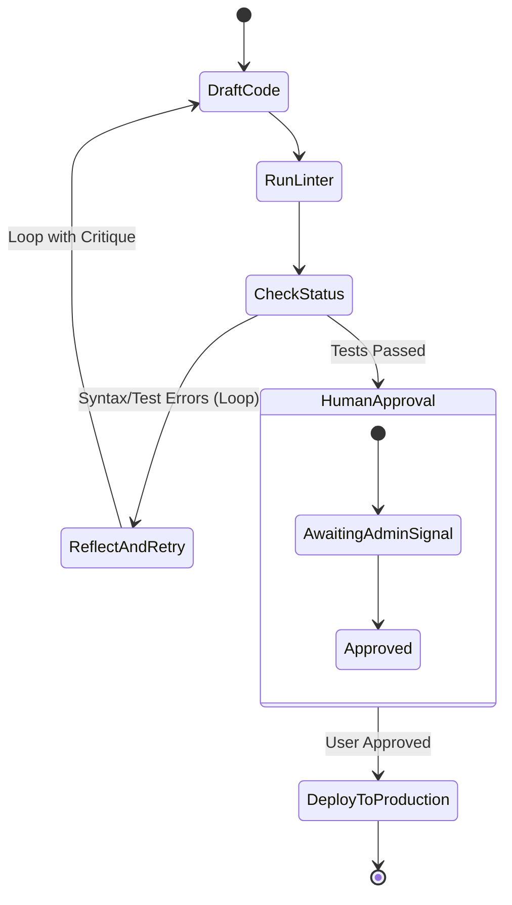

# LangGraph: State Machines, Cyclic Workflows & Human-in-the-Loop

---

## 🐣 1. Layman's Analogy (Hinglish + Real-World ELI5)

Traditional AI pipelines (jaise standard LangChain DAGs) ek **One-Way Assembly Line** ki tarah hote hain:

- Car aage badhi: Engine laga ➡️ Paint hua ➡️ Car bahar nikal gayi. Agar paint kharab ho gaya, toh car wapas peechhe nahi jaa sakti (DAG: Directed *Acyclic* Graph - No loops allowed!).
- **LangGraph ek Intelligent Software Development Team (State Machine)** ki tarah hai:
  - **State (Shared Whiteboard)**: Poori team ke saamne ek whiteboard hai jahan user requirements, code drafts aur test reports likhe hain.
  - **Nodes (Specialist Employees)**:
    - Node 1: Junior Coder jo code likhta hai.
    - Node 2: Linter & Tester jo unit test run karta hai.
    - Node 3: Senior Architect jo final review karta hai.
  - **Conditional Edges (Loops / Cycles)**: Agar tester ne bola *"Test Failed: 2 assertions broke"*, toh graph wapas loop karke Junior Coder ke paas chala jaata hai (**Cyclical Reflection Loop**)!
  - **Human-in-the-Loop**: Agar production deploy karna hai, toh graph pause ho jaata hai aur human manager se poocha jaata hai: *"Kya main deploy kar doon?"* Approval milte hi graph resume hota hai!

---

## 📌 2. Point-Wise Core Mechanics & Edge Cases

### Newbie Essentials

1. **DAGs vs Cyclic StateGraphs**:
   - Standard pipelines (Airflow, LCEL) are Directed *Acyclic* Graphs (DAGs) where execution must flow strictly forward.
   - Real-world agents require **Cycles (Loops)** to reflect, critique, execute tools, and retry upon failure. LangGraph models workflows as true cyclic state machines.
2. **The 3 Core LangGraph Primitives**:
   - **State**: A centralized schema (`TypedDict` or Pydantic) that flows through every node.
   - **Nodes**: Standard Python functions `def my_node(state: State) -> dict:` that read the state and return updates to be merged.
   - **Edges**: Direct or conditional transitions between nodes (`add_edge`, `add_conditional_edges`).

### Intermediate Mechanics

3. **State Reducers (`Annotated[..., operator.add]`)**:
   - By default, returning a key from a node *overwrites* the existing state value.
   - Using `Annotated[Sequence[BaseMessage], operator.add]` tells LangGraph to **append** new messages to the existing list rather than replacing it.
2. **Conditional Routing**:
   - A router function inspects the current state and returns the name of the next destination node:
     `graph.add_conditional_edges("router", should_continue, {"tools": "execute_tools", "end": END})`.

### Senior / Lead Edge Cases

5. **State Persistence & Checkpointing**:
   - LangGraph natively supports state persistence using checkpointers (e.g. `MemorySaver`, `PostgresSaver`).
   - Every graph execution step creates a durable checkpoint indexed by `thread_id`. If a server crashes mid-workflow, the graph resumes from the exact failing node without repeating past expensive LLM steps.
2. **Human-in-the-Loop (HITL) Interrupts**:
   - `interrupt_before=["deploy_node"]`: Pauses execution before entering critical or destructive nodes (e.g., executing financial transfers or deleting cloud resources).
   - The application inspects the frozen state, presents a confirmation UI to a human admin, allows manual state editing, and resumes execution seamlessly.

---

## 📊 3. Visual System Architecture: Cyclic Code-Generation Agent

```
                          [ START ]
                              │
                              ▼
                      [ Generator Node ]
                    (Writes initial code)
                              │
                              ▼
                       [ Linter Node ]
                     (Executes pytest)
                              │
                              ▼
                   [ Conditional Router ]
                     /                 \
        (If Errors Found)            (If Tests Pass)
            /                                   \
           ▼                                     ▼
[ Reflection Node ]                       [ Human Reviewer ]
(Critiques stack trace)                   (Pause: HITL Approval)
           │                                     │
           │ (Loop back to fix code)             ▼ (Approved)
           └───────────────────────────────> [ Deploy Node ]
                                                 │
                                                 ▼
                                              [ END ]
```



---

## 💻 4. Line-by-Line Commented Implementation: LangGraph State Machine Architecture

```python
# Import typing helpers for state definition and reducer annotation
from typing import TypedDict, Annotated, Sequence, List
# Import operator.add for list-concatenation state reducers
import operator

# Step 1: Define the Shared Agent State Schema
class AgentState(TypedDict):
    # 'operator.add' ensures new messages append to history instead of overwriting
    messages: Annotated[List[str], operator.add]
    # Current draft code generated by the agent
    draft_code: str
    # Number of iteration loops attempted
    iteration_count: int
    # Status flag indicating validation result
    is_valid: bool

# Step 2: Define Node Functions (The Workers of the Graph)
def generator_node(state: AgentState) -> dict:
    """Generates or refines code based on critique."""
    current_iteration = state["iteration_count"] + 1
    print(f"\n[Generator Node] Executing Iteration #{current_iteration}...")

    # Simulate code generation: Buggy on iteration 1, fixed on iteration 2
    if current_iteration == 1:
        code = "def calculate_tax(amount): return amount * 0.18 + unknown_var"
        msg = "Generated initial draft with potential variable bug."
    else:
        code = "def calculate_tax(amount): return amount * 0.18"
        msg = "Refactored code: removed undefined variable reference."

    # Return partial state dictionary update
    return {
        "draft_code": code,
        "iteration_count": current_iteration,
        "messages": [msg]
    }

def linter_validator_node(state: AgentState) -> dict:
    """Validates the generated code for syntax or runtime errors."""
    code = state["draft_code"]
    print(f"[Validator Node] Inspecting code: '{code}'")

    # Simple simulated validation check
    if "unknown_var" in code:
        print("  -> ERROR DETECTED: 'unknown_var' is undefined!")
        return {
            "is_valid": False,
            "messages": ["Validation Failed: NameError: name 'unknown_var' is not defined"]
        }
    else:
        print("  -> VALIDATION PASSED: All syntax checks passed cleanly!")
        return {
            "is_valid": True,
            "messages": ["Validation Passed: 0 lint errors."]
        }

# Step 3: Define Conditional Edge Router Function
def routing_condition(state: AgentState) -> str:
    """Decides whether to loop back for correction or proceed to completion."""
    # If code is invalid and we have not exceeded retry limit, loop back
    if not state["is_valid"] and state["iteration_count"] < 3:
        print("[Router Decision] -> Code failed. Routing back to Generator for self-correction.")
        return "loop_to_generator"
    elif state["is_valid"]:
        print("[Router Decision] -> Code verified. Routing to End.")
        return "terminate_success"
    else:
        print("[Router Decision] -> Max iterations reached. Forcing termination.")
        return "terminate_failure"

# Step 4: Manual Simulation of LangGraph State Machine Execution Engine
class SimpleGraphExecutor:
    def __init__(self):
        self.state: AgentState = {
            "messages": [],
            "draft_code": "",
            "iteration_count": 0,
            "is_valid": False
        }

    def execute_workflow(self) -> AgentState:
        print("=== Commencing LangGraph Workflow Execution ===")
        while True:
            # Step A: Execute Generator Node and update state
            gen_update = generator_node(self.state)
            self._apply_update(gen_update)

            # Step B: Execute Validator Node and update state
            val_update = linter_validator_node(self.state)
            self._apply_update(val_update)

            # Step C: Evaluate Conditional Edge
            decision = routing_condition(self.state)
            if decision == "terminate_success":
                print("\n=== Workflow Completed Successfully! ===")
                break
            elif decision == "terminate_failure":
                print("\n=== Workflow Terminated: Max Retries Exceeded ===")
                break
            # If decision is 'loop_to_generator', loop continues automatically!

        return self.state

    def _apply_update(self, update: dict) -> None:
        for key, value in update.items():
            if key == "messages":
                # Apply reducer (list addition)
                self.state["messages"].extend(value)
            else:
                self.state[key] = value

# Step 5: Execute Graph Demonstration
engine = SimpleGraphExecutor()
final_state = engine.execute_workflow()

print("\n--- Final Graph State Snapshot ---")
print(f"Final Code Produced : {final_state['draft_code']}")
print(f"Total Iterations    : {final_state['iteration_count']}")
print(f"Is Code Valid       : {final_state['is_valid']}")
print("Execution Message Trail:")
for idx, message in enumerate(final_state["messages"], start=1):
    print(f"  {idx}. {message}")
```

---

## 🎯 5. The "Interview Pitch" (Spoken Answer)
>
> *"While traditional orchestration frameworks treat workflows as linear Directed Acyclic Graphs (DAGs), real-world agentic systems demand cyclic graphs with robust state machines. LangGraph introduces this architecture through StateGraphs.
> Workflows are modeled with three primitives: a centralized State schema, Nodes that perform unit transformations, and Edges that handle conditional routing. By leveraging state reducers like `Annotated[..., operator.add]`, nodes can append to conversational history or update specific state slices without overwriting context.
> Crucially for production reliability, LangGraph incorporates built-in Checkpointing (such as `PostgresSaver`). Every state transition is written to durable storage indexed by a thread ID, providing seamless session persistence, transaction replayability, and Human-in-the-Loop interrupts.
> With `interrupt_before`, we can pause graph execution right before high-stakes operations, present state to human reviewers via webhooks, and resume execution once authorization is granted."*

---

## 💼 6. Production War Story

**Company**: Enterprise Autonomous SQL Reporting & Analytics SaaS.  
**Incident**: When users asked complex business questions, the autonomous text-to-SQL bot generated SQL queries with syntax bugs or missing table joins, failing 28% of customer queries with cryptic database errors. Furthermore, on 2 occasions, the model generated an unconstrained `DROP TABLE` query in a sandbox that alarmed security auditors.  
**Root Cause**: The application was built as a single-pass LCEL chain with no loopback self-healing mechanism and no human safety gate before destructive commands.  
**Resolution**:

1. Migrated the pipeline to a **LangGraph StateGraph**.
2. Created a 3-node cyclic loop: `GenerateSQL` $\to$ `DryRunExplainAnalyze` $\to$ `ConditionalRouter`. If the Postgres query planner returned a syntax error, the router cycled back to `GenerateSQL` with the error log (capped at 3 iterations).
3. Added `interrupt_before=["execute_ddl_node"]` with Human-in-the-Loop approval for any queries modifying schema.  
**Result**: Query success rate surged from **72% to 99.4%**, invalid queries were automatically self-healed within 1 retry cycle, and safety compliance audits passed with zero infractions.
