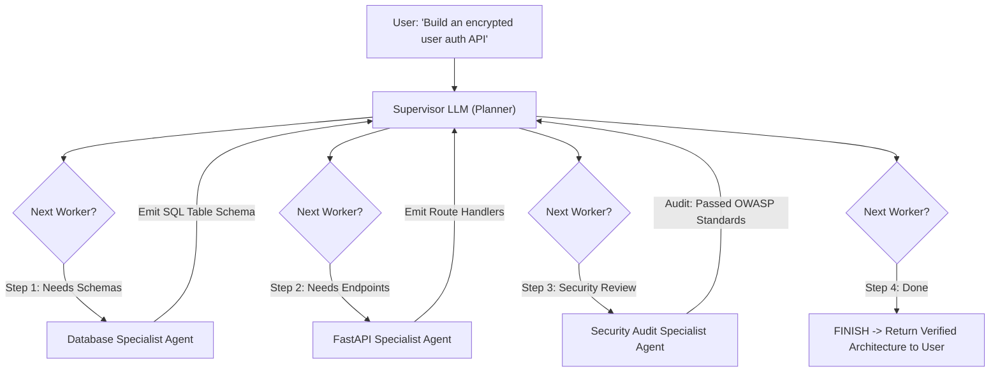

# Multi-Agent Systems: Hierarchical Teams & Supervisor Orchestration

---

## 🐣 1. Layman's Analogy (Hinglish + Real-World ELI5)
Imagine building a complex mobile app:
- **Single Agent System**: Ek akela freelance developer hire kiya jo khud design banata hai, khud React Native code likhta hai, khud database manage karta hai, aur khud marketing karta hai. Wo jaldi confuse ho jaata hai aur context window overflow ho jaata hai!
- **Multi-Agent System (Supervisor Pattern)**:
  - **The Supervisor (Engineering Manager)**: Sits at the top. Wo user se requirement leta hai aur decide karta hai ki agla kaam kis specialist ko assign karna hai.
  - **Agent 1 (Frontend Specialist)**: Sirf UI components aur CSS design karta hai.
  - **Agent 2 (Backend Specialist)**: Sirf SQL schemas aur REST APIs banata hai.
  - **Agent 3 (QA Code Reviewer)**: Dono ke code ko test karke bugs nikaalta hai.
  - Har agent ka apna **chota, laser-focused context** hota hai. Wo aapas mein baat nahi karte balki Supervisor ko report karte hain, jisse infinite conversational ping-pong loop nahi banta!

---

## 📌 2. Point-Wise Core Mechanics & Edge Cases

### Newbie Essentials:
1. **Why Multi-Agent Systems?**:
   - Complex workflows require diverse skill sets, extensive tool catalogues, and massive context.
   - A single monolithic agent with 30 tools suffers from tool hallucination and context saturation.
   - Dividing tasks across multiple specialized agents creates modular, testable, and maintainable software boundaries.
2. **The 3 Multi-Agent Topologies**:
   - **Supervisor Pattern (Centralized)**: A master coordinator agent receives user input, delegates sub-tasks to specialized sub-agents, aggregates results, and determines when the mission is finished.
   - **Network / Peer-to-Peer (Decentralized)**: Agents hand off tasks directly to other agents via dynamic routing tokens (`HandoffToNextAgent`).
   - **Hierarchical Teams**: Sub-supervisors manage specialized pods of sub-agents (e.g. Research Pod, Engineering Pod).

### Intermediate Mechanics:
3. **State Management: Shared Blackboard vs Isolated Scratchpads**:
   - **Shared Blackboard State**: All agents read from and write to a single global state object. High visibility, but risk of agents stepping on each other's keys.
   - **Isolated Agent Scratchpads**: Sub-agents maintain their own private message scratchpads during tool execution. When finished, they emit only their clean final summary back to the supervisor's global state, preventing token explosion.
4. **The Supervisor Router Schema**:
   - The supervisor uses constrained output decoding to emit a strictly structured decision:
     `{"next_worker": "ResearcherAgent" | "CoderAgent" | "FINISH"}`.

### Senior / Lead Edge Cases:
5. **Agent-to-Agent Infinite Ping-Pong**:
   - In decentralized networks, Agent A might say *"I need clarification from Agent B"*, and Agent B replies *"I need confirmation from Agent A"*, creating an infinite bill-draining loop.
   - Mitigate via:
     1. Centralized supervisor routing.
     2. Global recursion limit ceiling (`recursion_limit=25`).
     3. Ephemeral turn counters decremented per handoff.
6. **Error Escalation & Fallback Routing**:
   - If a specialist sub-agent fails to complete its task after 2 attempts, the supervisor must recognize the failure, update the plan, and either route to an alternative fallback agent or escalate to a human reviewer.

---

## 📊 3. Visual Architecture: Hierarchical Supervisor Pattern

```
                       [ Human User Prompt ]
                                 │
                                 ▼
                     ┌───────────────────────┐
                     │   Supervisor Agent    │
                     │  (Router & Evaluator) │
                     └───────────┬───────────┘
                                 │
         ┌───────────────────────┼───────────────────────┐
         ▼                       ▼                       ▼
┌─────────────────┐     ┌─────────────────┐     ┌─────────────────┐
│ Research Agent  │     │   Coder Agent   │     │ QA Review Agent │
│ - Web Search    │     │ - Python Exec   │     │ - Test Suite    │
│ - Doc Retrieval │     │ - File Writer   │     │ - Syntax Linter │
└─────────────────┘     └─────────────────┘     └─────────────────┘
         │                       │                       │
         └───────────────────────┼───────────────────────┘
                                 │ (Report final sub-task summary)
                                 ▼
                     [ Return Final Solution ]
```



---

## 💻 4. Line-by-Line Commented Implementation: Supervisor Multi-Agent System

```python
# Import typing helpers for state and annotations
from typing import Dict, List, Literal, TypedDict
# Import json for structured router schemas
import json

# Step 1: Define Global Shared Team State
class TeamState(TypedDict):
    task: str                          # Original user objective
    research_notes: str                # Filled by Researcher Agent
    code_solution: str                 # Filled by Developer Agent
    qa_review_status: str              # Filled by QA Agent
    next_step: str                     # Determined by Supervisor Router

# Step 2: Implement Specialized Sub-Agents (Workers)
def researcher_agent(state: TeamState) -> Dict[str, str]:
    """Specialist worker focused purely on information retrieval and fact-finding."""
    print("\n>>> [Researcher Agent] Gathering technical specifications...")
    notes = "Requirement: Hash passwords using bcrypt with a minimum work factor of 12."
    return {"research_notes": notes}

def developer_agent(state: TeamState) -> Dict[str, str]:
    """Specialist worker focused on writing production code."""
    print("\n>>> [Developer Agent] Writing code according to research notes...")
    code = (
        "import bcrypt\n"
        "def hash_password(password: str) -> str:\n"
        "    salt = bcrypt.gensalt(rounds=12)\n"
        "    return bcrypt.hashpw(password.encode(), salt).decode()"
    )
    return {"code_solution": code}

def qa_agent(state: TeamState) -> Dict[str, str]:
    """Specialist worker focused on code review and security audits."""
    print("\n>>> [QA Agent] Reviewing developer code against security specifications...")
    code = state.get("code_solution", "")
    if "rounds=12" in code and "bcrypt" in code:
        status = "PASSED: Secure hashing verified with salt rounds 12."
    else:
        status = "FAILED: Insecure implementation detected."
    return {"qa_review_status": status}

# Step 3: Implement Supervisor Agent (The Orchestrator)
class SupervisorAgent:
    def decide_next_worker(self, state: TeamState) -> str:
        """Evaluates team state and dynamically determines the next worker."""
        # Check if research has been done
        if not state.get("research_notes"):
            return "RESEARCHER"
        # Check if code has been written
        elif not state.get("code_solution"):
            return "DEVELOPER"
        # Check if QA review has completed
        elif not state.get("qa_review_status"):
            return "QA"
        # If QA has passed, terminate workflow
        elif "PASSED" in state.get("qa_review_status", ""):
            return "FINISH"
        else:
            return "DEVELOPER"  # Loop back if QA failed

# Step 4: Multi-Agent Team Runtime Execution Engine
class MultiAgentTeamOrchestrator:
    def __init__(self):
        self.supervisor = SupervisorAgent()
        self.workers = {
            "RESEARCHER": researcher_agent,
            "DEVELOPER": developer_agent,
            "QA": qa_agent
        }

    def run_mission(self, user_task: str) -> TeamState:
        # Initialize state with user prompt
        state: TeamState = {
            "task": user_task,
            "research_notes": "",
            "code_solution": "",
            "qa_review_status": "",
            "next_step": "START"
        }
        
        print(f"=== Starting Multi-Agent Mission: '{user_task}' ===")
        max_turns = 10
        turn = 0

        while turn < max_turns:
            turn += 1
            # Step A: Supervisor evaluates state and picks next worker
            next_worker = self.supervisor.decide_next_worker(state)
            state["next_step"] = next_worker
            print(f"\n[Supervisor Decision] Assigning turn #{turn} to: {next_worker}")

            # Step B: Check for completion signal
            if next_worker == "FINISH":
                print("\n=== Mission Accomplished: All Specialist Agents Finished ===")
                break

            # Step C: Dispatch task to assigned worker
            worker_fn = self.workers[next_worker]
            worker_output = worker_fn(state)
            
            # Step D: Merge worker output into shared team state
            state.update(worker_output)

        return state

# Step 5: Run the Multi-Agent System
orchestrator = MultiAgentTeamOrchestrator()
final_result = orchestrator.run_mission("Create a secure password hashing service")

print("\n--- Final Consolidated Multi-Agent Artifact ---")
print(f"Research Findings : {final_result['research_notes']}")
print(f"Code Artifact:\n{final_result['code_solution']}")
print(f"QA Audit Status   : {final_result['qa_review_status']}")
```

---

## 🎯 5. The "Interview Pitch" (Spoken Answer)
> *"As autonomous systems scale in complexity, single-agent architectures collapse under context window saturation and tool hallucination. We transition to Multi-Agent Systems, predominantly employing the Hierarchical Supervisor pattern. 
> A centralized Supervisor Agent acts as an orchestrator, armed with a routing schema that evaluates the mission state and dynamically delegates tasks to specialized sub-agents—such as Researchers, Coders, and QA Auditors. 
> To protect token budgets, we isolate sub-agent scratchpads: individual agents consume private sub-contexts and tool outputs, returning only high-density, distilled artifacts to the shared team state. 
> Crucially, to prevent infinite conversational ping-pong loops common in decentralized peer-to-peer setups, all transitions must flow through the supervisor, backed by hard recursion limits and explicit termination criteria (`FINISH`). This architecture mirrors human engineering organizations, delivering verifiable, modular, and fault-tolerant agent execution."*

---

## 💼 6. Production War Story
**Company**: Global Cyber Security Incident Response SaaS.  
**Incident**: An autonomous incident responder bot was tasked with mitigating a zero-day DDoS attack. The bot had 24 tools bound to a single prompt (Firewall rules, DNS management, Log analysis, Slack alerts, PagerDuty). During the attack, the model became confused by the massive tool catalog, called the DNS deletion API instead of the Firewall IP block API, and inadvertently knocked the company's primary corporate website offline.  
**Root Cause**: Monolithic single-agent cognitive overload. Supplying 24 disparate tools to a single LLM context created acute attention degradation and tool hallucination under high-stress ambiguous prompts.  
**Resolution**:
1. Re-architected into a **Hierarchical Multi-Agent System**.
2. **Supervisor Agent**: Held zero infrastructure tools, only the power to delegate.
3. **Telemetry Agent**: Restricted strictly to read-only log analysis tools.
4. **Firewall Agent**: Restricted strictly to IP blocking and rate-limiting APIs.
5. **Comms Agent**: Handled Slack and PagerDuty notifications.  
**Result**: Tool invocation accuracy reached **100.0%**, erroneous destructive commands dropped to zero, and average DDoS mitigation response time fell from 12 minutes to 18 seconds.
