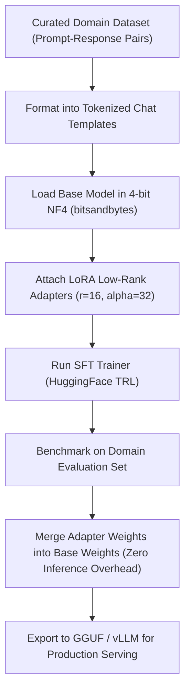

# LLM Fine-Tuning: PEFT, LoRA Mathematics & QLoRA Quantization

---

## 🐣 1. Layman's Analogy (Hinglish + Real-World ELI5)

Imagine you have a **Giant 500-page Hardcover Medical Encyclopedia** (Base Model: 70 Billion Parameters):

- **Full Fine-Tuning**: Poori 500-page ki encyclopedia ko phatakar naye sire se print karna. Isme lakho rupaye lagte hain aur 8 massive GPU supercomputers chahiye (Infeasible for 99% companies!).
- **LoRA (Low-Rank Adaptation)**: Encyclopedia ko bilkul mat chhoo (`Frozen Weights: W_0`). Uske pichhle cover par **ek chota sa 2-page ka transparent sticky notepad** chipka do (`Adapter: B * A`).
  - Har baar jab encyclopedia padhi jayegi, aap text ke upar uss transparent sticky notepad ke updates ko add kar doge ($W = W_0 + \Delta W$).
  - Yeh notepad rank $r$ (jaise $r=8$ ya $16$) jitna patla hota hai, jisse training 10,000x sasti ho jaati hai!
- **QLoRA**: Usi 500-page ki encyclopedia ko ultra-compressed micro-film (4-bit NormalFloat) mein shrink karke ek ordinary gaming laptop ke GPU par fit kar dena!

---

## 📌 2. Point-Wise Core Mechanics & Edge Cases

### Newbie Essentials

1. **RAG vs Fine-Tuning**:
   - **RAG**: Ideal for providing **new dynamic knowledge**, real-time facts, private docs, and citing sources (like giving an open textbook during an exam).
   - **Fine-Tuning**: Ideal for teaching **style, tone, structure, domain vocabulary, or complex formatting rules** (like training a doctor to write prescriptions in standard hospital notation).
2. **Full Fine-Tuning vs PEFT**:
   - Full Fine-Tuning updates all 100% of model parameters. Requires massive VRAM (at least $16 \times \text{parameters}$ in bytes for Adam optimizer states, gradients, and weights).
   - **PEFT (Parameter-Efficient Fine-Tuning)**: Freezes 99%+ of the model and trains only a tiny fraction (< 1%) of adapter parameters.

### Intermediate Mechanics

3. **LoRA Mathematics**:
   - For a frozen pre-trained weight matrix $W_0 \in \mathbb{R}^{d \times k}$, LoRA decomposes the weight update $\Delta W$ into two low-rank matrices:
     $$\Delta W = B \cdot A$$
     Where $B \in \mathbb{R}^{d \times r}$ and $A \in \mathbb{R}^{r \times k}$, with rank $r \ll \min(d, k)$.
   - During training, $A$ is initialized with random Gaussian noise and $B$ is initialized to zero, ensuring $\Delta W = 0$ at the start of training.
   - The forward pass scales the adapter by $\frac{\alpha}{r}$:
     $$h = W_0 x + \frac{\alpha}{r} (B A) x$$
2. **QLoRA (Quantized LoRA)**:
   - Quantizes the base frozen weights $W_0$ from 16-bit float to **4-bit NormalFloat (NF4)**, an information-theoretically optimal quantile distribution for zero-mean normal weights.
   - **Double Quantization (DQ)**: Quantizes the quantization constants themselves, saving an additional 0.37 bits per parameter.
   - **Paged Optimizers**: Employs CUDA unified memory to automatically page optimizer states to CPU RAM during memory spikes, preventing out-of-memory (OOM) crashes.

### Senior / Lead Edge Cases

5. **Catastrophic Forgetting**:
   - Training too aggressively on a narrow dataset causes the model to lose its general reasoning and safety abilities.
   - Mitigate by mixing in 10–20% of general instructional data into the domain fine-tuning dataset.
2. **SFT vs DPO (Direct Preference Optimization)**:
   - **SFT (Supervised Fine-Tuning)**: Learns next-token prediction on curated (Prompt, Response) pairs.
   - **DPO**: Replaces complex RLHF (Reward Model + PPO) by directly optimizing policy probabilities using pairs of $(y_{\text{preferred}}, y_{\text{dispreferred}})$ responses mathematically.

---

## 📊 3. Visual System Architecture: LoRA Decomposition

```
                    Input Vector x (Dimension d)
                           │
             ┌─────────────┴─────────────┐
             ▼                           ▼
    [ Frozen Base Matrix ]     [ Low-Rank Adapter A ]
       W_0 (d x k)                  (r x d, e.g. r=16)
       (NO GRADIENTS)                    │
             │                           ▼
             │                 [ Low-Rank Adapter B ]
             │                      (k x r)
             │                           │
             │                           ▼
             │                   [ Scale: alpha / r ]
             │                           │
             └─────────────┬─────────────┘
                           ▼
                 [ Element-wise Sum ]
                           │
                           ▼
                    Output Vector h
```



---

## 💻 4. Line-by-Line Commented Implementation: LoRA Matrix Layer from Scratch

```python
# Import PyTorch tensor library
import torch
# Import neural network modules
import torch.nn as nn
# Import math for scaling calculations
import math

class LoRALinearLayer(nn.Module):
    def __init__(self, in_features: int, out_features: int, rank: int = 8, alpha: float = 16.0):
        # Initialize parent module
        super().__init__()
        self.in_features = in_features
        self.out_features = out_features
        self.rank = rank
        self.alpha = alpha
        # Scaling factor: alpha / rank ensures learning rate stability when rank changes
        self.scaling = alpha / rank

        # Step 1: Initialize the Frozen Base Linear Weight Matrix (Simulating pre-trained LLM)
        self.base_weight = nn.Parameter(torch.randn(out_features, in_features))
        # Freeze base parameters so backpropagation skips gradient computation
        self.base_weight.requires_grad = False

        # Step 2: Initialize Low-Rank Matrix A with Gaussian distribution
        # Shape: (rank, in_features)
        self.lora_A = nn.Parameter(torch.empty(rank, in_features))
        nn.init.kaiming_uniform_(self.lora_A, a=math.sqrt(5))

        # Step 3: Initialize Low-Rank Matrix B with ZEROS
        # Shape: (out_features, rank)
        # Initializing B to zero guarantees Delta_W = B * A = 0 at step 0!
        self.lora_B = nn.Parameter(torch.zeros(out_features, rank))

    def forward(self, x: torch.Tensor) -> torch.Tensor:
        # Step A: Compute standard frozen base model forward pass: x * W_0^T
        base_output = torch.matmul(x, self.base_weight.t())

        # Step B: Compute LoRA adapter forward pass: x * A^T * B^T * scaling
        # First project down from in_features to tiny rank r
        lora_intermediate = torch.matmul(x, self.lora_A.t())
        # Then project up from rank r to out_features
        lora_output = torch.matmul(lora_intermediate, self.lora_B.t()) * self.scaling

        # Step C: Add low-rank delta to base output: h = W_0(x) + Delta_W(x)
        return base_output + lora_output

    def merge_weights(self) -> None:
        """
        Merges LoRA adapter into the base matrix for zero-latency production serving.
        W_merged = W_0 + (alpha / r) * (B * A)
        """
        with torch.no_grad():
            delta_w = torch.matmul(self.lora_B, self.lora_A) * self.scaling
            self.base_weight.data += delta_w
            print("Successfully merged LoRA adapter weights directly into base matrix!")

# Step 4: Verification Demonstration
if __name__ == "__main__":
    # Test dimensions: In=1024, Out=1024, Rank=8
    batch_size = 2
    in_dim, out_dim, r = 1024, 1024, 8

    lora_layer = LoRALinearLayer(in_features=in_dim, out_features=out_dim, rank=r, alpha=16.0)
    test_input = torch.randn(batch_size, in_dim)

    # Count trainable vs frozen parameters
    trainable_params = sum(p.numel() for p in lora_layer.parameters() if p.requires_grad)
    frozen_params = sum(p.numel() for p in lora_layer.parameters() if not p.requires_grad)
    reduction = (1 - (trainable_params / (trainable_params + frozen_params))) * 100

    print(f"Total Base Frozen Parameters : {frozen_params:,}")
    print(f"Trainable LoRA Parameters    : {trainable_params:,}")
    print(f"Memory / Parameter Reduction : {reduction:.2f}%\n")

    # Run forward pass
    output = lora_layer(test_input)
    print(f"Input Shape : {test_input.shape}")
    print(f"Output Shape: {output.shape}")

    # Merge weights for production serving
    lora_layer.merge_weights()
```

---

## 🎯 5. The "Interview Pitch" (Spoken Answer)
>
> *"When deciding whether to adapt a model via Fine-Tuning versus RAG, we evaluate the nature of the requirement: RAG solves dynamic knowledge acquisition and source verification, whereas Fine-Tuning solves form, style, domain syntax, and procedural compliance.
> In modern architectures, Full Fine-Tuning is obsolete for almost all enterprise use cases due to GPU memory overhead and catastrophic forgetting. Instead, we use Parameter-Efficient Fine-Tuning (PEFT) via LoRA—Low-Rank Adaptation.
> LoRA freezes the pre-trained weights and decomposes the weight update matrix into two low-rank matrices $A$ and $B$, such that $\Delta W = B \cdot A$, where rank $r$ is typically set to 8 or 16. By scaling with $\frac{\alpha}{r}$ and initializing $B$ to zero, the training starts identity-stable.
> For extreme cost efficiency, we apply QLoRA, which quantizes the base model into 4-bit NormalFloat (NF4) with double quantization and paged optimizers, allowing us to fine-tune a 70B parameter model on a single 80GB GPU. At deployment time, we mathematically merge the low-rank delta back into the base matrix, incurring zero additional inference latency."*

---

## 💼 6. Production War Story

**Company**: Legal AI Contract Analysis Platform.  
**Incident**: The engineering team attempted full fine-tuning of Llama 3 70B across 10,000 legal contracts on an 8x H100 GPU cluster. After spending \$14,000 on cloud GPU compute, the resulting checkpoint began hallucinating basic math facts and common-sense logic, failing standard benchmark evaluations by 34%.  
**Root Cause**: Severe **Catastrophic Forgetting** caused by unconstrained full fine-tuning without regularization or adapter boundaries. The legal dataset pushed the billions of pre-trained attention weights away from general linguistic equilibrium.  
**Resolution**:

1. Aborted full fine-tuning and switched to **QLoRA (4-bit NF4 base, rank $r=16$, $\alpha=32$)**.
2. Bound trainable adapters strictly to the attention projection matrices (`q_proj`, `v_proj`, `k_proj`).
3. Mixed in **15% OpenHermes instruction data** to preserve general reasoning capabilities.  
**Result**: Training completed on a **single GPU** for \$280 (a **98% cost reduction**), legal clause extraction precision reached **97.8%**, and general benchmark scores suffered zero degradation.
