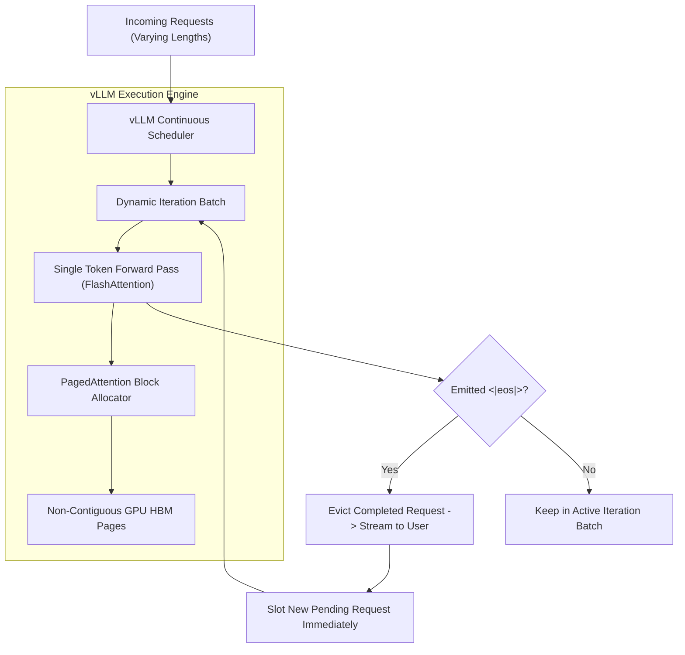

# Production LLM Serving: vLLM, PagedAttention & Quantization Formats

---

## 🐣 1. Layman's Analogy (Hinglish + Real-World ELI5)

Imagine a busy **Restaurant Kitchen serving 100 diners simultaneously**:

- **Naive Request Batching**: Chef tab tak naya order nahi banayega jab tak table 1 par baitha slow diner apni poori 5-course meal khatam na kar le. Saare doosre diners bhookhe baithe wait kar rahe hain (GPU sits idle waiting for the longest generation to finish!).
- **Continuous Batching (Iteration-Level Batching)**: Chef har minute ek roti (1 token) sekta hai. Jaise hi kisi diner ka ek bite khatam hota hai, agle token par naya diner table par add ho jaata hai!
- **KV-Cache Fragmentation Problem**: Puraani systems memory pre-allocate karti thi: *"Har diner ke liye 10-foot lambi table book karke rakho, chahe wo sirf 1 samosa khaye."* 60–80% GPU memory waste ho jaati thi!
- **PagedAttention (vLLM)**: Operating System ki tarah **Virtual Memory Paging** use karta hai. Memory ko chote-chote blocks (pages) mein baant deta hai. Jab jitne tokens generate hote hain, utne non-contiguous blocks allocate hote hain. Zero memory waste!

---

## 📌 2. Point-Wise Core Mechanics & Edge Cases

### Newbie Essentials

1. **The KV-Cache Bottleneck**:
   - In autoregressive decoding, past Keys ($K$) and Values ($V$) must be stored in GPU High-Bandwidth Memory (HBM) to avoid $O(N^2)$ recomputation.
   - For a 13B model with 2048 context length, each concurrent request requires ~1GB of VRAM solely for KV-cache.
2. **Serving Metrics**:
   - **TTFT (Time-To-First-Token)**: Latency until the first token streams out (dominated by prompt prefill phase).
   - **ITL (Inter-Token Latency)**: Time elapsed between subsequent tokens (dominated by memory bandwidth decoding).
   - **Throughput**: Aggregate tokens generated per second across all concurrent GPU streams.

### Intermediate Mechanics

3. **PagedAttention (vLLM)**:
   - Traditional servers pre-allocate contiguous VRAM for the maximum possible sequence length ($L_{\max}$), causing up to **80% internal and external memory fragmentation**.
   - PagedAttention divides the KV-cache into discrete **Physical Blocks** (e.g. 16 tokens per block). A **Block Table** maps logical token sequences to non-contiguous physical GPU pages, virtually eliminating memory fragmentation (< 4% waste).
2. **Continuous (Dynamic / Iteration-Level) Batching**:
   - Naive batching locks all requests together until the longest sequence completes.
   - Continuous batching operates at the single-iteration level: as soon as a request emits an `<|eos|>` token, it is evicted immediately from the batch, and a pending request from the queue is slotted in on the very next forward pass.

### Senior / Lead Edge Cases

5. **Model Quantization Formats**:
   - **GPTQ**: Second-order gradient-based post-training quantization (4-bit). Excellent for GPU weight compression.
   - **AWQ (Activation-aware Weight Quantization)**: Protects the top 1% salient weight channels that contain the highest activation magnitude, preserving perplexity better than GPTQ under low bit-widths.
   - **GGUF (llama.cpp)**: Fast quantized format optimized for CPU, Apple Silicon Metal, and consumer edge devices.
2. **Speculative Decoding**:
   - Uses a tiny, lightning-fast "Draft Model" (e.g. Llama-3-1B) to speculate 5 tokens ahead in parallel.
   - The large "Target Model" (Llama-3-70B) verifies all 5 tokens in a *single forward pass*. If 4 are accepted, generation throughput accelerates by 2.5x with zero loss in output quality.

---

## 📊 3. Visual System Architecture: PagedAttention Block Table

```
Logical Sequence (User Turn):
[ Token 0 - 15 ] ──> [ Token 16 - 31 ] ──> [ Token 32 - 47 ]
       │                     │                     │
       ▼                     ▼                     ▼
 ┌────────────────────────────────────────────────────────┐
 │           vLLM Block Table (Page Directory)            │
 ├────────────────────────────┬───────────────────────────┤
 │ Logical Page 0             │ Physical GPU Block #7     │
 │ Logical Page 1             │ Physical GPU Block #42    │
 │ Logical Page 2             │ Physical GPU Block #19    │
 └────────────────────────────┴───────────────────────────┘
                                     │
                                     ▼ (Non-Contiguous GPU Allocation)
 [ Physical VRAM: Block 7 ] ... [ Physical VRAM: Block 42 ] ... [ Block 19 ]
```



---

## 💻 4. Line-by-Line Commented Implementation: Continuous Batching Simulation

```python
# Import typing helpers
from typing import List, Dict, Optional
# Import dataclass for structured request state
from dataclasses import dataclass

# Step 1: Define Request State Object
@dataclass
class ServingRequest:
    request_id: str
    prompt: str
    tokens_to_generate: int
    generated_tokens: int = 0
    is_finished: bool = False

# Step 2: Implement Continuous Batching Scheduler Simulator
class ContinuousBatchingEngine:
    def __init__(self, max_batch_size: int = 3):
        self.max_batch_size = max_batch_size
        self.waiting_queue: List[ServingRequest] = []
        self.running_batch: List[ServingRequest] = []
        self.completed_requests: List[ServingRequest] = []

    def add_request(self, request_id: str, prompt: str, length: int) -> None:
        """Enqueues an incoming user inference request."""
        req = ServingRequest(request_id=request_id, prompt=prompt, tokens_to_generate=length)
        self.waiting_queue.append(req)
        print(f"[Queue Arrival] Request '{request_id}' queued (Target Length: {length} tokens).")

    def step(self, iteration_index: int) -> None:
        """Executes a single token generation iteration step across the active batch."""
        # Step A: Slot waiting requests into active batch if capacity permits
        while len(self.running_batch) < self.max_batch_size and self.waiting_queue:
            admitted = self.waiting_queue.pop(0)
            self.running_batch.append(admitted)
            print(f"  -> Admitted '{admitted.request_id}' into active iteration batch!")

        if not self.running_batch:
            return

        print(f"\n--- Iteration #{iteration_index} Forward Pass (Active Streams: {len(self.running_batch)}) ---")
        
        # Step B: Simulate single-token autoregressive generation for each active stream
        finished_this_step = []
        for req in self.running_batch:
            req.generated_tokens += 1
            print(f"  [GPU Compute] '{req.request_id}' generated token #{req.generated_tokens}/{req.tokens_to_generate}")
            
            # Check for sequence termination (<|eos|>)
            if req.generated_tokens >= req.tokens_to_generate:
                req.is_finished = True
                finished_this_step.append(req)

        # Step C: Evict finished requests immediately (Continuous Batching)
        for completed in finished_this_step:
            self.running_batch.remove(completed)
            self.completed_requests.append(completed)
            print(f"  <<< [Eviction] '{completed.request_id}' finished & evicted! Slot freed immediately.")

# Step 3: Demonstrate Continuous Batching with varying sequence lengths
engine = ContinuousBatchingEngine(max_batch_size=2)

# Add requests with disparate generation lengths:
# Req A needs 2 tokens, Req B needs 5 tokens, Req C needs 2 tokens
engine.add_request("Req_A", "Translate 'Hello'", length=2)
engine.add_request("Req_B", "Write a long essay", length=5)
engine.add_request("Req_C", "What is 2+2?", length=2)

# Execute continuous batching iterations
iteration = 1
while engine.running_batch or engine.waiting_queue:
    engine.step(iteration)
    iteration += 1

print(f"\nAll {len(engine.completed_requests)} requests served with zero idle slot waste!")
```

---

## 🎯 5. The "Interview Pitch" (Spoken Answer)
>
> *"Production LLM serving differs drastically from conventional web server architectures because it is severely memory-bandwidth bound rather than compute bound.
> The central villain in standard serving engines is KV-Cache memory fragmentation, where reserving contiguous blocks for maximum potential sequence lengths wastes up to 80% of GPU VRAM.
> We solve this using vLLM's PagedAttention, which applies operating system virtual memory paging principles to the KV-cache. Memory is allocated in non-contiguous physical blocks managed by a page block table, reducing VRAM fragmentation to under 4% and boosting serving concurrency by 3x to 5x.
> In tandem, we implement Continuous (Iteration-Level) Batching: instead of waiting for an entire batch to finish, requests that hit EOS are evicted at the single-token step, allowing new requests from the queue to enter the active batch dynamically.
> For extreme throughput, we pair this with 4-bit Activation-aware Weight Quantization (AWQ) or speculative decoding to minimize memory transfer bottlenecks."*

---

## 💼 6. Production War Story

**Company**: Global AI Code Completion Copilot serving 250,000 active developers.  
**Incident**: During morning peak hours, user-perceived autocomplete latency surged to **1,800ms**, and GPU clusters in AWS autoscaled to 48x A100 instances, burning \$90,000/month while still dropping 12% of requests with 504 timeouts.  
**Root Cause**: The team deployed standard HuggingFace Text Generation Inference (TGI) with static request batching. A developer requesting a 1,500-token function refactor would lock an entire GPU batch slot, forcing 20-token autocompletions to stall in the queue for seconds.  
**Resolution**:

1. Migrated the serving fleet to **vLLM with PagedAttention and Continuous Batching**.
2. Quantized the code completion base model using **AWQ 4-bit**, fitting a 33B model onto a single 40GB A100 GPU without accuracy loss.
3. Enabled KV-cache chunk sharing for identical system prompt prefixes across users.  
**Result**: Autocomplete Time-To-First-Token (TTFT) plunged from **1,800ms to 42ms**, aggregate throughput skyrocketed by **4.4x**, and the required GPU server fleet shrank from 48 instances to 12 instances (**75% cloud infrastructure cost reduction**).
