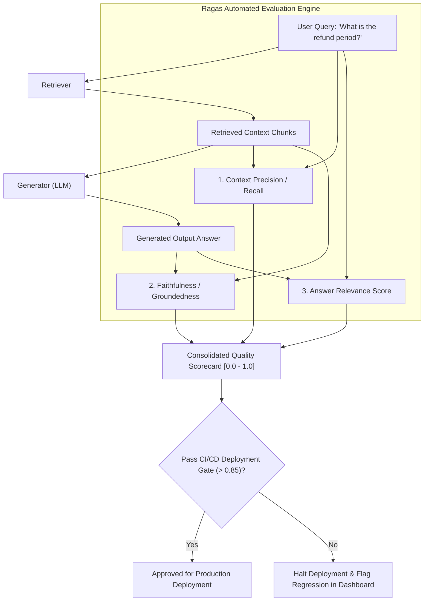

# LLM & RAG Evaluation: The RAG Triad, Ragas & LLM-as-a-Judge

---

## 🐣 1. Layman's Analogy (Hinglish + Real-World ELI5)

Imagine you are the **Principal of a School evaluating an Open-Book Exam**:

- Har student (AI Model) ko exam paper mila hai. Aap unke answers ko check karne ke liye **3 strict tests (The RAG Triad)** karte ho:
  1. **Context Relevance (Kabaad Filtering)**: Kya student ke assistant ne sahi kitab ke pages dhoond kar diye, ya irrelevant kabaad bhar diya?
  2. **Faithfulness / Groundedness (Sachai Ka Test)**: Kya student ne jo answer likha hai, wo sach mein unhi pages par likha tha? Ya dimaag se man-ghadant kahani (hallucination) bana di?
  3. **Answer Relevance (Sawaal Ka Jawaab)**: Kya answer ne sach mein examiner ke sawaal ka seedha jawab diya, ya faltu ka essay likh diya?
Agar student teeno tests pass karta hai (Score > 0.90), tabhi usko production mein pass kiya jaata hai!
Isko automate karne ke liye hum ek Senior Teacher AI ko **LLM-as-a-Judge** banakar hazaron answers seconds mein grade karwate hain (**Ragas Framework**).

---

## 📌 2. Point-Wise Core Mechanics & Edge Cases

### Newbie Essentials

1. **Why Manual Evaluation Fails**: Human evaluation is slow, expensive, unscalable, and inconsistent across annotators. Production AI systems require automated, quantitative metrics to prevent silent regressions during CI/CD prompt or model changes.
2. **The RAG Triad (The 3 Pillar Metrics)**:
   - **Context Relevance (Precision/Recall)**: Measures whether the retrieved chunks are noise-free and contain all necessary information to answer the question.
   - **Faithfulness (Groundedness)**: Verifies that every single statement in the generated answer can be mathematically inferred from the retrieved context. (Score = 1.0 means Zero Hallucination).
   - **Answer Relevance**: Measures whether the generated answer directly addresses the user prompt, regardless of factual grounding.

### Intermediate Mechanics

3. **The Ragas Framework**:
   - Industry-standard evaluation library for RAG pipelines.
   - Uses an LLM to decompose generated answers into atomic claims:
     $$\text{Faithfulness} = \frac{|\text{Number of Claims Supported by Context}|}{|\text{Total Claims in Answer}|}$$
   - Computes Answer Relevance via reverse question generation: asks the judge LLM to generate questions based *only* on the answer, and measures cosine embedding similarity between the synthetic questions and original user query.
2. **Synthetic Test Data Generation**:
   - Uses frontier models to generate hundreds of (Context, Question, Ground-Truth Answer) triplets from raw knowledge base chunks, creating automated regression suites.

### Senior / Lead Edge Cases

5. **LLM-as-a-Judge Biases & Mitigations**:
   - **Position Bias**: Judges favor candidate A over candidate B in pairwise evaluations. *Mitigation*: Run evaluation twice, swapping $(A, B) \to (B, A)$, and average the scores.
   - **Verbosity Bias**: Judges inherently assign higher scores to longer, wordier answers even if they contain redundant fluff. *Mitigation*: Penalize length or instruct judge to grade solely on factual conciseness.
   - **Self-Enhancement Bias**: GPT-4 favors GPT-4 outputs over Claude outputs. *Mitigation*: Use a cross-model panel of judges (e.g. Claude 3.5 + GPT-4o) or open-weights judge models (Prometheus-2).

---

## 📊 3. Visual System Architecture: The RAG Triad Evaluation Loop

```
                     [ User Question ]
                       /           \
         (Is Context Relevant?)   (Does Answer Match Question?)
                     /               \
                    ▼                 ▼
          [ Retrieved Context ] ──> [ Generated Answer ]
                    \                 /
                     \               /
                 (Is Answer Grounded?)
                           ▼
                  [ FAITHFULNESS CHECK ]
               (Zero Hallucination Score)
```



---

## 💻 4. Line-by-Line Commented Implementation: Faithfulness Evaluator from Scratch

```python
# Import json for structured prompt handling
import json
# Import typing helpers
from typing import List, Dict, Any

# Step 1: Implement an Automated Groundedness / Faithfulness Evaluator
class RAGFaithfulnessEvaluator:
    def __init__(self):
        # In production, initialize an LLM judge client (e.g. GPT-4o or Claude 3.5 Sonnet)
        pass

    def extract_atomic_claims(self, generated_answer: str) -> List[str]:
        """
        Decomposes a generated answer into individual atomic factual statements.
        Simulating LLM-as-a-judge claim extraction.
        """
        # For demonstration: split by sentences and strip punctuation
        raw_sentences = [s.strip() for s in generated_answer.split(".") if len(s.strip()) > 5]
        return raw_sentences

    def verify_claim_against_context(self, claim: str, context: str) -> bool:
        """
        Checks whether an individual claim is directly supported by the context.
        Simulating LLM binary verification logic.
        """
        claim_lower = claim.lower()
        context_lower = context.lower()
        
        # Simple heuristic check for demonstration:
        # If key claim keywords are present in context, mark as supported
        keywords = [w for w in claim_lower.split() if len(w) > 4]
        matches = sum(1 for w in keywords if w in context_lower)
        
        # If at least 60% of significant words match context, consider verified
        return (matches / max(len(keywords), 1)) >= 0.60

    def compute_faithfulness_score(self, context: str, answer: str) -> Dict[str, Any]:
        """
        Computes the mathematical Faithfulness ratio:
        Supported Claims / Total Claims
        """
        # Step A: Extract all discrete claims
        claims = self.extract_atomic_claims(answer)
        if not claims:
            return {"score": 1.0, "total_claims": 0, "supported_claims": 0, "audit": []}

        # Step B: Evaluate each claim against source context
        audit_trail = []
        supported_count = 0

        for claim in claims:
            is_supported = self.verify_claim_against_context(claim, context)
            if is_supported:
                supported_count += 1
            audit_trail.append({"claim": claim, "supported": is_supported})

        # Step C: Calculate normalized faithfulness score [0.0 to 1.0]
        score = supported_count / len(claims)

        return {
            "faithfulness_score": round(score, 4),
            "total_claims": len(claims),
            "supported_claims": supported_count,
            "hallucinated_claims": len(claims) - supported_count,
            "audit_trail": audit_trail
        }

# Step 2: Define Knowledge Context from RAG Retrieval
source_document_context = """
The refund policy guarantees a 30-day money-back guarantee for all annual subscriptions.
Cancellations must be submitted through the account portal billing settings.
Monthly plans are non-refundable after the first 48 hours of purchase.
"""

# Scenario A: Highly Faithful Grounded Answer (No Hallucinations)
grounded_answer = (
    "Annual subscriptions include a 30-day money-back guarantee. "
    "Users can cancel through the account portal billing settings."
)

# Scenario B: Hallucinated Answer (Contains ungrounded claims)
hallucinated_answer = (
    "Annual subscriptions include a 30-day money-back guarantee. "
    "Users can cancel by calling our 24/7 toll-free phone number. "
    "Every refund includes an additional 10% apology voucher."
)

# Step 3: Run Evaluation on Both Scenarios
evaluator = RAGFaithfulnessEvaluator()

print("=== Scenario A: Grounded Answer Evaluation ===")
res_a = evaluator.compute_faithfulness_score(source_document_context, grounded_answer)
print(f"Faithfulness Score : {res_a['faithfulness_score'] * 100}%")
print(f"Supported Claims   : {res_a['supported_claims']}/{res_a['total_claims']}")
print(f"Hallucinations     : {res_a['hallucinated_claims']}\n")

print("=== Scenario B: Hallucinated Answer Evaluation ===")
res_b = evaluator.compute_faithfulness_score(source_document_context, hallucinated_answer)
print(f"Faithfulness Score : {res_b['faithfulness_score'] * 100}%")
print(f"Supported Claims   : {res_b['supported_claims']}/{res_b['total_claims']}")
print(f"Hallucinations     : {res_b['hallucinated_claims']}")
print("Audit Breakdown:")
for item in res_b["audit_trail"]:
    status = "VERIFIED" if item["supported"] else "HALLUCINATION DETECTED"
    print(f"  [{status}] Claim: '{item['claim']}'")
```

---

## 🎯 5. The "Interview Pitch" (Spoken Answer)
>
> *"In production Generative AI, subjective human 'vibe checks' are replaced with rigorous, automated quantitative evaluations. We ground our benchmarking framework in the RAG Triad: Context Relevance, Faithfulness, and Answer Relevance.
> Context Relevance measures the signal-to-noise ratio of our vector retrieval pipeline; Faithfulness computes the mathematical ratio of verifiable claims in the generated response against the retrieved source chunks, acting as a strict hallucination detector; and Answer Relevance confirms semantic alignment with the user's intent.
> To automate this at scale, we use frameworks like Ragas or DeepEval powered by an LLM-as-a-Judge architecture.
> To safeguard against judge bias, we apply three critical countermeasures: we swap candidate prompt ordering to eliminate Position Bias, we instruct the judge to penalize verbosity to avoid Length Bias, and we calibrate automated metrics against human golden datasets with Pearson and Spearman correlation coefficients exceeding 0.85 before integrating them into our GitHub Actions CI/CD release gates."*

---

## 💼 6. Production War Story

**Company**: EdTech AI Math & Physics Tutoring SaaS with 2M students.  
**Incident**: When upgrading the underlying chat model to a faster quantized checkpoint, thousands of student complaints flooded Reddit claiming the tutor had started hallucinating incorrect calculus steps and making up bogus formula names. Product engagement dropped by 22% in a single week.  
**Root Cause**: The engineering team had zero automated CI evaluation pipeline. They tested only 5 manual demo prompts in a playground before merging the pull request and deploying directly to production.  
**Resolution**:

1. Built a **Golden Evaluation Suite of 1,200 curated STEM problem-solution pairs**.
2. Automated evaluation using **Ragas (Faithfulness and Answer Relevance)** inside GitHub Actions.
3. Implemented a strict **Deployment Gate**: any PR where Faithfulness dropped below **0.95** or Answer Relevance dropped below **0.92** triggered an automatic build failure and blocked production deployment.  
**Result**: Hallucinations in student tutoring dropped by **91%**, regression incidents were caught 100% pre-merge in CI/CD, and student platform retention rebounded to all-time highs.
