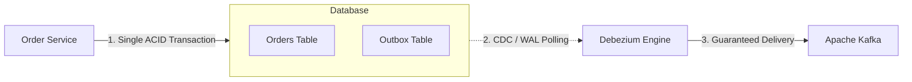

# System Design Master Interview Bank: Part 3 (Q41 - Q60)
## Event-Driven Architecture, Streaming, LSM Trees & Batch Processing

---

### Q41: What is the architectural difference between a Message Queue and a Distributed Commit Log?
**Answer:**
```
[ Message Queue (RabbitMQ / AWS SQS) ]
  ├── Smart Broker, Dumb Consumer.
  ├── Message is deleted from broker as soon as consumer ACKs it.
  ├── Does NOT support replaying historical messages.
  └── Ideal for transient, task-based work distribution.

[ Distributed Commit Log (Apache Kafka / Pulsar) ]
  ├── Dumb Broker, Smart Consumer.
  ├── Messages are append-only and immutable on disk; retained by TTL (e.g. 7 days).
  ├── Consumers track their own offsets and can REPLAY events from any point in time.
  └── Ideal for high-throughput event streaming and analytics.
```

---

### Q42: Explain Delivery Semantics: At-Most-Once, At-Least-Once, and Exactly-Once.
**Answer:**
1. **At-Most-Once:** Message may be lost, but will never be delivered more than once.
   - *Mechanism:* Consumer commits offset *before* processing message. If consumer crashes during processing, the message is skipped.
2. **At-Least-Once (Industry Standard Default):** Message will never be lost, but may be delivered multiple times.
   - *Mechanism:* Consumer processes message, writes to database, and *then* commits offset. If consumer crashes before committing offset, the broker redelivers the message.
   - *Requirement:* Consumers **must be idempotent**!
3. **Exactly-Once:** Message is effectively processed exactly once.
   - *Achieved via:* Two-Phase Commit transactions between Kafka producer and broker + idempotent consumers using deduplication keys in persistent storage.

---

### Q43: How do you design an Idempotent Consumer?
**Answer:**
To guarantee that processing a duplicate message produces identical system state without duplicate business operations:
1. **Unique Idempotency Key:** Every event message must carry a unique ID (e.g. `event_id` or `payment_id`).
2. **Database Unique Constraint / Dedup Table:**
   Before executing business logic, consumer performs an insert into a processed events table within a database transaction:
   ```sql
   INSERT INTO processed_events (event_id, processed_at) 
   VALUES ('evt_998124', NOW()) 
   ON CONFLICT (event_id) DO NOTHING;
   ```
   If 0 rows were inserted (duplicate event), the consumer acknowledges and skips processing.

---

### Q44: What is the Transactional Outbox Pattern and why is it needed?
**Answer:**
- **The Problem (Dual-Write Anti-Pattern):**
  A service needs to update its local database AND publish an event to Kafka.
  If the database commit succeeds but Kafka publish fails (network timeout), data is inconsistent.
- **The Outbox Pattern Solution:**
  1. In a single local ACID transaction, the service writes business data to `orders` table AND appends an event record to an `outbox` table.
  2. A separate background worker or **Change Data Capture (CDC) engine (e.g. Debezium + Kafka Connect)** reads the `outbox` table Write-Ahead Log and streams events reliably to Kafka.



---

### Q45: How does Apache Kafka achieve horizontal scalability and high throughput?
**Answer:**
Kafka handles millions of events/sec through 4 key architectural innovations:
1. **Partitioning:** Topics are split into independent partitions distributed across multiple brokers. Each partition is an append-only sequential log.
2. **Sequential Disk I/O:** Appends to the end of a file sequentially on disk (Sequential disk writes approach 600 MB/s, comparable to sequential RAM access).
3. **Page Cache Architecture:** Avoids JVM heap garbage collection overhead by keeping log segments directly inside the Linux OS Kernel Page Cache.
4. **Zero-Copy Network Transfer (`sendfile` syscall):** Transfers data directly from the OS page cache to the network socket buffer, completely bypassing user-space CPU copying.

---

### Q46: What is a Kafka Consumer Group and Rebalancing?
**Answer:**
- **Consumer Group:** A set of consumers collaborating to read from a Kafka topic.
  - Each partition inside a topic is assigned to **exactly one consumer** inside a consumer group at any given time.
  - If you have 10 partitions and 10 consumers in a group, each consumer reads 1 partition in parallel.
  - If you have more consumers than partitions, the extra consumers sit idle.
- **Consumer Rebalancing:** When a consumer joins or leaves the group (crashes), Kafka triggers a rebalance to reassign partitions among active members, causing brief latency pauses.

---

### Q47: What is a Dead Letter Queue (DLQ) and Poison Pill message?
**Answer:**
- **Poison Pill:** A corrupted or malformed message (e.g. unexpected null value or invalid JSON) that causes consumer parsing code to crash repeatedly.
- If unhandled, the consumer gets stuck retrying the same message forever, halting processing for all subsequent messages on that partition.
- **Dead Letter Queue (DLQ):** After a pre-configured retry threshold (e.g. 3 attempts with exponential backoff), the consumer catches the exception, routes the malformed message to a DLQ topic for offline engineer inspection, commits the offset, and continues processing subsequent valid messages.

---

### Q48: How do Log-Structured Merge (LSM) Trees work?
**Answer:**
Used by high-write databases (Cassandra, RocksDB, Bigtable, ScyllaDB):

```
Write Request
     │
     ├─► [ 1. Write-Ahead Log (WAL) ] ──► Sequential write on disk for crash durability
     │
     ▼
[ 2. MemTable ] ──► Sorted in-memory skip-list (Lightning fast O(log N) writes in RAM)
     │
     ▼ (When MemTable fills, e.g. 64MB)
[ 3. SSTables (Sorted String Tables) ] ──► Flushed to disk as IMMUTABLE sorted files
     │
     ▼
[ 4. Compaction ] ──► Background merge-sort combining multiple SSTables and purging deleted keys
```

**Reads:**
Queries check MemTable $\to$ check Bloom Filters $\to$ search SSTables.

---

### Q49: Why are LSM Trees faster than B+Trees for write-heavy workloads?
**Answer:**
- **B+Tree Writes:** Modifying a B+Tree requires in-place disk page updates. If keys are randomly distributed, every write requires **random disk seeks**, which saturates disk heads and triggers heavy write amplification.
- **LSM Tree Writes:** LSM Trees **never modify files in place**. All writes are appended sequentially in memory (MemTable) and flushed sequentially to disk as immutable SSTables. Sequential disk writes are orders of magnitude faster than random writes.

---

### Q50: What are Bloom Filters and how do they speed up LSM Tree reads?
**Answer:**
- **Bloom Filter:** A space-efficient probabilistic data structure used to test whether an element is a member of a set.
- **Properties:**
  - **No False Negatives:** If it returns *false*, the key is **100% guaranteed not to exist**.
  - **Possible False Positives:** If it returns *true*, the key *might* exist.
- **Role in LSM Trees:** Stored in RAM for each on-disk SSTable. Before performing an expensive disk read on an SSTable, the engine checks its Bloom Filter. If it returns false, the engine skips reading that SSTable from disk entirely!

---

### Q51: What is Compaction in LSM Trees (Size-Tiered vs Leveled)?
**Answer:**
Over time, writes generate hundreds of immutable SSTables on disk, degrading read performance.
- **Compaction:** A background merge-sort process that reads multiple SSTables, merges matching keys, removes tombstoned (deleted) records, and writes out fresh, consolidated SSTables.
- **Size-Tiered Compaction:** Merges SSTables of similar sizes. Excellent for high write throughput, but uses higher disk space.
- **Leveled Compaction:** Organizes data into exponential levels ($L0, L1, L2$). Each level has a fixed size limit (e.g. $L1 = 10\text{MB}, L2 = 100\text{MB}$). Guarantees that at $L1+$, each key exists in at most one SSTable, optimizing read latency.

---

### Q52: What is Event Sourcing?
**Answer:**
- Instead of storing only the *current state* of an entity in a database table, **Event Sourcing** persists the full sequence of state-changing events in an append-only event log.
- Current state is reconstructed by replaying all historical events from the beginning.
- **Benefits:** Complete, immutable audit log; time-travel debugging; ability to replay events into new read projections.
- **Challenge:** Replaying 1,000,000 events to compute account balance is slow $\to$ solved via **Snapshots** (saving state every $N$ events).

---

### Q53: What is CQRS (Command Query Responsibility Segregation)?
**Answer:**
- Segregates read and write data models:
  1. **Command Side (Write):** Handles state mutations, enforces business rules and invariants, optimized for transactions (normalized relational DB or Event Store).
  2. **Query Side (Read):** Optimized for fast read queries, search, and UI views (denormalized Redis, Elasticsearch, or read-optimized read models).
- Synchronization between Command and Query is handled asynchronously via events.

---

### Q54: What is the difference between Batch Processing and Stream Processing?
**Answer:**
| Dimension | Batch Processing (Hadoop / Spark) | Stream Processing (Apache Flink / Kafka Streams) |
| :--- | :--- | :--- |
| **Data Scope** | Bounded datasets (fixed historical datasets). | Unbounded continuous data streams. |
| **Latency** | Minutes to hours. | Sub-second to milliseconds. |
| **Execution Model** | Scheduled jobs (e.g. nightly cron ETL). | Continuous real-time event-by-event processing. |
| **Use Case** | Nightly payroll, machine learning model retraining, daily billing aggregations. | Fraud detection, live telemetry monitoring, real-time recommendation engines. |

---

### Q55: How does the MapReduce Programming Model work?
**Answer:**
Designed for processing petabytes of data across thousands of commodity machines in 3 steps:
1. **Map Phase:** Worker nodes process partitioned input splits in parallel, transforming raw data into intermediate key-value pairs:
   `Map(k1, v1) -> list(k2, v2)`
2. **Shuffle and Sort Phase:** The MapReduce framework automatically partitions, network-routes, and sorts all values by intermediate key `k2` across reduce workers.
3. **Reduce Phase:** Reducer nodes process all values grouped under a specific key `k2` to compute aggregated results:
   `Reduce(k2, list(v2)) -> list(k3, v3)`

---

### Q56: What is Lambda Architecture vs Kappa Architecture?
**Answer:**
- **Lambda Architecture:** Combines a **Speed Layer** (Stream processing for low-latency real-time views) and a **Batch Layer** (Hadoop/Spark for accurate historical views).
  - *Flaw:* Developers must write and maintain identical business transformation logic in **two completely different codebases** (e.g. Spark batch and Storm streaming).
- **Kappa Architecture:** Eliminates the batch processing codebase completely! Uses a **single stream processing engine** (e.g., Apache Flink) for both real-time streams and historical reprocessing by simply resetting consumer offsets in Kafka.

---

### Q57: What is Stream Windowing (Tumbling vs Hopping vs Sliding vs Session)?
**Answer:**
Streaming data is unbounded, so aggregations must be scoped to bounded time windows:
1. **Tumbling Window:** Fixed-size, non-overlapping windows (e.g. 12:00-12:05, 12:05-12:10).
2. **Hopping (Sliding) Window:** Fixed-size, overlapping windows that advance by a hop interval (e.g. 5-minute window advancing every 1 minute).
3. **Session Window:** Dynamic window demarcated by periods of user inactivity (e.g. window closes after 15 minutes of user inactivity).

---

### Q58: What are Watermarks in Stream Processing?
**Answer:**
- In distributed streaming, network delays cause events to arrive out of chronological order.
- A **Watermark** is a temporal metric that signals the stream processor: "We assume all events with timestamps prior to timestamp $T$ have arrived."
- When a watermark for timestamp $T$ passes, the window closes and computes results. Events arriving after the watermark are handled as **Late Data** (dropped or routed to a dead-letter stream).

---

### Q59: How do you handle Backpressure in Stream Processing?
**Answer:**
- **Backpressure:** Occurs when a downstream consumer cannot process data as fast as the upstream producer emits it.
- **Handling Mechanisms:**
  1. **TCP Flow Control:** Downstream shrinks TCP window size, slowing down the socket.
  2. **Reactive Streams (Pull-based flow control):** Consumer explicitly requests $N$ items from upstream (`request(n)`), ensuring it is never overwhelmed.
  3. **Queue Buffering with Drop Policies:** Drop oldest, drop newest, or route to temporary disk queues.

---

### Q60: What is Change Data Capture (CDC)?
**Answer:**
- **CDC:** A software design pattern that monitors and captures low-level changes (INSERT, UPDATE, DELETE) made to a database's Write-Ahead Log (WAL) and streams them as structured events in real time.
- **Advantage:** Zero impact on database query CPU, bypasses application-level triggers, and enables reliable data synchronization across databases, search indexes (Elasticsearch), and analytics caches (Redis).
