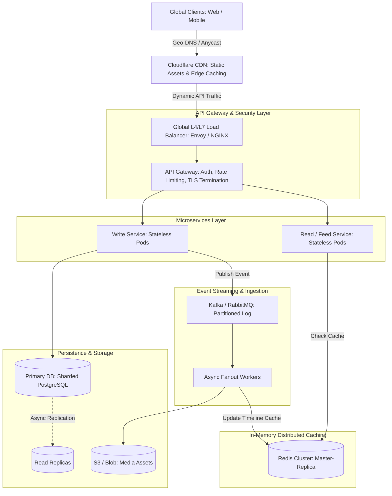

# Master System Design Interview Framework (The 45-Minute Senior/Staff Playbook)

---

## 🎯 Executive Overview & Evaluation Criteria

In modern senior and staff software engineering interviews (FAANG, Tier-1 MNCs, and high-growth unicorns), interviewers evaluate you across **four primary competency pillars**:

```
                  ┌─────────────────────────────────────────┐
                  │ 45-Minute System Design Interview Focus │
                  └────────────────────┬────────────────────┘
                                       │
        ┌──────────────────┬───────────┴───────────┬──────────────────┐
        ▼                  ▼                       ▼                  ▼
[1. Scope & Scale]  [2. Architecture]      [3. Data & Storage]  [4. Deep Dives & Resiliency]
  Requirements,       Component flows,       Schema, Indexes,     Bottlenecks, Failover,
  SLA/SLO, QPS/Storage REST/gRPC contracts   Sharding, Caching    Observability, Trade-offs
```

---

## ⏱️ Step-by-Step 45-Minute Time Allocation

| Phase | Time | Primary Focus | Red Flags to Avoid |
| :--- | :--- | :--- | :--- |
| **Phase 1: Scope & Clarification** | 00:00 - 07:00 | Functional vs Non-Functional requirements, back-of-the-envelope capacity estimations. | Jumping immediately into drawing architecture before scoping. |
| **Phase 2: API & Data Model** | 07:00 - 16:00 | Explicit REST/gRPC signatures, entity relationships, database selection (SQL vs NoSQL). | Glossing over request/response fields or choosing databases without trade-off rationale. |
| **Phase 3: High-Level Architecture** | 16:00 - 28:00 | End-to-end data flow: Client -> CDN/DNS -> Gateway -> App Services -> Cache -> Storage. | Leaving components disconnected or drawing an overly simplistic monolith. |
| **Phase 4: Deep Dive & Bottlenecks** | 28:00 - 40:00 | Sharding keys, cache invalidation, consensus, race conditions, hotspot handling. | Passive waiting for the interviewer; you should drive the deep dive. |
| **Phase 5: Resiliency & Wrap-Up** | 40:00 - 45:00 | Single point of failure (SPOF) audit, rate limiting, circuit breakers, disaster recovery. | Hand-waving "we'll just add more servers" without answering where bottlenecks shift. |

---

## 📐 Phase 1: Requirements Clarification & Capacity Estimation

### 1. Requirements Checklist

- **Functional Requirements (FR):** Narrow down to 3 core user journeys.
  - *Example (Twitter/X):* 1. Post a tweet, 2. View user timeline, 3. View home timeline (fanout).
- **Non-Functional Requirements (NFR):**
  - **Availability vs Consistency:** Under CAP/PACELC, which do we favor? (e.g., Timeline: High Availability AP; Financial Ledger: Strict Consistency CP).
  - **Latency SLA:** P99 read latency < 50ms, write latency < 200ms.
  - **Scale:** Global distribution, multi-region failover.

### 2. Back-of-the-Envelope Calculation Blueprint

```
Key Numbers to Memorize:
  - 1 Day = 86,400 seconds ≈ 100,000 seconds (for quick estimation)
  - 1 Million requests/day = 10^6 / 10^5 ≈ 10 requests/sec (QPS)
  - 100 Million requests/day ≈ 1,000 QPS
  - 1 Billion requests/day ≈ 10,000 QPS
  - Peak QPS = Average QPS * (2 to 5 multiplier)
```

#### Formula Matrix

- **Write QPS:** $\frac{\text{Daily Active Users (DAU)} \times \text{Writes per User per Day}}{86,400}$
- **Read QPS:** $\text{Write QPS} \times \text{Read-to-Write Ratio}$ (e.g., 100:1 for social feeds)
- **Storage per Year:** $\text{Write QPS} \times \text{Payload Size (Bytes)} \times 86,400 \times 365$
- **Network Bandwidth:** $\text{QPS} \times \text{Payload Size (Bytes)} \times 8 \text{ bits/Byte}$
- **Memory for Caching (80/20 Pareto Rule):** Cache 20% of the daily read traffic volume in RAM.

---

## 🔌 Phase 2: API Design & Data Modeling

### 1. API Contract Blueprint (RESTful & Idempotent)

Always declare exact HTTP methods, path params, headers, and idempotency keys:

```http
POST /api/v1/tweets
Authorization: Bearer <JWT>
Idempotency-Key: <UUIDv4>
Content-Type: application/json

{
  "user_id": "usr_99812",
  "content": "Hello distributed systems!",
  "media_ids": ["img_01", "img_02"],
  "created_at": 1726739200
}

Response: HTTP 202 Accepted
{
  "tweet_id": "tw_7761234981",
  "status": "QUEUED"
}
```

### 2. Database Selection Decision Tree

```
Do you require ACID multi-row transactions & fixed relational structure?
  ├── YES ──► Relational Database (PostgreSQL / MySQL / CockroachDB / Google Cloud Spanner)
  └── NO
        ├── Key-Value lookup with sub-millisecond SLA? ──► Redis / DynamoDB / Aerospike
        ├── High write-throughput time-series or append-only log? ──► Cassandra / ScyllaDB / ClickHouse
        ├── Flexible nested documents / catalogs? ──► MongoDB / Couchbase
        └── Full-text fuzzy search / log aggregation? ──► Elasticsearch / OpenSearch
```

---

## 🏗️ Phase 3: High-Level Architecture Diagram



---

## 🔬 Phase 4: Core Deep-Dive Heuristics & Bottlenecks

### 1. Data Sharding & Partitioning Strategies

- **Range-Based Partitioning:** (e.g., `A-C`, `D-F` or by date). *Risk:* Massive hot partitions on trending letters or recent dates.
- **Hash-Based Partitioning:** `Shard = Hash(partition_key) % N`. Uniform distribution, but adding shards requires re-hashing all records.
- **Consistent Hashing (Ring with Virtual Nodes):**
  - Solves rehashing: Adding/removing nodes only migrates $\frac{1}{N}$ keys.
  - Virtual nodes prevent hot spots on unequal hardware allocations.

### 2. Cache Invalidation & Stampede Mitigation

- **Cache Invalidation:** Write-Through vs Write-Back vs Cache-Aside (Lazy Loading).
- **Cache Stampede (Thundering Herd):** Multiple concurrent requests miss the cache simultaneously, overwhelming the DB.
  - *Fix 1: Distributed Mutex (`SETNX` in Redis):* Only one thread queries DB; others wait.
  - *Fix 2: Probabilistic Early Invalidation (XFetch Algorithm):* Recompute key before expiration based on read frequency and computation time.

### 3. Concurrency & Race Conditions

- **Optimistic Locking:** Version column (`WHERE version = 5`). High throughput for low-contention reads.
- **Pessimistic Locking:** `SELECT FOR UPDATE`. Guarantees consistency at the expense of database connection starvation.
- **Distributed Locks:** Redis Redlock or ZooKeeper/etcd leases for multi-instance coordination.

---

## 🛡️ Phase 5: Resiliency, SRE & Production Readiness Checklist

1. **Single Point of Failure (SPOF) Elimination:** Every layer must have at least $N+1$ redundancy across multiple Availability Zones (AZs).
2. **Backpressure & Graceful Degradation:**
   - Drop non-critical features during surges (e.g., disable real-time recommendation ranker, serve cached generic feeds).
3. **Circuit Breakers (Resilience4j / Envoy):** Fail fast when downstream services exhibit >50% error rates or latency timeouts.
4. **Idempotency Guarantee:** Every mutation endpoint must require an `Idempotency-Key` stored in Redis with TTL to prevent double billing or duplicate records.
5. **Observability (Three Pillars):**
   - **Metrics:** Prometheus counter, gauge, and histogram (P50, P90, P99).
   - **Logs:** JSON structured logging with unified `correlation_id` / `trace_id`.
   - **Traces:** OpenTelemetry / Jaeger spans across distributed network hops.
