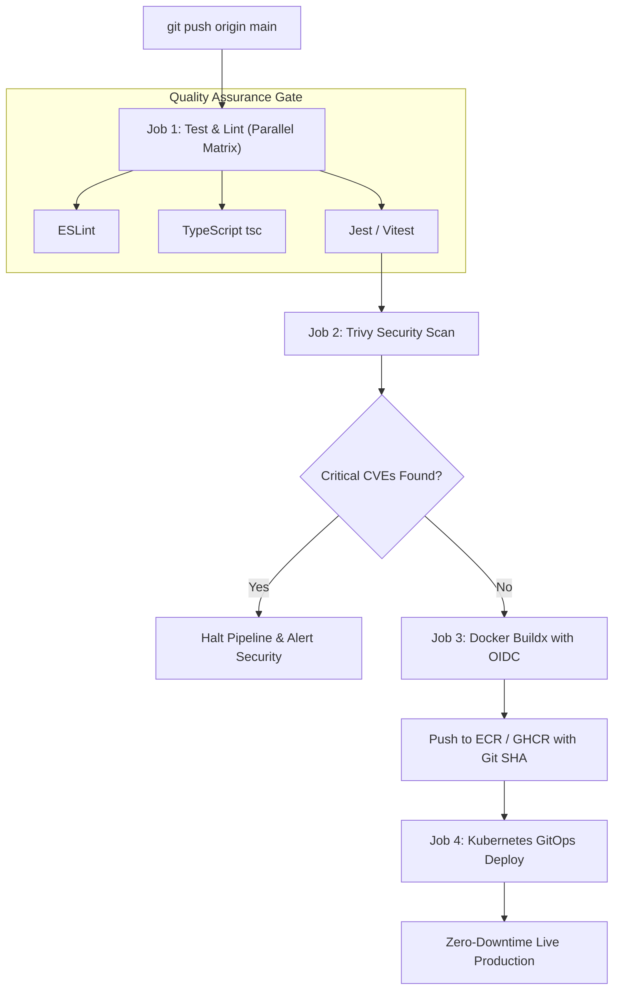

# Production CI/CD Pipeline: GitHub Actions, Multi-Stage Docker & Security Scanning

---

## 🐣 1. Layman's Analogy (Hinglish + Real-World ELI5)
Imagine you are a car manufacturer like **Tesla or Maruti Suzuki**:
- Purane zamane mein (Manual Deployments): Har car banne ke baad ek mechanic physically chabi lagata tha, tyre check karta tha, aur showroom tak drive karke le jata tha. Agar mechanic ne clutch check karna bhool gaya, toh customer highway par fas jata tha (Manual human error & Friday night deployment disasters!).
- **GitHub Actions Production CI/CD**: Yeh ek **Fully Automated Robotic Assembly Line** hai:
  1. Jaise hi developer code commit karke `git push` karta hai, robotic sensors trigger ho jate hain (**Event Triggers**).
  2. Inspection robot (CI: Continuous Integration) linter, type-checker aur 500 unit tests chala kar verify karta hai ki koi nut-bolt loose toh nahi hai.
  3. Security robot (Trivy / Snyk) scan karta hai ki koi malicious malware toh nahi ghus gaya.
  4. Packaging robot (Docker Buildx) car ko tightly pack karta hai.
  5. Deployment robot (CD: Continuous Delivery) zero-downtime rolling update ke sath production cloud (Kubernetes) par live launch kar deta hai!

---

## 📌 2. Point-Wise Core Mechanics & Edge Cases

### Newbie Essentials:
1. **CI vs CD**:
   - **Continuous Integration (CI)**: Automatically checks out code, installs dependencies, runs linters, checks types, and executes automated test suites on every pull request.
   - **Continuous Delivery / Deployment (CD)**: Automatically builds production artifacts (Docker images) and deploys them to staging and production clusters upon merging to `main`.
2. **Key Concepts**:
   - **Workflow**: Automated process defined in YAML under `.github/workflows/`.
   - **Events (`on:`)**: Triggers that start the workflow (`push`, `pull_request`, `schedule`, `workflow_dispatch`).
   - **Jobs & Runners**: Jobs run on isolated virtual environments (e.g. `ubuntu-latest`). Jobs run in parallel by default, unless ordered via `needs: [job_a]`.

### Intermediate Mechanics:
3. **Caching Dependencies (`actions/cache`)**:
   - Running `npm install` from scratch on every commit wastes 4–8 minutes of runner compute.
   - Using `actions/setup-node@v4` with `cache: 'npm'` caches `~/.npm` based on `package-lock.json` hash, reducing build times by 70%.
4. **Multi-Architecture Docker Buildx**:
   - `docker/setup-buildx-action` enables QEMU virtualization to build cross-platform multi-arch container images (`linux/amd64` and `linux/arm64`) with layer caching pushed directly to Amazon ECR or GitHub Container Registry (GHCR).

### Senior / Lead Edge Cases:
5. **OIDC (OpenID Connect) vs Long-Lived Cloud Keys**:
   - Never store static `AWS_ACCESS_KEY_ID` or `AWS_SECRET_ACCESS_KEY` in GitHub repository secrets (major credential leakage vector!).
   - Use GitHub OIDC tokens to assume short-lived, ephemeral IAM roles in AWS/GCP dynamically via `aws-actions/configure-aws-credentials@v4` with zero stored secrets.
6. **Concurrency Cancelling on Fast Pushes**:
   - When a developer pushes 3 commits rapidly to a PR, running 3 parallel CI builds wastes runner minutes.
   - Use `concurrency: { group: "${{ github.workflow }}-${{ github.ref }}", cancel-in-progress: true }` to automatically cancel obsolete pending runs.

---

## 📊 3. Visual System Architecture: Enterprise CI/CD Pipeline

```
[ Developer Pushes to Branch ]
              │
              ▼
┌────────────────────────────────────────────────────────┐
│               Job 1: Lint, Typecheck & Test            │
│  - actions/checkout@v4                                 │
│  - npm ci (Cached ~/.npm)                              │
│  - eslint && tsc --noEmit                              │
│  - jest --ci --coverage                                │
└─────────────────────────────┬──────────────────────────┘
                              │ (On Pass & PR Merged to main)
                              ▼
┌────────────────────────────────────────────────────────┐
│               Job 2: Container Security Scan           │
│  - Trivy Container Vulnerability Scanner               │
│  - Blocks pipeline if CRITICAL CVEs detected           │
└─────────────────────────────┬──────────────────────────┘
                              │ (Zero Critical CVEs)
                              ▼
┌────────────────────────────────────────────────────────┐
│               Job 3: Docker Build & Push (Buildx)      │
│  - GitHub OIDC assumes temporary AWS IAM Role          │
│  - Builds linux/amd64 container with BuildKit cache    │
│  - Pushes image tagged with Git SHA to AWS ECR         │
└─────────────────────────────┬──────────────────────────┘
                              │
                              ▼
┌────────────────────────────────────────────────────────┐
│               Job 4: Kubernetes Rolling Deployment     │
│  - kubectl set image deployment/app app=ecr/app:${SHA} │
│  - kubectl rollout status deployment/app --timeout=5m  │
└────────────────────────────────────────────────────────┘
```



---

## 💻 4. Line-by-Line Commented Workflow YAML Configuration

```yaml
# Name of the GitHub Actions workflow
name: Production Enterprise CI/CD Pipeline

# Step 1: Define triggering event conditions
on:
  push:
    branches: [main]       # Runs full CI/CD on merge to main
  pull_request:
    branches: [main]       # Runs CI checks on all pull requests

# Step 2: Concurrency group cancels redundant runs on rapid branch updates
concurrency:
  group: ${{ github.workflow }}-${{ github.ref }}
  cancel-in-progress: true

# Grant minimum permissions required for OIDC authentication
permissions:
  id-token: write        # Required for AWS OIDC authentication
  contents: read         # Required for code checkout
  security-events: write # Required for uploading Trivy SARIF reports

jobs:
  # ========================================================
  # JOB 1: Continuous Integration (Lint, Type-Check, Test)
  # ========================================================
  quality-checks:
    name: Lint, Typecheck and Automated Tests
    runs-on: ubuntu-latest
    steps:
      # Step 1.1: Fetch repository source code
      - name: Checkout Repository
        uses: actions/checkout@v4

      # Step 1.2: Install Node.js runtime with automatic dependency caching
      - name: Setup Node.js 20
        uses: actions/setup-node@v4
        with:
          node-version: 20
          cache: 'npm'

      # Step 1.3: Clean immutable installation of exact lockfile dependencies
      - name: Install Node Dependencies
        run: npm ci

      # Step 1.4: Execute code linting
      - name: Run ESLint
        run: npm run lint

      # Step 1.5: Validate TypeScript compile-time type safety without generating JS
      - name: TypeScript Type Check
        run: npx tsc --noEmit

      # Step 1.6: Run automated unit tests with code coverage
      - name: Run Unit Tests with Coverage
        run: npm test -- --ci --coverage --maxWorkers=2

  # ========================================================
  # JOB 2: Container Vulnerability Security Scanning
  # ========================================================
  security-audit:
    name: Container & Dependency Vulnerability Scan
    needs: quality-checks
    runs-on: ubuntu-latest
    steps:
      - name: Checkout Repository
        uses: actions/checkout@v4

      # Step 2.1: Run Aqua Security Trivy vulnerability scanner
      - name: Run Trivy Vulnerability Scanner
        uses: aquasecurity/trivy-action@master
        with:
          scan-type: 'fs'
          ignore-unfixed: true
          severity: 'CRITICAL,HIGH'
          exit-code: '1' # Fails build if CRITICAL security flaws are found

  # ========================================================
  # JOB 3: Build & Push Docker Image via OIDC
  # ========================================================
  build-and-deploy:
    name: Docker Buildx & Kubernetes Rollout
    needs: [quality-checks, security-audit]
    if: github.ref == 'refs/heads/main' # Only deploy on merges to main
    runs-on: ubuntu-latest
    steps:
      - name: Checkout Code
        uses: actions/checkout@v4

      # Step 3.1: Authenticate with AWS using OIDC (Zero static credentials!)
      - name: Configure AWS Credentials via OIDC
        uses: aws-actions/configure-aws-credentials@v4
        with:
          role-to-assume: arn:aws:iam::123456789012:role/GitHubActionsDeploymentRole
          aws-region: us-east-1

      # Step 3.2: Set up Docker Buildx for advanced layer caching
      - name: Setup Docker Buildx
        uses: docker/setup-buildx-action@v3

      # Step 3.3: Authenticate Docker with Amazon ECR
      - name: Login to Amazon ECR
        uses: aws-actions/amazon-ecr-login@v2

      # Step 3.4: Build and push container tagged with Git commit SHA
      - name: Build and Push Docker Container
        uses: docker/build-push-action@v5
        with:
          context: .
          push: true
          tags: 123456789012.dkr.ecr.us-east-1.amazonaws.com/production-app:${{ github.sha }}
          cache-from: type=gha # Cache layers in GitHub Actions cache
          cache-to: type=gha,mode=max

      # Step 3.5: Execute zero-downtime rolling update on Kubernetes cluster
      - name: Deploy to Kubernetes
        run: |
          echo "Rolling out image to Kubernetes deployment..."
          # In real cluster: kubectl set image deployment/prod-app prod-app=123456789012.dkr.ecr.us-east-1.amazonaws.com/production-app:${{ github.sha }}
          # In real cluster: kubectl rollout status deployment/prod-app --timeout=300s
```

---

## 🎯 5. The "Interview Pitch" (Spoken Answer)
> *"In production enterprise engineering, Continuous Integration and Continuous Deployment (CI/CD) guarantees code quality, security posture, and release velocity. We structure our GitHub Actions pipelines into sequential, gated jobs. 
> Job 1 handles Continuous Integration: checking out code, utilizing `actions/setup-node` caching against package-lock hashes to minimize runner times, running linters, enforcing `tsc --noEmit` type checks, and executing Jest test suites with mandatory coverage thresholds. 
> Job 2 enforces DevSecOps: running Trivy or Snyk filesystem scans to block builds with Critical CVEs before containerization. 
> Job 3 handles Continuous Deployment using Docker Buildx and GitHub Actions layer caching. Critically, we never store static cloud keys in repository secrets; instead, we authenticate via OpenID Connect (OIDC) to assume short-lived, ephemeral IAM roles in AWS or GCP. 
> Images are tagged with immutable Git commit SHAs, pushed to our container registry, and rolled out to Kubernetes clusters with automated health-check rollbacks."*

---

## 💼 6. Production War Story
**Company**: Global HealthTech Telemedicine API Platform.  
**Incident**: An engineer committed a static AWS root access key inside a `.env.local` file that was accidentally pushed to GitHub. Within 12 minutes, automated crawler bots compromised the key, launched 120 unauthorized crypto-mining EC2 instances, and racked up \$24,000 in cloud charges before AWS fraud alerts terminated the account.  
**Root Cause**: The repository lacked pre-commit secret detection, used static long-lived IAM keys in GitHub Secrets, and had zero automated secret scanning in the CI pipeline.  
**Resolution**:
1. Completely revoked all static AWS secret keys and migrated the GitHub Actions workflow to **AWS IAM OIDC Federation**.
2. Integrated **Gitleaks** and **Trivy security scans** into the CI pipeline to block any commit containing regex patterns matching API tokens.
3. Configured branch protection rules requiring all quality and security scans to pass before pull request merge authorization.  
**Result**: Secret leak incidents dropped to **zero**, cloud security audit compliance achieved a perfect 100% score, and automated PR check times stabilized at under 2.5 minutes.
