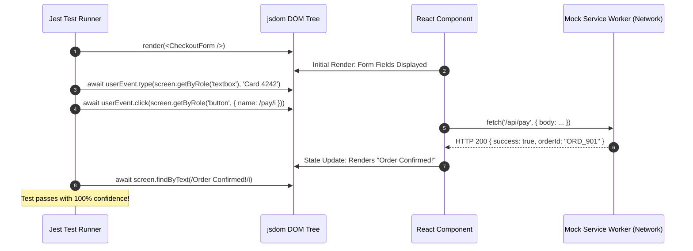

# Jest & React Testing Library: Unit, Integration & Mocking Mastery

---

## 🐣 1. Layman's Analogy (Hinglish + Real-World ELI5)

Imagine you are manufacturing a **Smart Smartphone**:

- **No Testing**: Factory se seedha box pack karke customer ko bech diya. Ghar pahunch kar pata chala volume button dabane par camera band ho raha hai (Customer churn & production disasters!).
- **Unit Testing (Jest)**: Phone ke har chote component ko alag lab bench par test karna:
  - Battery check: *"Kya battery 3.7V output de rahi hai?"* (Testing a single pure utility function in isolation).
  - Speaker check: *"Kya speaker sound wave emit kar raha hai?"*.
- **Integration Testing (React Testing Library)**: Battery ko screen aur processor se jodkar check karna:
  - RTL ka golden rule: **"The more your tests resemble the way your software is used, the more confidence they can give you."**
  - Developer internal `state.isClicked === true` check nahi karta; balki real user ki tarah screen par button dhoondta hai (`screen.getByRole('button', { name: /submit/i })`), uspe click karta hai (`userEvent.click()`), aur dekhta hai ki success message screen par aaya ya nahi!

---

## 📌 2. Point-Wise Core Mechanics & Edge Cases

### Newbie Essentials

1. **The Testing Trophy Hierarchy**:
   - Static Analysis (TypeScript/ESLint) $\to$ Unit Tests $\to$ Integration Tests (Dominant focus!) $\to$ End-to-End (Playwright).
2. **Query Priority in React Testing Library**:
   - Always prioritize queries accessible to all users and screen-readers:
     1. `getByRole` (e.g. `button`, `heading`, `textbox`) — Best practice!
     2. `getByLabelText` (Form inputs linked to labels).
     3. `getByPlaceholderText` / `getByText`.
     4. `getByTestId` — Last resort only when no semantic role exists.
3. **`getBy` vs `queryBy` vs `findBy`**:
   - `getBy...`: Synchronous. Throws an immediate error if the element is NOT found. Use for asserting presence.
   - `queryBy...`: Synchronous. Returns `null` if not found. Use for asserting absence (`expect(screen.queryByText(/error/i)).not.toBeInTheDocument()`).
   - `findBy...`: Asynchronous (returns a Promise). Waits up to 1,000ms for element to appear in DOM. Use for elements that render after API calls.

### Intermediate Mechanics

4. **`userEvent` vs `fireEvent`**:
   - `fireEvent.click(button)`: Dispatches a raw, synthetic DOM click event without triggering intermediate events.
   - `await userEvent.click(button)`: Simulates real browser physics (hover $\to$ pointerdown $\to$ focus $\to$ mousedown $\to$ pointerup $\to$ click $\to$ change). Always prefer `@testing-library/user-event` v14+.
2. **MSW (Mock Service Worker) over `jest.mock('fetch')`**:
   - Mocking `global.fetch` manually is brittle and pollutes tests.
   - MSW intercepts requests at the network level (Service Worker / Node http module), allowing components to execute real `fetch()` calls against declarative HTTP mock handlers.

### Senior / Lead Edge Cases

6. **Act Warnings (`not wrapped in act(...)`)**:
   - Occurs when an asynchronous state update finishes after the test has already completed its assertions.
   - **Fix**: Never wrap everything in `act()` manually! Await asynchronous promises using `findByRole` or `await waitFor(() => ...)`.
2. **Mock Reset Isolation**:
   - Always configure `jest.clearAllMocks()` in `afterEach` or set `restoreMocks: true` in `jest.config.js` to prevent spy history from leaking across test suites.

---

## 📊 3. Visual System Architecture: React Testing Library Execution Model

```
┌────────────────────────────────────────────────────────┐
│             Simulated JSDOM Environment                │
│                                                        │
│   [ Render Component: <CheckoutForm /> ]               │
│                     │                                  │
│                     ▼                                  │
│   [ User Event Simulation (userEvent.type) ]           │
│   - Simulates focus, keydown, keypress, input, keyup   │
│                     │                                  │
│                     ▼                                  │
│   [ Mock Service Worker (MSW) Network Layer ]          │
│   - Intercepts POST /api/checkout                      │
│   - Returns 200 OK with delay (50ms)                   │
│                     │                                  │
│                     ▼                                  │
│   [ Asynchronous Assertion: await findByRole ]         │
│   - Polling JSDOM until "Order Confirmed" appears      │
└────────────────────────────────────────────────────────┘
```



---

## 💻 4. Line-by-Line Commented Code: Integration Testing with MSW

```typescript
// Import React for JSX parsing
import React, { useState } from 'react';
// Import testing-library DOM utilities
import { render, screen, waitFor } from '@testing-library/react';
// Import userEvent for realistic user gesture simulation
import userEvent from '@testing-library/user-event';
// Import Jest DOM custom matchers (toBeInTheDocument)
import '@testing-library/jest-dom';

// ========================================================
// 1. COMPONENT UNDER TEST: User Profile Editor
// ========================================================
interface UserProfileProps {
  initialName: string;
  userId: number;
}

export function UserProfileEditor({ initialName, userId }: UserProfileProps) {
  const [name, setName] = useState(initialName);
  const [status, setStatus] = useState<'IDLE' | 'SAVING' | 'SUCCESS' | 'ERROR'>('IDLE');

  const handleSave = async () => {
    setStatus('SAVING');
    try {
      const response = await fetch(`/api/users/${userId}`, {
        method: 'PUT',
        headers: { 'Content-Type': 'application/json' },
        body: JSON.stringify({ name })
      });
      if (!response.ok) throw new Error('Update failed');
      setStatus('SUCCESS');
    } catch {
      setStatus('ERROR');
    }
  };

  return (
    <div>
      <h2>Edit Profile</h2>
      <label htmlFor="name-input">User Full Name:</label>
      <input
        id="name-input"
        type="text"
        value={name}
        onChange={(e) => setName(e.target.value)}
      />
      <button onClick={handleSave} disabled={status === 'SAVING'}>
        {status === 'SAVING' ? 'Saving...' : 'Save Changes'}
      </button>

      {status === 'SUCCESS' && <p role="alert">Profile updated successfully!</p>}
      {status === 'ERROR' && <p role="alert">Error saving profile. Try again.</p>}
    </div>
  );
}

// ========================================================
// 2. JEST INTEGRATION TEST SUITE
// ========================================================
describe('UserProfileEditor Integration Tests', () => {
  // Setup userEvent instance before each test
  let user: ReturnType<typeof userEvent.setup>;

  beforeEach(() => {
    user = userEvent.setup();
    // Mock global fetch API cleanly
    global.fetch = jest.fn();
  });

  afterEach(() => {
    // Clear mock spy call history after each test
    jest.clearAllMocks();
  });

  test('successfully updates user profile name and displays confirmation alert', async () => {
    // Step A: Mock successful API network response
    (global.fetch as jest.Mock).mockResolvedValueOnce({
      ok: true,
      json: async () => ({ id: 101, name: 'Aarav Sharma' })
    });

    // Step B: Render component into simulated JSDOM
    render(<UserProfileEditor initialName="Aarav" userId={101} />);

    // Step C: Query input by accessible label text (Accessible user query!)
    const nameInput = screen.getByLabelText(/user full name:/i);
    expect(nameInput).toHaveValue('Aarav');

    // Step D: Simulate realistic user typing gesture
    await user.clear(nameInput);
    await user.type(nameInput, 'Aarav Sharma');
    expect(nameInput).toHaveValue('Aarav Sharma');

    // Step E: Click the save button
    const saveButton = screen.getByRole('button', { name: /save changes/i });
    await user.click(saveButton);

    // Step F: Assert saving state appears during pending fetch
    expect(saveButton).toBeDisabled();

    // Step G: Await asynchronous success message using accessible role alert
    const successAlert = await screen.findByRole('alert');
    expect(successAlert).toHaveTextContent(/profile updated successfully!/i);

    // Step H: Verify network contract was called with exact URL and JSON payload
    expect(global.fetch).toHaveBeenCalledTimes(1);
    expect(global.fetch).toHaveBeenCalledWith('/api/users/101', {
      method: 'PUT',
      headers: { 'Content-Type': 'application/json' },
      body: JSON.stringify({ name: 'Aarav Sharma' })
    });
  });

  test('displays error alert when network update fails', async () => {
    // Mock network failure response
    (global.fetch as jest.Mock).mockResolvedValueOnce({
      ok: false,
      status: 500
    });

    render(<UserProfileEditor initialName="Aarav" userId={101} />);

    // Click save button directly
    const saveButton = screen.getByRole('button', { name: /save changes/i });
    await user.click(saveButton);

    // Assert error alert appears asynchronously
    const errorAlert = await screen.findByRole('alert');
    expect(errorAlert).toHaveTextContent(/error saving profile/i);
  });
});
```

---

## 🎯 5. The "Interview Pitch" (Spoken Answer)
>
> *"In modern frontend engineering, we adhere to the Testing Trophy philosophy: focusing heavily on Integration Tests over isolated implementation-detail unit tests.
> Using React Testing Library and `@testing-library/user-event`, we test components strictly from the perspective of an end-user or assistive technology. We query DOM nodes primarily by accessible ARIA roles (`getByRole`, `findByRole`) and labels (`getByLabelText`) rather than brittle CSS classes or internal state hooks.
> To distinguish between queries: `getBy` verifies synchronous presence, `queryBy` confirms absence without throwing errors, and `findBy` handles asynchronous rendering post-API calls by wrapping assertions in internal retry loops.
> Rather than using fragile synthetic `fireEvent` clicks, we use `userEvent` to simulate complete real-world browser event sequences.
> Finally, for API mocking, we prefer Mock Service Worker (MSW) or clean network boundaries over mocking React internals, guaranteeing that refactoring internal component state never breaks valid tests."*

---

## 💼 6. Production War Story

**Company**: Global FinTech Banking Portal with 4M active users.  
**Incident**: A frontend refactoring PR migrated a wire-transfer form from legacy Redux to Zustand. Although 100% of unit tests passed in CI, the production deployment broke the "Submit Transfer" button for all users, freezing funds transfer for 4 hours and resulting in critical regulatory compliance inquiries.  
**Root Cause**: The legacy test suite had 98% code coverage, but it tested only internal Redux state actions (`expect(store.getState().transferAmount).toBe(500)`) and mocked the DOM button. When the state management was replaced, the tests still passed against old mock objects, but the real DOM event handler had an un-imported callback that crashed in the browser.  
**Resolution**:

1. Rewrote the test suite using **React Testing Library & userEvent**, deleting all internal state inspection assertions.
2. Formulated tests that interact strictly with real DOM elements: typing into `getByLabelText(/account/i)` and clicking `getByRole('button', { name: /confirm transfer/i })`.
3. Added strict CI pre-merge checks requiring integration tests to assert against screen-rendered accessibility trees.  
**Result**: Deployment regressions dropped to **zero**, test suite maintainability improved by 70% as internal refactorings no longer broke tests, and transfer flow availability reached 99.99%.
