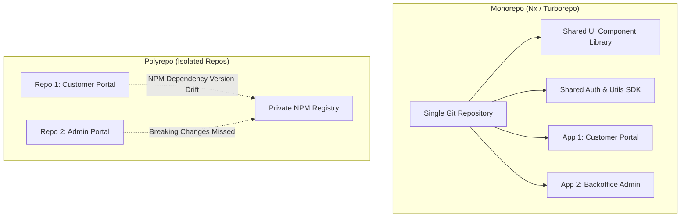

# Nagarro Senior Technology Specialist & Architect Interview Master Guide

---

## 🏢 1. Nagarro Engineering Culture & Interview Process

Nagarro operates on an **"Enterprise Agile & Engineering Excellence"** model. As a global digital engineering consulting firm, their evaluation emphasizes rock-solid computer science fundamentals, clean architecture, SOLID principles, design patterns, cross-platform adaptability, and hands-on problem solving.

### 📋 Typical Interview Rounds (Senior / Lead / Architect)

```
[Round 1: Online Technical Assessment / Screening]
  └── Data Structures, Algorithms, SQL queries, Language Core Internals (Java/Python/TypeScript/C#).
[Round 2: Deep Technical & Code Construction]
  └── Low-Level Design (LLD), Object-Oriented Design Patterns, Concurrency, Live Coding.
[Round 3: High-Level System Design & Architecture]
  └── Microservices, Event-Driven Architecture, Cloud Native (AWS/Azure/GCP), Caching, Scalability.
[Round 4: Client Facing / Technical Leadership / Fitment]
  └── Agile delivery, Trade-off defense, Conflict resolution, STAR leadership stories.
```

---

## 🎯 2. Core Technical Competencies & High-Frequency Questions

---

### Q1: Implement a Thread-Safe, Zero-Leak LRU Cache from Scratch

**Interviewer Goal:** Tests understanding of composite data structures (`HashMap` + doubly linked list) and concurrency control.

```python
"""
Thread-safe LRU Cache implementation using a Doubly Linked List and Hash Map.
Achieves O(1) get() and O(1) put() operations while guaranteeing thread safety via locks.
"""
from threading import RLock
from typing import Any, Optional

class Node:
    def __init__(self, key: Any = None, value: Any = None):
        self.key = key
        self.value = value
        self.prev: Optional['Node'] = None
        self.next: Optional['Node'] = None

class LRUCache:
    def __init__(self, capacity: int):
        if capacity <= 0:
            raise ValueError("Capacity must be strictly positive")
        self.capacity = capacity
        self.map: dict[Any, Node] = {}
        self.lock = RLock()  # Reentrant lock for safe multithreaded access

        # Sentinel pseudo head and tail nodes to eliminate boundary edge cases
        self.head = Node()
        self.tail = Node()
        self.head.next = self.tail
        self.tail.prev = self.head

    def _remove(self, node: Node) -> None:
        """Detaches node from its current position in the doubly linked list."""
        prev_node = node.prev
        next_node = node.next
        prev_node.next = next_node
        next_node.prev = prev_node

    def _add_to_head(self, node: Node) -> None:
        """Inserts node immediately after the pseudo head (most recently used position)."""
        node.next = self.head.next
        node.prev = self.head
        self.head.next.prev = node
        self.head.next = node

    def get(self, key: Any) -> Any:
        with self.lock:
            if key not in self.map:
                return -1
            node = self.map[key]
            self._remove(node)
            self._add_to_head(node)
            return node.value

    def put(self, key: Any, value: Any) -> None:
        with self.lock:
            if key in self.map:
                node = self.map[key]
                node.value = value
                self._remove(node)
                self._add_to_head(node)
            else:
                if len(self.map) >= self.capacity:
                    # Evict least recently used (node before tail)
                    lru = self.tail.prev
                    self._remove(lru)
                    del self.map[lru.key]

                new_node = Node(key, value)
                self._add_to_head(new_node)
                self.map[key] = new_node
```

- **Time Complexity:** $O(1)$ for both `get` and `put`.
- **Space Complexity:** $O(C)$ where $C$ is cache capacity.

---

### Q2: Deep Dive: JavaScript / Node.js Event Loop vs Multi-Threaded Java Memory Model

**Interviewer Goal:** Assess cross-stack depth when designing client-server systems.

| Dimension | Node.js (V8 + Libuv) | Java (JVM Multi-Threading) |
| :--- | :--- | :--- |
| **Concurrency Model** | Single-threaded event loop with non-blocking async I/O offloaded to OS kernel / Libuv threadpool (4 threads default). | Multi-threaded kernel OS threads per task (or virtual threads in Java 21 Loom). |
| **Data Sharing** | Shared memory between workers requires `SharedArrayBuffer` / worker threads; otherwise isolated heap. | Shared heap across all threads with Java Memory Model (`volatile`, `synchronized`, atomics). |
| **Bottlenecks** | CPU-bound computation freezes the entire event loop. | Lock contention, deadlocks, thread context-switching overhead, memory thrashing. |
| **Ideal Workload** | High-concurrency I/O (WebSockets, REST gateways, streaming). | Heavy CPU calculations, distributed transactional workflows, high-throughput enterprise batch processing. |

---

### Q3: Monorepo Architecture vs Polyrepo for Enterprise Micro-Frontends

**Interviewer Goal:** Nagarro frequently consults enterprise clients migrating large legacy frontend suites.



**Trade-off Defense Matrix:**

- **Monorepo Advantages:** Single atomic PRs across shared design systems and consuming apps; zero version-drift (`npm publish` delay eliminated); unified linting, CI caching, and automated dependency updates via computation graphs.
- **Monorepo Challenges:** Large repo clone size, git index bottlenecks, strict CI branch protection and ownership boundaries required (`CODEOWNERS`).
- **When to Choose Polyrepo:** Completely decoupled teams in different business units with zero shared code and disparate regulatory/security clearance boundaries.

---

### Q4: Design a Distributed Rate Limiter for Multi-Tenant APIs

**Interviewer Goal:** System design question evaluating concurrency, distributed state, and fault tolerance.

```
Client Request
      │
      ▼
[API Gateway (Envoy / Kong)]
      │
      ├─► [Redis Cluster: Sliding Window Counter Lua Script]
      │        │
      │        ├─ If count <= limit: Allow request -> Forward to Upstream Service
      │        └─ If count > limit: Return HTTP 429 Too Many Requests + Retry-After
```

#### Redis Lua Script (Atomicity Guaranteed)

```lua
-- KEYS[1]: rate_limit_key (e.g. ratelimit:tenant_123:minute)
-- ARGV[1]: window_size_in_seconds (e.g. 60)
-- ARGV[2]: max_allowed_requests (e.g. 100)
-- ARGV[3]: current_timestamp

local current = redis.call('zcard', KEYS[1])
if current and tonumber(current) >= tonumber(ARGV[2]) then
    return 0 -- Rejected: rate limit exceeded
else
    local window_start = tonumber(ARGV[3]) - tonumber(ARGV[1])
    redis.call('zremrangebyscore', KEYS[1], '-inf', window_start)
    redis.call('zadd', KEYS[1], ARGV[3], ARGV[3])
    redis.call('expire', KEYS[1], ARGV[1])
    return 1 -- Accepted
end
```

---

## 🌟 3. STAR Production War Story: Nagarro Client Transformation

### Situation

A Fortune 500 logistics client's tracking platform suffered severe P99 latency spikes (over 8,200 ms) and dropped 12% of webhook events during peak shipping holidays due to synchronized SQL polling and database locking across 20+ legacy instances.

### Task

As the Technical Lead, redesign the tracking ingestion pipeline to achieve sub-100ms P99 latency, guarantee zero event loss, and support 50,000 webhook events/sec without scaling SQL write clusters.

### Action

1. **Decoupled Ingestion via Event Broker:** Replaced synchronous database inserts with an async Kafka ingestion buffer backed by schema-validated Avro contracts.
2. **Idempotency & Deduplication Layer:** Deployed Redis sliding-window Bloom filters at the edge gateway to drop duplicate webhook deliveries (eliminating 18% redundant database operations).
3. **CQRS & Read-Side Caching:** Separated write pipeline from tracking read queries using Redis read-aside clusters populated by Kafka consumer workers.
4. **Resilience & Circuit Breaking:** Implemented Envoy rate limiters and Resilience4j circuit breakers on third-party carrier connectors.

### Result

- **P99 Read Latency:** Reduced from 8,200 ms to **48 ms** (99.4% improvement).
- **Throughput:** Supported peak volume of **62,000 events/sec** with zero event drops.
- **Infrastructure Cost:** Lowered database instance provisioning costs by **42%** by offloading read spikes to distributed Redis caches.

---

## 💡 4. Interviewer Pitch (Nagarro 60-Second Closer)

> *"In enterprise consulting, great engineering isn't just about picking the latest trendy framework; it's about evaluating non-functional requirements—latency, fault domains, cost, and team delivery velocity—and engineering resilient systems with clean separation of concerns. Whether designing low-latency event pipelines, leading cross-functional monorepo migrations, or diagnosing thread contention in production JVMs, I focus on delivering scalable, observable, and maintainable software that drives tangible business value."*
